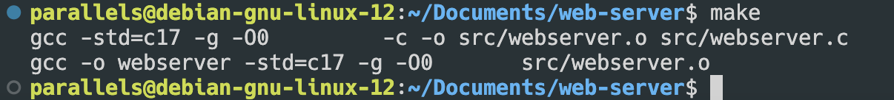
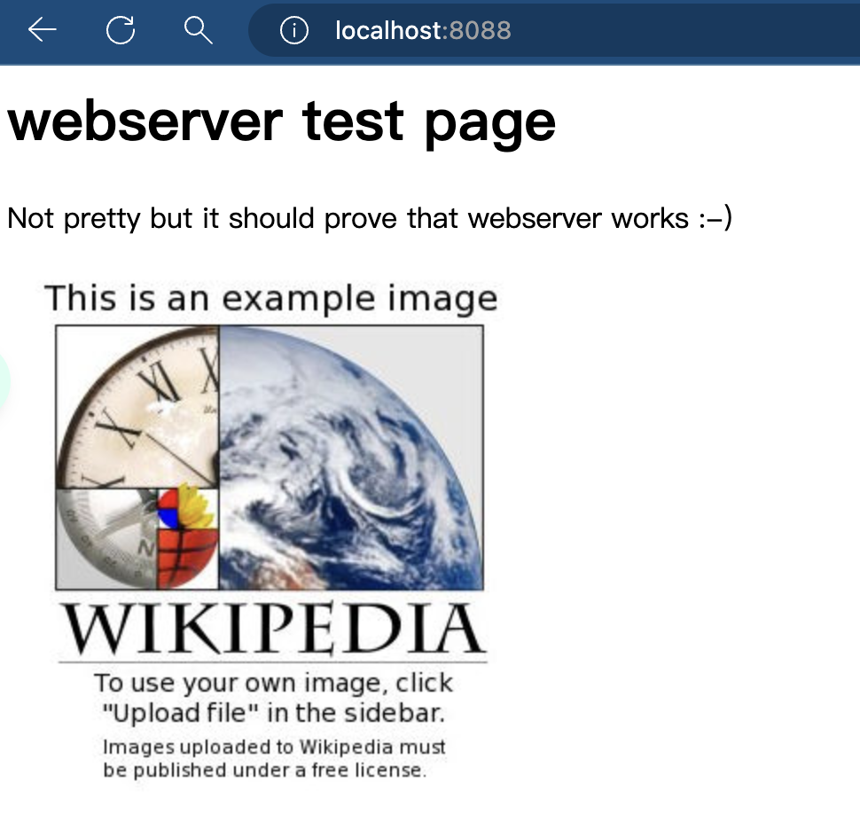
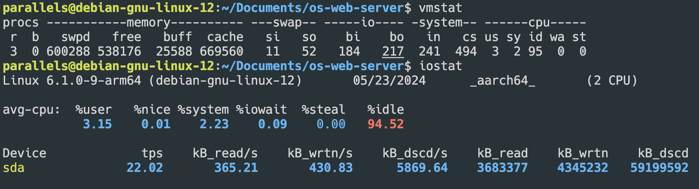
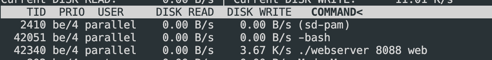
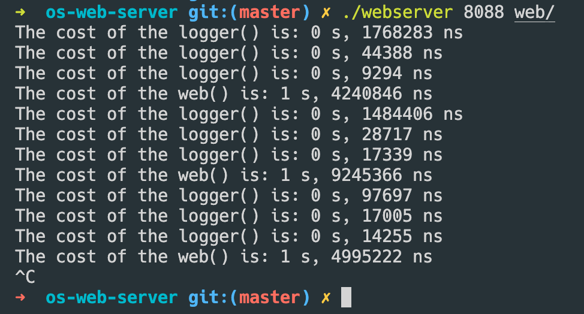
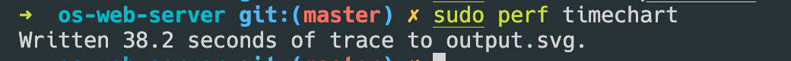

# 实验一

## 题目1

> 题目 1：创建 makefile 文件，将 1.3 节中的 webserver.c 代码进行编译为 webserver 可执行程序。

Makefile 是一种用于自动化构建和管理项目的工具，在这个项目中，当输入`make`指令时，`make`会读取当前文件夹下的`makefile`文件，使用文件中预定好的脚本对代码进行编译。

Makefile如下所示：

```makefile
PROGRAM = webserver
FILES.c = src/webserver.c
FILES.h = 
FILES.o = ${FILES.c:.c=.o}

CC      = gcc
SFLAGS  = -std=c17
GFLAGS  = -g
OFLAGS  = -O0
WFLAG1  = # -Wall
WFLAG2  = # -Wextra
WFLAG3  = # -Werror
WFLAG4  = # -Wstrict-prototypes
WFLAG5  = # -Wmissing-prototypes
WFLAGS  = ${WFLAG1} ${WFLAG2} ${WFLAG3} ${WFLAG4} ${WFLAG5}
UFLAGS  = # Set on command line only

CFLAGS  = ${SFLAGS} ${GFLAGS} ${OFLAGS} ${WFLAGS} ${UFLAGS}
LDFLAGS =
LDLIBS  =

all:  ${PROGRAM}

${PROGRAM}: ${FILES.c} ${FILES.h} ${FILES.o}
	${CC} -o $@ ${CFLAGS} ${FILES.o} ${LDFLAGS} ${LDLIBS} 
		
RM_FR  = rm -fr
SRC_STR = src/
EMPTY = 

clean:
	${RM_FR} ${subst ${SRC_STR}, ${EMPTY}, ${FILES.o}} ${FILES.o} ${PROGRAM}
```

- `PROGRAM`：定义要构建的可执行文件名称为webserver。

- `FILES.c`：定义了src/webserver.c源代码文件的路径。

- `FILES.h`：定义了头文件的路径（空）。

- `FILES.o`：通过将.c文件替换为.o生成的.o文件列表。

- `CC`：定义了要使用的C编译器为gcc。

- `SFLAGS`：定义了C语言标准为C17。

- `GFLAGS`：定义了调试信息选项为-g。

- `OFLAGS`：定义了优化级别为-O0，即不进行优化。

- `WFLAGS`：定义了一系列的警告选项（空），用于在编译时显示警告信息。

- `UFLAGS`：用于允许用户通过命令行设置编译选项（空）。

- `CFLAGS`：包括了所有的编译选项。

- `LDFLAGS`和`LDLIBS`：在构建可执行文件时用于指定链接选项和库（空）。

- all规则用于构建目标文件，即webserver可执行文件。它依赖于源代码文件、头文件和目标文件。

- clean规则用于清除生成的目标文件和可执行文件。

`make` 默认对 `makefile` 中的 `all` 标签进行查看，发现 `all` 的依赖是 `PROGRAM` ，于是执行 `PROGRAM`，先对 `PROGRAM` 中的 `${FILES.c} ${FILES.h} ${FILES.o}` 进行编译，最后执行 `${CC} -o $@ ${CFLAGS} ${FILES.o} ${LDFLAGS} ${LDLIBS} ` 进行最后的链接，即可编译程序。

在命令行中输入：

```bash
make
```
运行结果如下所示，`make` 正在自动化编译。


编译完成后，在目录下得到文件，即可运行。

```bash
./webserver 8088 web
```


## 题目2

> 首先启动webserver程序，例如，“webserver8088/home/web”命令将服务器的侦听端口设置为8088，检索文件的根路径为“/home/web”。然后，在浏览器中输入“http://127.0.0.1:8088/index.html”，观察浏览器中是否能够正常显示网页。在目录中查找webserver.log文件，将其打开观察日志信息。
>
> - 请解释为什么在浏览器中仅请求一次网页，而实际上webserver接收了很多次从浏览器发出的文件请求？
> -  请查阅相关文献，说明浏览器请求网页文件时，为加快html网页显示的速度，都采用了什么样的技术？

在浏览器地址栏中输入 `localhost:8088` ，可以得到如下网页：



日志信息为：

```log
INFO: request:GET / HTTP/1.1**Host: localhost:8088**Connection: keep-alive**Cache-Control: max-age=0**sec-ch-ua: "Microsoft Edge";v="125", "Chromium";v="125", "Not.A/Brand";v="24"**sec-ch-ua-mobile: ?0**sec-ch-ua-platform: "macOS"**Upgrade-Insecure-Requests: 1**User-Agent: Mozilla/5.0 (Macintosh; Intel Mac OS X 10_15_7) AppleWebKit/537.36 (KHTML, like Gecko) Chrome/125.0.0.0 Safari/537.36 Edg/125.0.0.0**Accept: text/html,application/xhtml+xml,application/xml;q=0.9,image/avif,image/webp,image/apng,*/*;q=0.8,application/signed-exchange;v=b3;q=0.7**Sec-Fetch-Site: none**Sec-Fetch-Mode: navigate**Sec-Fetch-User: ?1**Sec-Fetch-Dest: document**Accept-Encoding: gzip, deflate, br, zstd**Accept-Language: zh-CN,zh;q=0.9,en-US;q=0.8,en;q=0.7,en-GB;q=0.6,zh-TW;q=0.5****:1
INFO: SEND:index.html:1
INFO: Header:HTTP/1.1 200 OK
Server: nweb/23.0
Content-Length: 310
Connection: close
Content-Type: text/html:1
INFO: request:GET /example.png HTTP/1.1**Host: localhost:8088**Connection: keep-alive**sec-ch-ua: "Microsoft Edge";v="125", "Chromium";v="125", "Not.A/Brand";v="24"**sec-ch-ua-mobile: ?0**User-Agent: Mozilla/5.0 (Macintosh; Intel Mac OS X 10_15_7) AppleWebKit/537.36 (KHTML, like Gecko) Chrome/125.0.0.0 Safari/537.36 Edg/125.0.0.0**sec-ch-ua-platform: "macOS"**Accept: image/avif,image/webp,image/apng,image/svg+xml,image/*,*/*;q=0.8**Sec-Fetch-Site: same-origin**Sec-Fetch-Mode: no-cors**Sec-Fetch-Dest: image**Referer: http://localhost:8088/**Accept-Encoding: gzip, deflate, br, zstd**Accept-Language: zh-CN,zh;q=0.9,en-US;q=0.8,en;q=0.7,en-GB;q=0.6,zh-TW;q=0.5****:2
INFO: SEND:example.png:2
INFO: Header:HTTP/1.1 200 OK
Server: nweb/23.0
Content-Length: 106793
Connection: close
Content-Type: image/png:2
INFO: request:GET /favicon.png HTTP/1.1**Host: localhost:8088**Connection: keep-alive**sec-ch-ua: "Microsoft Edge";v="125", "Chromium";v="125", "Not.A/Brand";v="24"**sec-ch-ua-mobile: ?0**User-Agent: Mozilla/5.0 (Macintosh; Intel Mac OS X 10_15_7) AppleWebKit/537.36 (KHTML, like Gecko) Chrome/125.0.0.0 Safari/537.36 Edg/125.0.0.0**sec-ch-ua-platform: "macOS"**Accept: image/avif,image/webp,image/apng,image/svg+xml,image/*,*/*;q=0.8**Sec-Fetch-Site: same-origin**Sec-Fetch-Mode: no-cors**Sec-Fetch-Dest: image**Referer: http://localhost:8088/**Accept-Encoding: gzip, deflate, br, zstd**Accept-Language: zh-CN,zh;q=0.9,en-US;q=0.8,en;q=0.7,en-GB;q=0.6,zh-TW;q=0.5****:3
INFO: SEND:favicon.png:3
INFO: Header:HTTP/1.1 200 OK
Server: nweb/23.0
Content-Length: 28297
Connection: close
Content-Type: image/png:3
```

日志信息，显示了一些请求的信息和响应的头部信息。每个日志条目包含以下内容：

-  请求行：指定了请求的方法、路径和协议版本。

-  请求头部：列出了请求的各个头部字段，例如 Host、Connection、User-Agent 等。

-  发送信息：指明发送的文件名。

-  响应头部：列出了响应的各个头部字段，例如 Server、Content-Length、Content-Type 等。

> 请解释为什么在浏览器中仅请求一次网页，而实际上webserver接收了很多次从浏览器发出的文件请求？

因为在浏览器请求资源的过程中，首先请求 `index.html`，然后在解析`index.html` 的过程时，遇到了例如 `/example.png` 和 `/favicon.png` 的请求。这表明该网页引用了这两个图片资源，浏览器会通过发送额外的请求获取这些图片文件。因此，在浏览器请求了一次网页的过程中，会有多个文件请求。

> 请查阅相关文献，说明浏览器请求网页文件时，为加快html网页显示的速度，都采用了什么样的技术？

> ### [Source: Cloudflare]([Tips to improve website speed | How to speed up websites | Cloudflare](https://www.cloudflare.com/learning/performance/speed-up-a-website/))
> #### Optimize images
> 
>Images often take the longest to load on a website since image files tend to be larger in size than HTML and CSS files. Luckily, image load time can be reduced via [image optimization](https://www.cloudflare.com/learning/performance/glossary/what-is-an-image-optimizer/), which typically involves reducing its resolution and dimensions, and compressing the image file itself.
> 
>#### Limit the number of HTTP requests
> 
>Most webpages require browsers to make multiple [HTTP](https://www.cloudflare.com/learning/ddos/glossary/hypertext-transfer-protocol-http/) requests for various assets on the page, including images, scripts, and CSS files. In fact, many webpages require dozens of these requests. Each request results in a round trip to and from the server hosting the resource, which can add to the overall load time for a webpage.
> 
>Because of these potential issues, the total number of assets each page needs to load should be kept to a minimum. A speed test should help identify which HTTP requests are taking the most time.
> 
>#### Use browser HTTP caching
> 
>The browser cache is a temporary storage location where browsers save copies of static files so that they can load recently visited webpages more quickly. Developers can instruct browsers to cache elements of a webpage that will not change often. Instructions for browser caching go in the headers of HTTP responses from the hosting server. This greatly reduces the amount of data that the server needs to transfer to the browser, shortening load times for users who frequently visit certain pages.
> 
>#### Remove unnecessary render-blocking JavaScript
> 
>Webpages may have unnecessary code that loads before more important page content, slowing down the overall load time. This is especially common on large websites with many owners independently adding code and content. Web page owners can use a web performance tool to identify unnecessary code on poorly performing pages.
> 
>#### Limit the use of external scripts
> 
>Any scripted webpage elements that are loaded from somewhere else — such as external commenting systems, CTA buttons, CMS plugins, or lead-generation popups — need to be loaded each time a page loads.
> 
>Depending on the size of the script, these can slow a webpage down, or cause the webpage to not load all at once (this is called 'content jumping' or 'layout shifting' and can be especially frustrating for mobile users, who often have to scroll to see the entire webpage).
> 
>#### Limit redirect usage
> 
>A redirect is when visitors to one webpage get forwarded to a different page instead. Redirects add a few fractions of a second, or sometimes even whole seconds, to page load times. Redirects are sometimes unavoidable, but they can be overused — and may accumulate over time on larger websites with multiple owners. Website owners should institute clear guidelines on redirect usage and periodically scan important web pages for unnecessary redirects.
> 
>#### Minify CSS and JavaScript files
> 
>Minifying code means removing anything that a computer doesn't need in order to understand and carry out the code, including code comments, whitespace, and unnecessary semicolons. This makes CSS and JavaScript files slightly smaller so that they load faster in the browser and take up less bandwidth. Although minification usually provides marginal performance improvements, it is still an important best practice.
> 
>#### Use effective third-party services for important website functions
> 
>- **Hosting:** Even the best-designed website will load slowly if its origin server responds slowly to requests. Website owners should choose a server with an average response time of under 200 ms, and with a good record for reliability.
> - **DNS:** DNS is a system that translates domains (e.g. example.com) into IP addresses — an important part of the page loading process. Website owners should choose DNS services that [deliver results (‘resolve’) quickly and reliably](https://www.cloudflare.com/learning/dns/what-is-1.1.1.1/), rather than relying on their web host’s DNS.
> - **Caching:** The closer website content sits to the people requesting it, the faster they’ll be able to receive it. Website owners should use a [content delivery network](https://www.cloudflare.com/learning/cdn/what-is-a-cdn/) (CDN) to [cache](https://www.cloudflare.com/learning/cdn/what-is-caching/) web content in many locations around the world, so user requests do not have to travel hundreds or thousands of miles (and across many [autonomous networks](https://www.cloudflare.com/learning/network-layer/what-is-an-autonomous-system/)) to reach the website’s origin server.
> - **Cybersecurity:** DDoS attacks, malicious bots, and other cyber attacks can degrade a website’s performance. This topic is too broad to cover in detail here, but website owners should choose a [web application security](https://www.cloudflare.com/learning/security/what-is-web-application-security/) provider which filters out malicious traffic without slowing down legitimate traffic.

## 题目3

> 题目 3：修改 webserver.c 文件中 logger 函数源代码，使得日志文件中每行信息的起始部分均有时间信息，以表示这行信息被写入的时间。

我的思路是在 logger 里面添加另一个 `timebuffer`，将当前时间的信息写入其中；在最后对文件进行写入的阶段，先从 `timebuffer` 写入信息，然后从 `logbuffer` 中写入信息，这样就可以做到在每行的起始部分都有时间信息。（完整代码见[附录](#附录：完整代码)）

在 `logger` 的起始段加入：

```c
  char logbuffer[BUFSIZE * 2];

  /* 在 LOG 的每一行都增加日期和时间信息 */
  time_t t = time(NULL);
  struct tm tm = *localtime(&t);
  (void)sprintf(timebuffer, "[%d-%02d-%02d %02d:%02d:%02d] ", tm.tm_year + 1900,
                tm.tm_mon + 1, tm.tm_mday, tm.tm_hour, tm.tm_min, tm.tm_sec);

```

在 `logger` 的结束段加入：(此处用 `+++` 和  `---` 展示代码的变化)

```c
 /* 将 logbuffer 缓存中的消息存入 webserver.log 文件*/
  int fd = -1;
  if ((fd = open("webserver.log", O_CREAT | O_WRONLY | O_APPEND, 0644)) >= 0) {
---
+++ (void)write(fd, timebuffer, strlen(timebuffer));
    (void)write(fd, logbuffer, strlen(logbuffer));
    (void)write(fd, "\n", 1);
    (void)close(fd);
  }
```

这样，就实现了在 log 的开头加入日期和时间信息。

```log
[2024-05-23 10:31:07] INFO: request:GET / HTTP/1.1**Host: localhost:8088**Connection: keep-alive**Cache-Control: max-age=0**sec-ch-ua: "Microsoft Edge";v="125", "Chromium";v="125", "Not.A/Brand";v="24"**sec-ch-ua-mobile: ?0**sec-ch-ua-platform: "macOS"**Upgrade-Insecure-Requests: 1**User-Agent: Mozilla/5.0 (Macintosh; Intel Mac OS X 10_15_7) AppleWebKit/537.36 (KHTML, like Gecko) Chrome/125.0.0.0 Safari/537.36 Edg/125.0.0.0**Accept: text/html,application/xhtml+xml,application/xml;q=0.9,image/avif,image/webp,image/apng,*/*;q=0.8,application/signed-exchange;v=b3;q=0.7**Sec-Fetch-Site: none**Sec-Fetch-Mode: navigate**Sec-Fetch-User: ?1**Sec-Fetch-Dest: document**Accept-Encoding: gzip, deflate, br, zstd**Accept-Language: zh-CN,zh;q=0.9,en-US;q=0.8,en;q=0.7,en-GB;q=0.6,zh-TW;q=0.5****:1
[2024-05-23 10:31:07] INFO: SEND:index.html:1
[2024-05-23 10:31:07] INFO: Header:HTTP/1.1 200 OK
Server: nweb/23.0
Content-Length: 310
Connection: close
Content-Type: text/html:1
[2024-05-23 10:31:08] INFO: request:GET /example.png HTTP/1.1**Host: localhost:8088**Connection: keep-alive**sec-ch-ua: "Microsoft Edge";v="125", "Chromium";v="125", "Not.A/Brand";v="24"**sec-ch-ua-mobile: ?0**User-Agent: Mozilla/5.0 (Macintosh; Intel Mac OS X 10_15_7) AppleWebKit/537.36 (KHTML, like Gecko) Chrome/125.0.0.0 Safari/537.36 Edg/125.0.0.0**sec-ch-ua-platform: "macOS"**Accept: image/avif,image/webp,image/apng,image/svg+xml,image/*,*/*;q=0.8**Sec-Fetch-Site: same-origin**Sec-Fetch-Mode: no-cors**Sec-Fetch-Dest: image**Referer: http://localhost:8088/**Accept-Encoding: gzip, deflate, br, zstd**Accept-Language: zh-CN,zh;q=0.9,en-US;q=0.8,en;q=0.7,en-GB;q=0.6,zh-TW;q=0.5****:2
[2024-05-23 10:31:08] INFO: SEND:example.png:2
[2024-05-23 10:31:08] INFO: Header:HTTP/1.1 200 OK
Server: nweb/23.0
Content-Length: 106793
Connection: close
Content-Type: image/png:2
[2024-05-23 10:31:09] INFO: request:GET /favicon.png HTTP/1.1**Host: localhost:8088**Connection: keep-alive**sec-ch-ua: "Microsoft Edge";v="125", "Chromium";v="125", "Not.A/Brand";v="24"**sec-ch-ua-mobile: ?0**User-Agent: Mozilla/5.0 (Macintosh; Intel Mac OS X 10_15_7) AppleWebKit/537.36 (KHTML, like Gecko) Chrome/125.0.0.0 Safari/537.36 Edg/125.0.0.0**sec-ch-ua-platform: "macOS"**Accept: image/avif,image/webp,image/apng,image/svg+xml,image/*,*/*;q=0.8**Sec-Fetch-Site: same-origin**Sec-Fetch-Mode: no-cors**Sec-Fetch-Dest: image**Referer: http://localhost:8088/**Accept-Encoding: gzip, deflate, br, zstd**Accept-Language: zh-CN,zh;q=0.9,en-US;q=0.8,en;q=0.7,en-GB;q=0.6,zh-TW;q=0.5****:3
[2024-05-23 10:31:09] INFO: SEND:favicon.png:3
[2024-05-23 10:31:09] INFO: Header:HTTP/1.1 200 OK
Server: nweb/23.0
Content-Length: 28297
Connection: close
Content-Type: image/png:3
```

## 题目4

> 题目 4 ： 在浏览器中多次快速点击刷新按钮后，为什么浏览器要隔很长一段时间才开始显示页面？请结合日志文件中的信息来分析具体原因。

因为这个 web 服务器是一个单线程服务器，它一次性只能处理一个请求。根据 log 文件可以看到，在连续刷新网页时，web服务器会优先处理刷新前的访问，在刷新后，需要等待服务器对之前的请求进行回应完毕（即使这个回应已经对网页加载没有作用了），然后才对当前的访问进行回应。多次刷新后，需要等待服务器所有之前的请求的响应后才能处理当前的请求，等待完毕后才能根据服务器回应的 html 文件来加载并显示页面，这也是为什么浏览器需要等待很长一段时间来显示页面。

## 题目5

> 题目5：使用http_load工具对此webserver程序进行性能测试，并记录其返回的各种参数数据。同时在服务器端，使用vmstat、iostat和iotop等工具收集webserver运行时系统的各种数据，并对webserver进行分析，结合它的代码说明其对系统所带来的各种消耗。

### 运行 `http_load`

在客户端运行：

```bash
 http_load -parallel 5 -fetches 50 -seconds 20 urls.txt
```

等待约20秒后，结果为：

```bash
20 fetches, 5 max parallel, 6200 bytes, in 20.0041 seconds
310 mean bytes/connection
0.999797 fetches/sec, 309.937 bytes/sec
msecs/connect: 0.5565 mean, 0.867 max, 0.217 min
msecs/first-response: 4262.02 mean, 5019.46 max, 4.481 min
HTTP response codes:
  code 200 -- 20
```

-  `20 fetches`：总共进行了20次请求。

-  `5 max parallel`：最多同时执行5个并行请求。

-  `6200 bytes`：总共传输了6200字节的数据。

-  `in 20.0041 seconds`：总共耗时20.0041秒。

-  `310 mean bytes/connection`：每个连接平均传输了310字节的数据。

-  `0.999797 fetches/sec`：每秒平均完成0.999797次请求。

-  `309.937 bytes/sec`：每秒平均传输速率为309.937字节。

-  `msecs/connect: 0.5565 mean, 0.867 max, 0.217 min`：连接时间的统计信息，平均连接时间为0.5565毫秒，最大连接时间为0.867毫秒，最小连接时间为0.217毫秒。

-  `msecs/first-response: 4262.02 mean, 5019.46 max, 4.481 min`：首次响应时间的统计信息，平均首次响应时间为4262.02毫秒，最大首次响应时间为5019.46毫秒，最小首次响应时间为4.481毫秒。

-  `HTTP response codes`: 该部分统计了不同的 HTTP 响应码的数量，200 表示成功返回的次数为20。

### 查看 `vmstat` `iostat` `iotop`





发现 CPU 的占用，占用仅有 3.15% ，而 94.52% 为空闲。由于网页较小，并没有 io 占用大的情况。

### 总结

- 服务器首次响应时间较长：msecs/first-response 显示平均首次响应时间为4262.02毫秒，最大首次响应时间为5019.46毫秒。这表明服务器在处理请求时需要较长的时间来给出第一个响应。这是由于服务器为单线程，一次只能处理一个请求，而后面的请求被延后处理了。
- 并发连接数限制：测试中设置了最多同时执行5个并行请求，但是系统只允许一次一个请求。如果同时进行的请求超过这个限制，会导致请求排队等待处理，从而影响整体的响应时间。

## 题目6

> 题目6：在server.c中增加相关计时函数，分析一下程序的哪个部分最耗时？使用perf工具来跟踪webserver程序，根据其运行报告进行程序性能分析，请指出webserver中比较耗费时间的函数有哪些？

### 增加计时函数

`struct timespec`是一个表示时间的结构体，在 `POSIX C` 中用于存储秒数和纳秒数。它由两个成员组成：`tv_sec`表示秒数，`tv_nsec`表示纳秒数。

`clock_gettime()`是一个函数，用于获取各种时间相关的信息，包括实时时间、CPU时间和系统启动时间等。它以不同的参数（如`CLOCK_REALTIME`、`CLOCK_MONOTONIC`等）确定要获取的时间类型，并将时间值存储在`struct timespec`类型的变量中。

常用的时间类型参数包括：

-  `CLOCK_REALTIME`：表示实时时钟，提供系统的实时时间，可以用于获取当前的日期和时间。

-  `CLOCK_MONOTONIC`：表示单调时钟，提供一个递增的时间值，不受系统时间的影响，适用于计算时间间隔、定时器等。

-  `CLOCK_PROCESS_CPUTIME_ID`：表示进程的CPU时间，提供进程使用的CPU时间，不包括系统调用阻塞的时间。

-  `CLOCK_THREAD_CPUTIME_ID`：表示线程的CPU时间，提供线程使用的CPU时间，不包括系统调用阻塞的时间。

通过调用`clock_gettime()`函数并传入适当的时钟类型参数，可以获取当前的时间，并将其存储在`struct timespec`结构体中，方便对时间进行操作和计算。

在计算程序运行时间的示例中，`clock_gettime()` 被用于获取起始时间和结束时间，然后可以通过计算两个时间之间的差异来计算函数运行的实际时间。

分别在 `logger` 和 `web` 函数的开头和结尾加入以下代码：

首先，在函数的起始位置，创建一个`struct timespec`类型的变量`start_t`，用于记录起始时间。然后，使用`clock_gettime()`函数以`CLOCK_REALTIME`参数获取当前的实时时间，并将该时间值存储到`start_t`中。

```c
// 函数起始位置：
  // 计时器起点
  struct timespec start_t;
  clock_gettime(CLOCK_REALTIME, &start_t);
```

接着，在函数的结束位置，创建一个`struct timespec`类型的变量`end_t`，用于记录结束时间。同样地，使用`clock_gettime()`函数以`CLOCK_REALTIME`参数获取当前的实时时间，并将该时间值存储到`end_t`中。

```c
// 函数结束位置
  // 计时器终点
  struct timespec end_t;
  clock_gettime(CLOCK_REALTIME, &end_t);
  struct timespec diff = timer_diff(start_t, end_t);
// 在logger中：
  printf("The time of the logger() is : %ld s, %ld ns\n", diff.tv_sec,
         diff.tv_nsec);
// 或者，在web中：
  printf("The time of the web() is : %ld s, %ld ns\n", diff.tv_sec,
         diff.tv_nsec);
```
接下来，将起始时间和结束时间作为参数传递给一个名为`timer_diff()`的自定义函数，该函数目的是计算两个时间之间的差异，并返回一个`struct timespec`类型的变量`diff`。这是为了计算整个函数的执行时间。

```c
// 计时函数, 用来计算时间差
struct timespec timer_diff(struct timespec start, struct timespec end) {
  struct timespec result;
  if ((end.tv_nsec - start.tv_nsec) < 0) {
    result.tv_sec = end.tv_sec - start.tv_sec - 1;
    result.tv_nsec = 1000000000 + end.tv_nsec - start.tv_nsec;
  } else {
    result.tv_sec = end.tv_sec - start.tv_sec;
    result.tv_nsec = end.tv_nsec - start.tv_nsec;
  }
  return result;
}
```

最后，在logger或web中，通过打印`diff`的秒数和纳秒数，可以显示函数运行的实际时间。

然后，编译并且运行程序，并打开浏览器对 `localhost:8088` 进行访问，程序会输出如下结果：



从上面的代码中可以发现，函数 `web` 所需要的时间是最长的，这是因为 `webserver` 在 socket drain 后需要等待一秒，大大浪费了性能。

### 运行 `perf` 分析性能

在服务端终端中以 `perf` 监听的方式开启 `webserver`

```bash
sudo perf timechart record ./webserver 8088 web/
```

然后，在本机客户端开启`http_load`

```bash
http_load -parallel 50 -fetches 50 -seconds 20 urls.txt
```

结束 `webserver`， 让 `perf` 转换数据为 `svg`

```bash
sudo perf timechart
```



在 `output.svg` 中，可以看到 `webserver` 的 CPU burst 基本上为一秒一次，在运行了20秒后，实际 CPU 时间为 31.4ms， 所以，CPU的利用率是很低的


## 题目7

> 题目7：根据题目5和题目6的结论，能否指出webserver性能低下的原因？并给出相应的解决方法？

### Webserver性能低下的原因

1. 只有一个进程和单个线程，一次性只能处理一个请求
2. 在 Socket drain 的时候， webserver 需要等待一秒，造成时间的浪费
3. CPU 利用率很低

对于单进程的 webserver，按照测试结果来看，平均一秒只能回应一个请求，如果有并发的请求则很难同时处理，绝大多数的请求都被延后处理了，这是因为每次都需要 1秒 来处理单个请求，且服务器只用单进程，效率不高

### 解决办法

当前的单进程单线程架构限制了服务器同时处理多个请求的能力。通过将服务器设计为多进程或多线程模式，可以同时处理多个请求，提高并发性能。

## 附录：完整代码

```c
// Server Code

// webserver.c

// The following main code from https://github.com/ankushagarwal/nweb*, but they
// are modified slightly

// to use POSIX features
#define _POSIX_C_SOURCE 200809L

#include <arpa/inet.h>
#include <bits/time.h>
#include <errno.h>
#include <fcntl.h>
#include <netinet/in.h>
#include <signal.h>
#include <stdio.h>
#include <stdlib.h>
#include <string.h>
#include <sys/socket.h>
#include <sys/types.h>
#include <time.h>
#include <unistd.h>

#define VERSION 23
#define BUFSIZE 8096
#define ERROR 42
#define LOG 44
#define FORBIDDEN 403
#define NOTFOUND 404

#ifndef SIGCLD
#define SIGCLD SIGCHLD
#endif

struct file_extension {
  char *ext;
  char *filetype;
} extensions[] = {
    {"gif", "image/gif"},
    {"jpg", "image/jpg"},
    {"jpeg", "image/jpeg"},
    {"png", "image/png"},
    {"ico", "image/ico"},
    {"zip", "image/zip"},
    {"gz", "image/gz"},
    {"tar", "image/tar"},
    {"htm", "text/html"},
    {"html", "text/html"},
    {0, 0},
};

// 计时函数, 用来计算时间差
struct timespec timer_diff(struct timespec start, struct timespec end) {
  struct timespec result;
  if ((end.tv_nsec - start.tv_nsec) < 0) {
    result.tv_sec = end.tv_sec - start.tv_sec - 1;
    result.tv_nsec = 1000000000 + end.tv_nsec - start.tv_nsec;
  } else {
    result.tv_sec = end.tv_sec - start.tv_sec;
    result.tv_nsec = end.tv_nsec - start.tv_nsec;
  }
  return result;
}

// 日志函数，将运行过程中的提示信息记录到 webserver.log 文件中

void logger(const int type, const char *s1, const char *s2,
            const int socket_fd) {
  // 计时器起点
  struct timespec start_t;
  clock_gettime(CLOCK_REALTIME, &start_t);

  char timebuffer[BUFSIZE * 2];
  char logbuffer[BUFSIZE * 2];

  // 在 LOG 的每一行都增加日期和时间信息
  time_t t = time(NULL);
  struct tm tm = *localtime(&t);
  sprintf(timebuffer, "[%d-%02d-%02d %02d:%02d:%02d] ", tm.tm_year + 1900,
          tm.tm_mon + 1, tm.tm_mday, tm.tm_hour, tm.tm_min, tm.tm_sec);

  // 根据消息类型，将消息放入 logbuffer 缓存，或直接将消息通过 socket
  // 通道返回给客户端
  switch (type) {
  case ERROR:
    sprintf(logbuffer, "ERROR: %s:%s Errno=%d exiting pid=%d", s1, s2, errno,
            getpid());
    break;

  case FORBIDDEN:
    write(socket_fd,
          "HTTP/1.1 403 Forbidden\n"
          "Content-Length: 185\n"
          "Connection:close\n"
          "Content-Type: text/html\n\n"
          "<html><head>\n<title>403Forbidden</title>\n</"
          "head><body>\n<h1>Forbidden</h1>\n The requested URL, file "
          "type or operation is not allowed on this simple static file "
          "webserver.\n</body></html>\n",
          271);
    sprintf(logbuffer, "FORBIDDEN: %s:%s", s1, s2);
    break;

  case NOTFOUND:
    write(socket_fd,
          "HTTP/1.1 404 not found\n"
          "Content length: 136\n"
          "Connection: close\n"
          "Content-Type: text/html\n\n"
          "<html><head>\n"
          "<title>404 not found</title>\n"
          "</head><body>\n<h1> Not Found</ h1>\nThe requested URL was "
          "not found on this server.\n"
          "<body></html>\n",
          224);
    sprintf(logbuffer, "NOT FOUND: %s:%s", s1, s2);

    break;

  case LOG:
    sprintf(logbuffer, "INFO: %s:%s:%d", s1, s2, socket_fd);
    break;
  }

  // 将 logbuffer 缓存中的消息存入 webserver.log 文件
  int fd = -1;
  if ((fd = open("webserver.log", O_CREAT | O_WRONLY | O_APPEND, 0644)) >= 0) {
    write(fd, timebuffer, strlen(timebuffer));
    write(fd, logbuffer, strlen(logbuffer));
    write(fd, "\n", 1);
    close(fd);
  }

  // 计时器终点
  struct timespec end_t;
  clock_gettime(CLOCK_REALTIME, &end_t);
  struct timespec diff = timer_diff(start_t, end_t);
  printf("The cost of the logger() is: %ld s, %ld ns\n", diff.tv_sec,
         diff.tv_nsec);
}

// 此函数完成了 WebServer
// 主要功能，它首先解析客户端发送的消息，然后从中获取客户端请求的文
// 件名，然后根据文件名从本地将此文件读入缓存，并生成相应的 HTTP
// 响应消息；最后通过服务器与客户端的 socket 通道向客户端返回 HTTP 响应消息

void web(int fd, int hit) {
  // 计时器起点
  struct timespec start_t;
  clock_gettime(CLOCK_REALTIME, &start_t);

  int file_fd;
  char *fstr;
  static char buffer[BUFSIZE + 1]; // 设置静态缓冲区

  int read_ret;
  read_ret = read(fd, buffer, BUFSIZE); // 从连接通道中读取客户端的请求消息
  if (read_ret == 0 ||
      read_ret ==
          -1) { // 如果读取客户端消息失败，则向客户端发送 HTTP 失败响应信息
    logger(FORBIDDEN, "failed to read browser request", "", fd);
  }

  if (read_ret > 0 &&
      read_ret < BUFSIZE) { // 设置有效字符串，即将字符串尾部表示为 0
    buffer[read_ret] = 0;
  } else {
    buffer[0] = 0;
  }

  for (long i = 0; i < read_ret; i++) { // 移除消息字符串中的“CF”和“LF”字符
    if (buffer[i] == '\r' || buffer[i] == '\n') {
      buffer[i] = '*';
    }
  }

  logger(LOG, "request", buffer, hit);

  // 判断客户端 HTTP 请求消息是否为 GET 类型，如果不是则给出相应的响应消息

  if (strncmp(buffer, "GET ", 4) && strncmp(buffer, "get ", 4)) {
    logger(FORBIDDEN, "Only simple GET operation supported", buffer, fd);
  }

  int buflen = 0;
  for (long i = 4; i < BUFSIZE;
       i++) { // null terminate after the second space to ignore extra stuff
    if (buffer[i] == ' ') { // string is "GET URL " + lots of other stuff
      buffer[i] = 0;
      // set length of the buffer to i
      buflen = i;
      break;
    }
  }

  for (long j = 0; j < buflen - 1; j++) {
    // 在消息中检测路径，不允许路径中出现 '.'
    if (buffer[j] == '.' && buffer[j + 1] == '.') {
      logger(FORBIDDEN, "Parent directory (..) path names not supported",
             buffer, fd);
    }
  }
  if (!strncmp(&buffer[0], "GET /\0", 6) ||
      !strncmp(&buffer[0], "get /\0", 6)) {
    // 如果请求消息中没有包含有效的文件名，则使用默认的文件名 index.html
    strcpy(buffer, "GET /index.html");
  }

  // 根据预定义在 extensions 中的文件类型，检查请求的文件类型是否本服务器支持

  buflen = strlen(buffer);
  fstr = (char *)0;

  for (long i = 0; extensions[i].ext != 0; i++) {
    long len = strlen(extensions[i].ext);
    if (!strncmp(&buffer[buflen - len], extensions[i].ext, len)) {
      fstr = extensions[i].filetype;
      break;
    }
  }

  if (fstr == 0) {
    logger(FORBIDDEN, "file extension type not supported", buffer, fd);
  }

  if ((file_fd = open(&buffer[5], O_RDONLY)) == -1) { // 打开指定的文件名
    logger(NOTFOUND, "failed to open file", &buffer[5], fd);
  }

  logger(LOG, "SEND", &buffer[5], hit);

  long len =
      (long)lseek(file_fd, (off_t)0, SEEK_END); // 通过 lseek 获取文件长度
  lseek(file_fd, (off_t)0, SEEK_SET); // 将文件指针移到文件首位置

  sprintf(buffer,
          "HTTP/1.1 200 OK\n"
          "Server: nweb/%d.0\n"
          "Content-Length: %ld\n"
          "Connection: close\n"
          "Content-Type: %s",
          VERSION, len, fstr); // Header without a blank line

  logger(LOG, "Header", buffer, hit);

  sprintf(buffer,
          "HTTP/1.1 200 OK\n"
          "Server: nweb/%d.0\n"
          "Content-Length: %ld\n"
          "Connection: close\n"
          "Content-Type: %s\n\n",
          VERSION, len, fstr); // Header + a blank line
  write(fd, buffer, strlen(buffer));

  // 不停地从文件里读取文件内容，并通过 socket 通道向客户端返回文件内容
  while ((read_ret = read(file_fd, buffer, BUFSIZE)) > 0) {
    write(fd, buffer, read_ret);
  }
  sleep(1); // sleep 的作用是防止消息未发出，已经将此 socket 通道关闭
  close(fd);

  // 计时器终点
  struct timespec end_t;
  clock_gettime(CLOCK_REALTIME, &end_t);
  struct timespec diff = timer_diff(start_t, end_t);
  printf("The cost of the web() is: %ld s, %ld ns\n", diff.tv_sec,
         diff.tv_nsec);
}

int main(int argc, char **argv) {
  // 解析命令参数

  if (argc < 3 || argc > 3 || !strcmp(argv[1], "-?")) {
    printf(
        "hint: nweb Port-Number Top-Directory\t\tversion %d\n\n"
        "\tnweb is a small and very safe mini web server\n"
        "\tnweb only servers out file/web pages with extensions named below\n"
        "\t and only from the named directory or its sub-directories.\n"
        "\tThere is no fancy features = safe and secure.\n\n"
        "\tExample:webserver 8181 /home/nwebdir &\n\n"
        "\tOnly Supports:",
        VERSION);

    for (long i = 0; extensions[i].ext != 0; i++) {
      printf(" %s", extensions[i].ext);
    }

    printf(
        "\n\tNot Supported: URLs including \"..\", Java, Javascript, CGI\n"
        "\tNot Supported: directories / /etc /bin /lib /tmp /usr /dev /sbin \n"
        "\tNo warranty given or implied\n\tNigel Griffiths nag@uk.ibm.com\n");
    exit(0);
  }

  if (!strncmp(argv[2], "/", 2) || !strncmp(argv[2], "/etc", 5) ||
      !strncmp(argv[2], "/bin", 5) || !strncmp(argv[2], "/lib", 5) ||
      !strncmp(argv[2], "/tmp", 5) || !strncmp(argv[2], "/usr", 5) ||
      !strncmp(argv[2], "/dev", 5) || !strncmp(argv[2], "/sbin", 6)) {
    printf("ERROR: Bad top directory %s, see nweb -?\n", argv[2]);
    exit(3);
  }

  if (chdir(argv[2]) == -1) {
    printf("ERROR: Can't Change to directory %s\n", argv[2]);
    exit(4);
  }

  // 建立服务端侦听 socket
  long listenfd;

  if ((listenfd = socket(AF_INET, SOCK_STREAM, 0)) < 0) {
    logger(ERROR, "system call", "socket", 0);
  }

  const long port = atoi(argv[1]);

  if (port < 0 || port > 60000) {
    logger(ERROR, "Invalid port number (try 1->60000)", argv[1], 0);
  }

  static struct sockaddr_in serv_addr; // static = initialised to zeros
  serv_addr = (struct sockaddr_in){
      .sin_addr.s_addr = htonl(INADDR_ANY),
      .sin_port = htons(port),
      .sin_zero = "",
      .sin_family = AF_INET,
  };

  if (bind(listenfd, (struct sockaddr *)&serv_addr, sizeof(serv_addr)) < 0) {
    logger(ERROR, "system call", "bind", 0);
  }

  if (listen(listenfd, 64) < 0) {
    logger(ERROR, "system call", "listen", 0);
  }

  static struct sockaddr_in cli_addr; // static = initialised to zeros
  for (long hit = 1;; hit++) {
    socklen_t length = sizeof(cli_addr);
    long socketfd;
    if ((socketfd = accept(listenfd, (struct sockaddr *)&cli_addr, &length)) <
        0) {
      logger(ERROR, "system call", "accept", 0);
    }
    web(socketfd, hit); // never read_returns
  }
}
```

