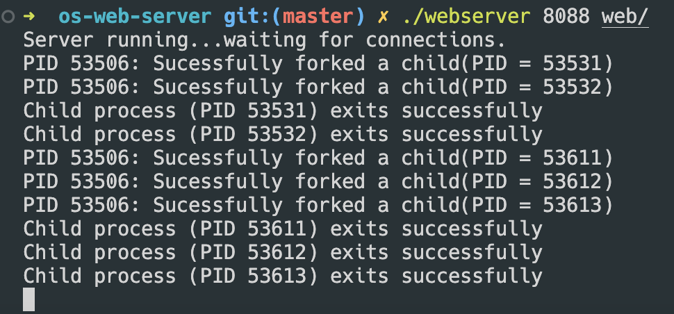
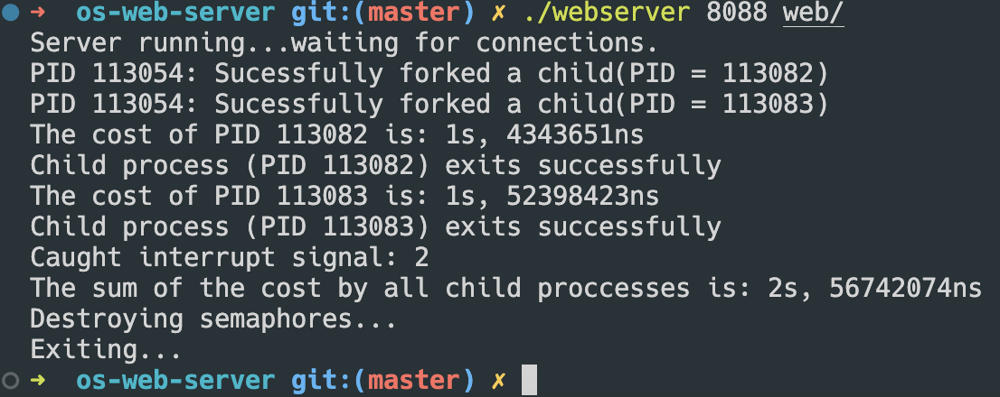

# 实验二

## 题目1

> 题目 1：使用fork函数，设计并实现WebServer以支持多进程并发处理众多客户端的请求。

由于之前的单进程服务器在遇到并发的请求的时候会出现响应慢的问题，因此改用多进程的服务器。如果使用多进程，就能同时处理多个请求，提高响应的速度。

对于WebServer，主要是使用fork函数在父进程中接受连接请求，在子进程中处理请求并响应。每当有一个客户端连接到服务器时，就会fork一个子进程来处理该请求，这样可以支持多个客户端并发请求处理。在子进程中处理完请求后，会计算处理时间，并更新全局计时器。

```c
int main(int argc, char const *argv[]) {
  // 前面的代码保持不变
  // ...
  for (long hit = 1;; hit++) {
    static struct sockaddr_in cli_addr; // static = initialised to zeros
    socklen_t length = sizeof(cli_addr);
    // Await a connection on socket FD.
    long socketfd;
    if ((socketfd = accept(listenfd, (struct sockaddr *)&cli_addr, &length)) <
        0) {
      logger(ERROR, "system call", "accept", 0);
    }

    // Fork一个子进程执行web响应操作
    pid_t child_pid = fork();

    if (child_pid < 0) {
      // child_pid < 0, fork操作失败，退出
      perror("fork failed");
      exit(EXIT_FAILURE);
    }

    if (child_pid > 0) {
      // child_pid > 0, 父进程继续接受请求
      printf("PID %d: Sucessfully forked a child(PID = %d)\n", getpid(),
             child_pid);
      continue;
    }

    // 子进程 child_pid == 0

    // close listening socket
    close(listenfd);

    // 回应请求
    web(socketfd, hit); // never read_returns

    // 子进程退出
    printf("Child process (PID %d) exits successfully\n", getpid());
    exit(EXIT_SUCCESS);
  }
}

```

关键操作包括：

- 接受客户端连接请求：使用accept函数接受客户端连接请求，得到socket描述符。
- Fork子进程：使用fork函数创建子进程，父进程继续等待新的连接请求，子进程处理当前请求。

运行结果如下图所示：




- 实验运行结果显示，每当有一个客户端连接到服务器，就会创建一个子进程来处理请求，并且在命令行中打印出子进程的PID。子进程能够独立处理请求，并在处理完成后退出。在子进程退出后，会显示该PID已经成功退出。

- 通过子进程处理请求，即使不断刷新网页，也不会出现如之前单进程的web服务器一样卡顿的现象，可以同时处理多个请求，提高了服务器的并发性能。

## 题目2

> 题目 2：使用信号量、共享内存等系统接口函数，来统计每个子进程的消耗时间以及所有子进程消耗时间之和。

1. 定义两个信号量，一个用作logger记录，一个用作timer计时

```c
// in types.h
// semaphores
extern sem_t *logging_semaphore;
extern sem_t *timer_semaphore;
```

2. 在 `main` 中初始化这两个信号量

```c
sem_t *semaphore_allocate_init(void) {
  // place semaphore in shared memory
  sem_t *semaphore = mmap(NULL, sizeof(*semaphore), PROT_READ | PROT_WRITE,
                          MAP_SHARED | MAP_ANONYMOUS, -1, 0);
  if (semaphore == MAP_FAILED) {
    perror("mmap");
    exit(EXIT_FAILURE);
  }

  // initialize semaphore
  if (sem_init(semaphore, 1, 1) < 0) {
    perror("sem_init");
    exit(EXIT_FAILURE);
  }

  // passing back
  return semaphore;
}

// semaphore definition
sem_t *logging_semaphore = NULL;
sem_t *timer_semaphore = NULL;

int main(int argc, char const *argv[]) {
  // ...
    
  // 初始化信号量
  logging_semaphore = semaphore_allocate_init();
  timer_semaphore = semaphore_allocate_init();
    
  // ...
    
}
```

3. 在fork的子进程中增加计时的代码

```c
int main(int argc, char const *argv[]) {
  
   // ...
    
  for (long hit = 1;; hit++) {
    // Fork一个子进程执行web响应操作
    pid_t child_pid = fork();

    // ... 父进程执行代码
	// ...
    // ...
      
    // 子进程 child_pid == 0

    // 子进程计时开始
    struct timespec start_t;
    clock_gettime(CLOCK_REALTIME, &start_t);

    // close listening socket
    close(listenfd);

    // 回应请求
    web(socketfd, hit); // never returns

    // 子进程计时器结束
    struct timespec end_t;
    clock_gettime(CLOCK_REALTIME, &end_t);
    struct timespec diff = timer_diff(start_t, end_t);

    // Wait for semaphore
    if (sem_wait(timer_semaphore) < 0) {
      perror("sem_wait error");
      exit(EXIT_FAILURE);
    }

    // ENTERING CRITICAL SECTION

    // 计时器加上 diff
    *global_timer = timer_add(*global_timer, diff);

    // CRITICAL SECTION ENDS

    // release semaphore
    if (sem_post(timer_semaphore) < 0) {
      perror("sem_post error");
      exit(EXIT_FAILURE);
    }

    // 输出子进程的时间
    printf("The cost of PID %d is: %lds, %ldns\n", getpid(), diff.tv_sec,
           diff.tv_nsec);
    // 退出
    printf("Child process (PID %d) exits successfully\n", getpid());
    exit(EXIT_SUCCESS);
  }
```

这样，就用信号量完整实现了计时的功能。

运行程序并刷新网页，可以得到：



## 题目3

> 题目 3：使用 http_load 来测试当前设计的多进程 WebServer 服务性能， 根据测试结果来分析其比单进程Web服务性能提高的原因。同时结合题目2，来分析当前多进程 WebServer 的性能瓶颈在何处？是否还能够继续提高此WebServer服务的性能？


## 附录: `webserver.c` 的完整代码

