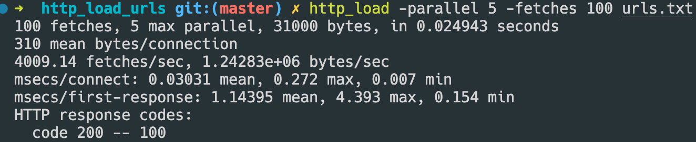
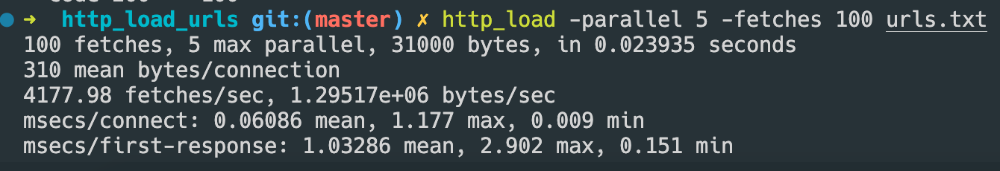
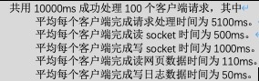
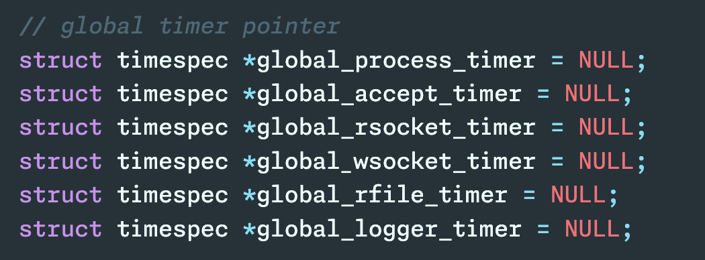
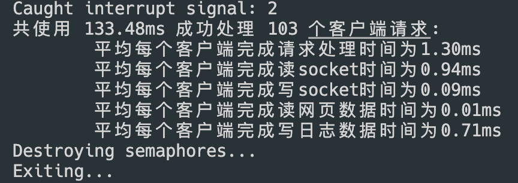
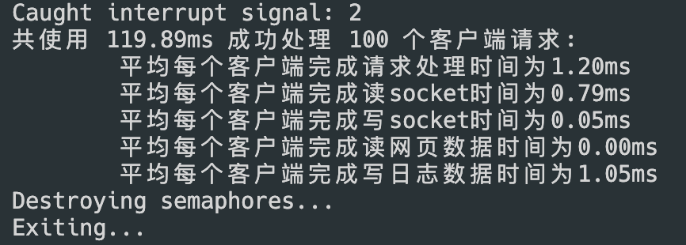
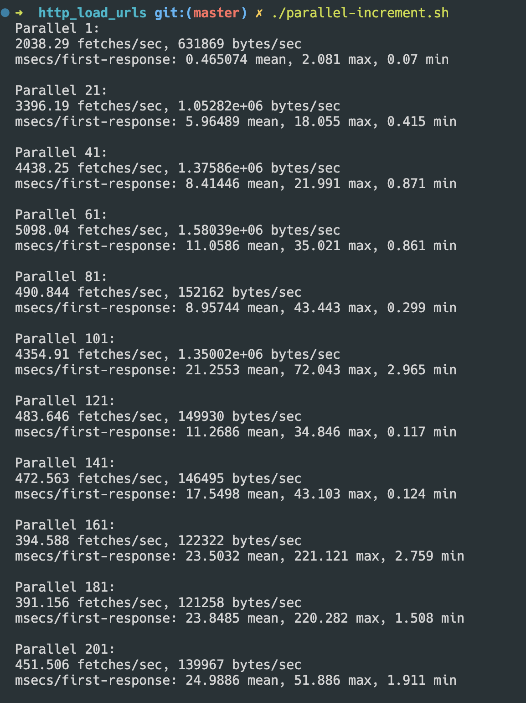

# 实验3

## 题目1

> ### 将上述多线程Web服务器与实验2中多进程模型的Web服务器性能进行对比，说明它俩各具有什么优缺点。具体对比的指标包括如下：

> - #### 使用http_load命令来测试这两个模型下Web服务器的性能指标。并根据这些测试指标对比，分析为什么这两种模型会产生不同的性能结果？
>

这是多进程模型下 Web 服务器的测试结果：



这是多线程模型下 Web 服务器的测试结果：



在输入相同的 `http_load` 指令下，可以看到，多进程模型的 `msecs/connect` 相比多线程模型的 `msecs/connect` 相对较长一点。

这是因为初始化一个新的线程比fork一个进程所需要的资源更少。所以，在多线程模型下，无论是连接时间或者响应时间都比多进程的要来的快，因为无论是连接或者相应都涉及到初始化线程/进程的问题，多线程模型在这方面天然拥有更多的优势。

> - #### 对这两个模型中的socket数据读取、发送、网页文件读取和日志文件写入四个I/O操作分别计时，并打印出每个进程或线程处理各项I/O计时的平均时间。例如，编写的程序应该打印出如下结果。
>
>     

##### 多进程模型的计时实现



这些变量声明是用来存储不同阶段的计时器值的。每个变量代表一个阶段（如进程处理，接受连接，读取socket，写入socket，读取文件，日志记录等）的计时器。这些计时器用于记录每个阶段的时间花费，以便在需要时对服务器的运行时间进行详细的分析和优化。

由于计时器过多，需要一个方法快速将这些计时器指针分配到共享内存。为此，引入函数 `timer_init` 。

```c
// 全局计时器初始化
struct timespec *timer_init(void) {
  struct timespec *result =
      mmap(NULL, sizeof(*global_process_timer), PROT_READ | PROT_WRITE,
           MAP_SHARED | MAP_ANONYMOUS, -1, 0);
  result->tv_sec = 0;
  result->tv_nsec = 0;
}
```

这样，在主函数中调用5次即可：

```c
  // 全局计时器初始化
  global_process_timer = timer_init();
  global_rsocket_timer = timer_init();
  global_wsocket_timer = timer_init();
  global_rfile_timer = timer_init();
  global_logger_timer = timer_init();

```

然后，在 `sigInterruptHandler` 中，将这些计时器变量全部释放。

```c
 if (munmap(global_process_timer, sizeof(*global_process_timer)) < 0) {
    perror("munmap failed");
    exit(EXIT_FAILURE);
  }

  if (munmap(global_accept_timer, sizeof(*global_accept_timer)) < 0) {
    perror("munmap failed");
    exit(EXIT_FAILURE);
  }

  if (munmap(global_wsocket_timer, sizeof(*global_wsocket_timer)) < 0) {
    perror("munmap failed");
    exit(EXIT_FAILURE);
  }

  if (munmap(global_rsocket_timer, sizeof(*global_rsocket_timer)) < 0) {
    perror("munmap failed");
    exit(EXIT_FAILURE);
  }

  if (munmap(global_rfile_timer, sizeof(*global_rfile_timer)) < 0) {
    perror("munmap failed");
    exit(EXIT_FAILURE);
  }

  if (munmap(global_logger_timer, sizeof(*global_logger_timer)) < 0) {
    perror("munmap failed");
    exit(EXIT_FAILURE);
  }

```

1. 想要获取平均客户端请求时间，需要在子进程刚刚建立的时候设置计时起点，在子进程结束的时候设置计时终点。然后，计算时间差，并将 `global_process_timer` 加上这个时间差。

```c
	// 在子进程刚被fork的时候

    // 子进程计时开始
    struct timespec start_t;
    clock_gettime(CLOCK_PROCESS_CPUTIME_ID, &start_t);
```

```c
	// 在子进程将要结束的时候
	// 子进程计时器结束
    struct timespec end_t;
    clock_gettime(CLOCK_PROCESS_CPUTIME_ID, &end_t);

	// 计算时间差
    const struct timespec diff = timer_diff(start_t, end_t);
```

最后，将全局的计时器相加

```c
 	// Wait for semaphore
    if (sem_wait(timer_semaphore) < 0) {
      perror("sem_wait error");
      exit(EXIT_FAILURE);
    }

    // ENTERING CRITICAL SECTION

    // 计时器加上 diff
    *global_process_timer = timer_add(*global_process_timer, diff);

    // CRITICAL SECTION ENDS

    // release semaphore
    if (sem_post(timer_semaphore) < 0) {
      perror("sem_post error");
      exit(EXIT_FAILURE);
    }
```

logger的计时同理：

```c
  // logger 计时开始
  struct timespec start_t;
  clock_gettime(CLOCK_PROCESS_CPUTIME_ID, &start_t);  

  /************************************************/


  /*****************  写日志部分   *****************/


  /************************************************/

  // logger 计时结束
  struct timespec end_t;
  clock_gettime(CLOCK_PROCESS_CPUTIME_ID, &end_t);
  // 计算时间差
  const struct timespec diff = timer_diff(start_t, end_t);

  // Wait for semaphore
  if (sem_wait(timer_semaphore) < 0) {
    perror("sem_wait error");
    exit(EXIT_FAILURE);
  }

  // ENTERING CRITICAL SECTION

  // 计时器加上 diff
  *global_logger_timer = timer_add(*global_logger_timer, diff);

  // CRITICAL SECTION ENDS

  // release semaphore
  if (sem_post(timer_semaphore) < 0) {
    perror("sem_post error");
    exit(EXIT_FAILURE);
  }
```

其余的读 socket，读文件，写socket类似于以上代码。

最后，运行该多进程 webserver，使用 http_load 进行请求，以下是运行结果：



##### 多线程模型的计时实现

实现方式和上述基本相同，不同的是，计时器 `global_process_timer` 的名称变化为  `global_thread_timer` （因为该模型是对每个子线程进行计时，而非每个进程）




> - #### 根据上面的计时数据结果，分析并说明哪些多进程模型和多线程模型中哪些I/O操作是最消耗时间的？

根据上面的计时数据结果，分析如下：

1. **多进程模型中最消耗时间的I/O操作**：

    - 在多进程模型中，平均每个客户端完成请求处理时间为1.30ms，而平均每个客户端完成读socket时间为0.94ms。可以看出，读取socket的操作依然是多进程模型中相对较为耗时的I/O操作。
    
    - 平均每个客户端完成写日志数据时间为0.71ms，多进程和多线程的结果区别并不大，主要瓶颈都在写日志上。


2. **多线程模型中最消耗时间的I/O操作**：

    - 在多线程模型中，平均每个客户端完成读socket时间为0.79ms，而平均每个客户端完成写日志数据时间为1.05ms。可以看出，在多线程模型中，写日志数据的操作成为相对比较耗时的I/O操作。
    
    - 在多线程模型中，读取socket时间相对较短（0.79ms），但是仍然是主要的性能瓶颈。


在两种模型中，I/O操作的消耗在读取socket和写日志数据两个环节比较耗时。

> - #### 思考一下，怎么修改线程模型，才能提高线程的并发性能？

1. **使用线程池**：创建线程的过程开销较大，可以通过线程池来复用线程，减少线程的创建和销毁，提高性能。线程池可以控制线程的数量，避免线程数量过多导致资源浪费。
2. **减少线程间同步和通信**：多线程之间的同步和通信会带来一定的开销，可以通过减少锁的竞争、使用无锁数据结构、降低线程间通信频率等方式来减少线程间的争用，提高并发性能。
3. **减少日志的使用**：从上述结果来看，写日志十分耗费性能，所以可以通过减少写日志的时间来优化性能。
4. **合理划分任务**：将任务划分成适当的粒度，避免单个任务占用过多的线程资源或时间，提高任务的并发执行能力。(例如后面的业务分割模型，在使用了线程池的基础上，进一步分割了业务，提高了效率)


## 题目2

> ### 调整http_load命令参数，增加其并发访问线程数量，会发现随着并发访问数量在达到一定数量后，再增多会导致多线程Web服务进程的性能出现下降的现象。试分析产生上述现象的原因是什么？

考虑方便快捷地调整参数并且运行测试，在 http_load 读取 urls.txt 的同级文件夹下运行脚本 `parallel-increment.sh` 来实现测试。

脚本内容如下：

```bash
#!/bin/zsh

for i in {1..201..20};
do
  echo "Parallel $i:"
  http_load -parallel $i -fetches 500 urls.txt | grep -E 'fetches/sec|bytes/sec|msecs/first-response'
  echo ''
done

```

脚本使用了http_load，通过不同的并发数进行多次测试，输出每个并发数下的相关性能指标，包括请求速度、数据传输速度以及首次响应时间等。

脚本的主要流程是：

1. 使用for循环，循环遍历不同的并发数，从1开始一直增加到201，每次增加20。
2. 对于每个并发数i，使用http_load工具发送500个请求给 web 服务器，其中并发数为i。
3. 使用grep命令筛选出关键信息，包括请求速度（fetches/sec）、数据传输速度（bytes/sec）和首次响应时间（msecs/first-response）等，并将结果输出到标准输出。
4. 在每次测试完成后，输出一个空行，方便结果的区分和查看。

需要注意的是，这里的 fetches 数量需要尽量大，因为如果总的请求数量过少，则在高并发的情况下条件下，无法体现性能瓶颈。

在启动了多线程模型 web 服务器的前提下，运行该脚本，结果如下：



####  **Fetches/Sec和Bytes/Sec**

- 从测试结果来看，当并发数量从1增加到61时，每秒的请求数`fetches/sec`和每秒的字节数`bytes/sec`都有所增加，这说明服务器的并发处理能力得到了提升。

- 当并发数量继续增加时，这两个指标开始下降，这说明服务器的并发处理能力已经达到了极限，再增加并发数量反而会导致性能下降，导致服务器因为线程数量太多，已经陷入了性能瓶颈。可以看到，在并发数量增加到100以上的时候，每秒的请求数`fetches/sec`已经从几千降低到了几百。可能是由于资源限制、锁竞争或网络延迟等因素引起的性能瓶颈。

#### **First-Response Time**

- 从`msecs/first-response`（从连接建立到收到第一个响应的时间）来看，并发数增加会导致平均首次响应时间随之增加。较低的并发数（如1、21、41）下，平均首次响应时间较短，随着并发数增加（超过101），平均首次响应时间开始显著增加，性能明显下降。同时，最大和最小首次响应时间也会出现波动和增长，说明系统在高并发情况下处理请求的稳定性降低。

#### **性能峰值**

- 根据`fetches/sec`和`bytes/sec`的变化情况可以看出，系统的性能在并发数达到一定程度后会出现峰值，然后随着进一步增加并发数，性能会下降。这是因为系统资源有限，无法无限制地提高并发处理能力，使得系统性能在某一并发数下达到最优，并在之后出现下降。

#### **并发数选择**

- 通过分析测试结果，可以大致确定系统在处理该测试负载时的最佳并发数范围。在这个范围内，系统能够达到较高的吞吐量和较低的响应时间。超出这个范围，系统的性能会出现下降，需要进一步优化。

对系统性能进行调优和优化时，需要综合考虑不同并发数下的性能表现，确保系统在高并发情况下仍能保持稳定和高效的性能。优化策略可以通过线程池实现，线程池维持了一定的线程数量，使得系统资源利用率最大化，不再受到上下文切换带来的性能影响。

## 完整代码

```c
// Server Code

// webserver.c

// The following main code from https://github.com/ankushagarwal/nweb*, but they
// are modified slightly

// to use POSIX features
#define _POSIX_C_SOURCE 200809L
#define _GNU_SOURCE

#include <arpa/inet.h>
#include <asm-generic/socket.h>
#include <bits/pthreadtypes.h>
#include <netinet/in.h>
#include <pthread.h>
#include <semaphore.h>
#include <stdio.h>
#include <stdlib.h>
#include <string.h>
#include <sys/socket.h>
#include <sys/types.h>
#include <time.h>
#include <unistd.h>

#include "include/interrupt.h"
#include "include/logger.h"
#include "include/thread_runner.h"
#include "include/timer.h"
#include "include/types.h"
#include "include/web.h"

// extensions
struct file_extension extensions[] = {
    {"gif", "image/gif"},  {"jpg", "image/jpg"}, {"jpeg", "image/jpeg"},
    {"png", "image/png"},  {"ico", "image/ico"}, {"zip", "image/zip"},
    {"gz", "image/gz"},    {"tar", "image/tar"}, {"htm", "text/html"},
    {"html", "text/html"}, {NULL, NULL},
};

// semaphore init
sem_t *logging_semaphore = NULL;
sem_t *timer_semaphore = NULL;

// global timer pointer
struct timespec *global_thread_timer = NULL;
struct timespec *global_rsocket_timer = NULL;
struct timespec *global_wsocket_timer = NULL;
struct timespec *global_rfile_timer = NULL;
struct timespec *global_logger_timer = NULL;

// 子线程数初始化为 0
long thread_count = 0;

// 解析命令参数
void argument_check(int argc, char const *argv[]);

// 捕捉 Ctrl+C 信号的 sigIntHandler
void sig_handler_init(void);

// 用来初始化信号量的函数
sem_t *semaphore_allocate_init(void);

// 全局计时器初始化
struct timespec *timer_init(void);

int main(int argc, char const *argv[]) {
  // 解析命令参数
  argument_check(argc, argv);

  // 捕捉 Ctrl+C 信号的 sigIntHandler
  sig_handler_init();

  // 初始化信号量
  logging_semaphore = semaphore_allocate_init();
  timer_semaphore = semaphore_allocate_init();

  // 全局计时器初始化
  global_thread_timer = timer_init();
  global_rsocket_timer = timer_init();
  global_wsocket_timer = timer_init();
  global_rfile_timer = timer_init();
  global_logger_timer = timer_init();

  // 建立服务端侦听 socket
  long listenfd;
  if ((listenfd = socket(AF_INET, SOCK_STREAM, 0)) < 0) {
    logger(ERROR, "system call", "socket", 0);
    perror("socket error");
    exit(EXIT_FAILURE);
  }

  const int enable = 1;
  if (setsockopt(listenfd, SOL_SOCKET, SO_REUSEADDR, &enable, sizeof(int)) <
      0) {
    perror("setsocket error");
    exit(EXIT_FAILURE);
  }

  const long port = atoi(argv[1]);
  if (port < 0 || port > 60000) {
    logger(ERROR, "Invalid port number (try 1->60000)", argv[1], 0);
    exit(EXIT_FAILURE);
  }

  static struct sockaddr_in serv_addr; // static = initialised to zeros
  serv_addr.sin_family = AF_INET;
  serv_addr.sin_addr.s_addr = htonl(INADDR_ANY);
  serv_addr.sin_port = htons(port);

  if (bind(listenfd, (struct sockaddr *)&serv_addr, sizeof(serv_addr)) < 0) {
    logger(ERROR, "system call", "bind", 0);
    perror("bind error");
    exit(EXIT_FAILURE);
  }

  if (listen(listenfd, LISTENQ) < 0) {
    logger(ERROR, "system call", "listen", 0);
    perror("listen error");
    exit(EXIT_FAILURE);
  }

  printf("%s\n", "Server running...waiting for connections.");

  static struct sockaddr_in cli_addr; // static = initialised to zeros
  socklen_t length = sizeof(cli_addr);

  // 初始化线程的 attribute
  pthread_attr_t attr;
  pthread_attr_init(&attr);
  // 设置线程的 attribute 为 detached state (主进程不用等待每个子线程结束)
  pthread_attr_setdetachstate(&attr, PTHREAD_CREATE_JOINABLE);

  for (long hit = 1;; hit++) {
    // Await a connection on socket FD.
    long socketfd;
    if ((socketfd = accept(listenfd, (struct sockaddr *)&cli_addr, &length)) <
        0) {
      logger(ERROR, "system call", "accept", 0);
      perror("accept error");
      exit(EXIT_FAILURE);
    }

    // 线程的临时 tid
    pthread_t tid;
    // 需要给 thread runner 传递的参数
    struct thread_runner_arg *args = calloc(1, sizeof(*args));
    args->socketfd = socketfd;
    args->hit = hit;
    // 创建子线程
    if (pthread_create(&tid, &attr, thread_runner, args)) {
      perror("pthread create failed");
      exit(EXIT_FAILURE);
    }
    // 创建进程成功，进程数增加
    thread_count++;
  }
}

void argument_check(int argc, char const *argv[]) {
  if (argc < 3 || argc > 3 || !strcmp(argv[1], "-?")) {
    printf(
        "hint: nweb Port-Number Top-Directory\t\tversion %d\n\n"
        "\tnweb is a small and very safe mini web server\n"
        "\tnweb only servers out file/web pages with extensions named below\n"
        "\t and only from the named directory or its sub-directories.\n"
        "\tThere is no fancy features = safe and secure.\n\n"
        "\tExample:webserver 8181 /home/nwebdir &\n\n"
        "\tOnly Supports:",
        VERSION);

    for (long i = 0; extensions[i].ext != 0; i++) {
      printf(" %s", extensions[i].ext);
    }

    printf(
        "\n\tNot Supported: URLs including \"..\", Java, Javascript, CGI\n"
        "\tNot Supported: directories / /etc /bin /lib /tmp /usr /dev /sbin \n"
        "\tNo warranty given or implied\n\tNigel Griffiths nag@uk.ibm.com\n");
    exit(EXIT_SUCCESS);
  }

  if (!strncmp(argv[2], "/", 2) || !strncmp(argv[2], "/etc", 5) ||
      !strncmp(argv[2], "/bin", 5) || !strncmp(argv[2], "/lib", 5) ||
      !strncmp(argv[2], "/tmp", 5) || !strncmp(argv[2], "/usr", 5) ||
      !strncmp(argv[2], "/dev", 5) || !strncmp(argv[2], "/sbin", 6)) {
    printf("ERROR: Bad top directory %s, see nweb -?\n", argv[2]);
    exit(EXIT_FAILURE);
  }

  if (chdir(argv[2]) == -1) {
    printf("ERROR: Can't Change to directory %s\n", argv[2]);
    exit(EXIT_FAILURE);
  }
}

sem_t *semaphore_allocate_init(void) {
  // place semaphore in shared memory
  sem_t *semaphore = (sem_t *)calloc(1, sizeof(*semaphore));

  // initialize semaphore
  if (sem_init(semaphore, 0, 1) < 0) {
    perror("sem_init failed");
    exit(EXIT_FAILURE);
  }

  // passing back
  return semaphore;
}

// 全局计时器初始化
struct timespec *timer_init(void) {
  return calloc(1, sizeof(struct timespec));
}
```

```c
// thread_runner.c

#define _GNU_SOURCE

#include <bits/time.h>
#include <fcntl.h>
#include <pthread.h>
#include <semaphore.h>
#include <stdio.h>
#include <stdlib.h>
#include <sys/syscall.h>
#include <sys/types.h>
#include <time.h>
#include <unistd.h>

#include "include/thread_runner.h"
#include "include/timer.h"
#include "include/types.h"
#include "include/web.h"

// 子线程进行的任务
void *thread_runner(void *args) {
  struct thread_runner_arg *processed_args = (struct thread_runner_arg *)args;
  const int socketfd = processed_args->socketfd;
  const int hit = processed_args->hit;

  // 计时器开始
  struct timespec thread_start_time;
  clock_gettime(CLOCK_REALTIME, &thread_start_time);

  // 回应请求
  web(socketfd, hit);

  // 计时器结束
  struct timespec thread_end_time;
  clock_gettime(CLOCK_REALTIME, &thread_end_time);

  // 计算时间差 diff
  const struct timespec diff = timer_diff(thread_start_time, thread_end_time);

  // 获取 tid
  const pid_t tid = syscall(__NR_gettid);
  // 输出当前进程时间
  printf("Thread %d costs: %lds %ldns\n", tid, diff.tv_sec, diff.tv_nsec);

  // 等待 semaphore
  if (sem_wait(timer_semaphore) < 0) {
    perror("sem_wait failed");
    exit(EXIT_FAILURE);
  }

  // 计时器增加
  *global_thread_timer = timer_add(*global_thread_timer, diff);

  // 释放 semaphore
  if (sem_post(timer_semaphore) < 0) {
    perror("sem_post failed");
    exit(EXIT_FAILURE);
  }

  // 释放传递的参数
  free(processed_args);

  // 退出
  pthread_exit(NULL);
}
```

```c
// interrupt.c

#include <semaphore.h>
#include <signal.h>
#include <stdio.h>
#include <stdlib.h>
#include <sys/mman.h>
#include <time.h>

#include "include/interrupt.h"
#include "include/timer.h"
#include "include/types.h"

void sig_handler_init(void) {
  struct sigaction sigIntHandler;
  sigIntHandler.sa_handler = interrupt_handler;
  sigemptyset(&sigIntHandler.sa_mask);
  sigIntHandler.sa_flags = 0;
  // 开始捕捉信号
  sigaction(SIGINT, &sigIntHandler, NULL);
}

// Interrupt handler
void interrupt_handler(int signal) {
  printf("\b\bCaught interrupt signal: %d\n", signal);

  // 打印时间总和
  printf("共使用 %.2fms 成功处理 %ld 个客户端请求: \n",
         timespec_to_double_in_ms(*global_thread_timer), thread_count);
  printf("\t平均每个客户端完成请求处理时间为%.2fms\n",
         timespec_to_double_in_ms(*global_thread_timer) / thread_count);
  printf("\t平均每个客户端完成读socket时间为%.2fms\n",
         timespec_to_double_in_ms(*global_rsocket_timer) / thread_count);
  printf("\t平均每个客户端完成写socket时间为%.2fms\n",
         timespec_to_double_in_ms(*global_wsocket_timer) / thread_count);
  printf("\t平均每个客户端完成读网页数据时间为%.2fms\n",
         timespec_to_double_in_ms(*global_rfile_timer) / thread_count);
  printf("\t平均每个客户端完成写日志数据时间为%.2fms\n",
         timespec_to_double_in_ms(*global_logger_timer) / thread_count);
  // destroy and munmap semaphores
  printf("Destroying semaphores...\n");

  if (sem_destroy(logging_semaphore) < 0) {
    perror("sem_destroy failed");
    exit(EXIT_FAILURE);
  }

  if (sem_destroy(timer_semaphore) < 0) {
    perror("sem_destroy failed");
    exit(EXIT_FAILURE);
  }

  // free semaphores
  free(logging_semaphore);
  free(timer_semaphore);

  // free timers
  free(global_thread_timer);
  free(global_rsocket_timer);
  free(global_wsocket_timer);
  free(global_rfile_timer);
  free(global_logger_timer);

  printf("Exiting...\n");
  exit(EXIT_SUCCESS);
}
```

```c
// web.c

#include <fcntl.h>
#include <stdio.h>
#include <stdlib.h>
#include <string.h>
#include <sys/types.h>
#include <time.h>
#include <unistd.h>

#include "include/logger.h"
#include "include/timer.h"
#include "include/types.h"
#include "include/web.h"

// 此函数完成了 WebServer
// 主要功能，它首先解析客户端发送的消息，然后从中获取客户端请求的文
// 件名，然后根据文件名从本地将此文件读入缓存，并生成相应的 HTTP
// 响应消息；最后通过服务器与客户端的 socket 通道向客户端返回 HTTP 响应消息

void web(const int socketfd, const int hit) {
  // 获取读并处理 socket 的时间
  struct timespec read_socket_start_t;
  clock_gettime(CLOCK_REALTIME, &read_socket_start_t);

  char buffer[BUFSIZE + 1]; // 设置静态缓冲区

  const int socket_read_ret =
      read(socketfd, buffer, BUFSIZE); // 从连接通道中读取客户端的请求消息
  if (socket_read_ret == 0 || socket_read_ret == -1) {
    // 如果读取客户端消息失败，则向客户端发送 HTTP 失败响应信息
    logger(FORBIDDEN, "failed to read browser request", "", socketfd);
    close(socketfd);
    return;
  }

  if (socket_read_ret > 0 && socket_read_ret < BUFSIZE) {
    // 设置有效字符串，即将字符串尾部表示为 0
    buffer[socket_read_ret] = 0;
  } else {
    buffer[0] = 0;
  }

  for (long i = 0; i < socket_read_ret; i++) {
    // 移除消息字符串中的“CF”和“LF”字符
    if (buffer[i] == '\r' || buffer[i] == '\n') {
      buffer[i] = '*';
    }
  }

  logger(LOG, "request", buffer, hit);

  // 判断客户端 HTTP 请求消息是否为 GET 类型，如果不是则给出相应的响应消息

  if (strncmp(buffer, "GET ", 4) && strncmp(buffer, "get ", 4)) {
    logger(FORBIDDEN, "Only simple GET operation supported", buffer, socketfd);
    close(socketfd);
    return;
  }

  int buflen = 0;
  for (long i = 4; i < BUFSIZE; i++) {
    // null terminate after the second space to ignore extra stuff
    if (buffer[i] == ' ') { // string is "GET URL " + lots of other stuff
      buffer[i] = 0;
      // set length of the buffer to i
      buflen = i;
      break;
    }
  }

  for (long j = 0; j < buflen - 1; j++) {
    // 在消息中检测路径，不允许路径中出现 '.'
    if (buffer[j] == '.' && buffer[j + 1] == '.') {
      logger(FORBIDDEN, "Parent directory (..) path names not supported",
             buffer, socketfd);
      close(socketfd);
      return;
    }
  }
  if (!strncmp(&buffer[0], "GET /\0", 6) ||
      !strncmp(&buffer[0], "get /\0", 6)) {
    // 如果请求消息中没有包含有效的文件名，则使用默认的文件名 index.html
    strcpy(buffer, "GET /index.html");
  }

  // 根据预定义在 extensions 中的文件类型，检查请求的文件类型是否本服务器支持

  buflen = strlen(buffer);
  const char *fstr = NULL;

  for (long i = 0; extensions[i].ext != 0; i++) {
    long len = strlen(extensions[i].ext);
    if (!strncmp(&buffer[buflen - len], extensions[i].ext, len)) {
      fstr = extensions[i].filetype;
      break;
    }
  }

  if (fstr == NULL) {
    logger(FORBIDDEN, "file extension type not supported", buffer, socketfd);
    close(socketfd);
    return;
  }

  // 读并处理 socket 的时间结束
  struct timespec read_socket_end_t;
  clock_gettime(CLOCK_REALTIME, &read_socket_end_t);

  // 计算 diff
  const struct timespec rsocket_diff =
      timer_diff(read_socket_start_t, read_socket_end_t);

  int file_fd = -1;
  if ((file_fd = open(&buffer[5], O_RDONLY)) == -1) { // 打开指定的文件名
    logger(NOTFOUND, "failed to open file", &buffer[5], socketfd);
    close(socketfd);
    return;
  }

  logger(LOG, "SEND", &buffer[5], hit);

  off_t len = lseek(file_fd, (off_t)0, SEEK_END); // 通过 lseek 获取文件长度
  lseek(file_fd, (off_t)0, SEEK_SET); // 将文件指针移到文件首位置

  sprintf(buffer,
          "HTTP/1.1 200 OK\n"
          "Server: nweb/%d.0\n"
          "Content-Length: %ld\n"
          "Connection: close\n"
          "Content-Type: %s",
          VERSION, len, fstr); // Header without a blank line

  logger(LOG, "Header", buffer, hit);

  sprintf(buffer,
          "HTTP/1.1 200 OK\n"
          "Server: nweb/%d.0\n"
          "Content-Length: %ld\n"
          "Connection: close\n"
          "Content-Type: %s\n\n",
          VERSION, len, fstr); // Header + a blank line
  write(socketfd, buffer, strlen(buffer));

  struct timespec read_file_sum = (struct timespec){
      .tv_sec = 0,
      .tv_nsec = 0,
  };

  struct timespec write_socket_sum = (struct timespec){
      .tv_sec = 0,
      .tv_nsec = 0,
  };

  // 不停地从文件里读取文件内容，并通过 socket 通道向客户端返回文件内容
  int file_read_ret;
  while ((file_read_ret = read_with_clocking(&read_file_sum, file_fd, buffer,
                                             BUFSIZE)) > 0) {
    struct timespec write_socket_start_t;
    clock_gettime(CLOCK_REALTIME, &write_socket_start_t);
    // 写 socket
    write(socketfd, buffer, file_read_ret);

    struct timespec write_socket_end_t;
    clock_gettime(CLOCK_REALTIME, &write_socket_end_t);
    // 计算 diff
    const struct timespec write_socket_diff =
        timer_diff(write_socket_start_t, write_socket_end_t);
    write_socket_sum = timer_add(write_socket_sum, write_socket_diff);
  }

  // 读取文件失败
  if (file_read_ret < 0) {
    perror("read error");
    close(file_fd);
    close(socketfd);
    return;
  }

  // 关闭文件，关闭 socket
  close(file_fd);
  close(socketfd);

  // Wait for semaphore
  if (sem_wait(timer_semaphore) < 0) {
    perror("sem_wait error");
    exit(EXIT_FAILURE);
  }

  // ENTERING CRITICAL SECTION

  // 计时器加上 diff
  *global_rsocket_timer = timer_add(*global_rsocket_timer, rsocket_diff);
  *global_rfile_timer = timer_add(*global_rfile_timer, read_file_sum);
  *global_wsocket_timer = timer_add(*global_wsocket_timer, write_socket_sum);

  // CRITICAL SECTION ENDS

  // release semaphore
  if (sem_post(timer_semaphore) < 0) {
    perror("sem_post error");
    exit(EXIT_FAILURE);
  }

  return;
}

ssize_t read_with_clocking(struct timespec *file_read_sum, int fd, void *buf,
                           size_t nbytes) {
  // 计时开始
  struct timespec start_t;
  clock_gettime(CLOCK_REALTIME, &start_t);

  const ssize_t result_size = read(fd, buf, nbytes);

  // 计时结束
  struct timespec end_t;
  clock_gettime(CLOCK_REALTIME, &end_t);
  // 计算差值并相加
  const struct timespec diff = timer_diff(start_t, end_t);
  *file_read_sum = timer_add(*file_read_sum, diff);

  return result_size;
}
```

```c
// logger.c

#include <errno.h>
#include <fcntl.h>
#include <semaphore.h>
#include <stdio.h>
#include <stdlib.h>
#include <string.h>
#include <time.h>
#include <unistd.h>

#include "include/logger.h"
#include "include/timer.h"
#include "include/types.h"

// 日志函数，将运行过程中的提示信息记录到 webserver.log 文件中

void logger(const int type, const char *s1, const char *s2,
            const int socket_fd) {
  // logger 计时开始
  struct timespec start_t;
  clock_gettime(CLOCK_REALTIME, &start_t);

  char timebuffer[BUFSIZE * 2];
  char logbuffer[BUFSIZE * 2];

  // 在 LOG 的每一行都增加日期和时间信息
  time_t t = time(NULL);
  struct tm tm = *localtime(&t);
  sprintf(timebuffer, "[%d-%02d-%02d %02d:%02d:%02d] ", tm.tm_year + 1900,
          tm.tm_mon + 1, tm.tm_mday, tm.tm_hour, tm.tm_min, tm.tm_sec);

  // 根据消息类型，将消息放入 logbuffer 缓存，或直接将消息通过 socket
  // 通道返回给客户端
  switch (type) {
  case ERROR:
    sprintf(logbuffer, "ERROR: %s:%s Errno=%d exiting pid=%d", s1, s2, errno,
            getpid());
    break;

  case FORBIDDEN:
    write(socket_fd,
          "HTTP/1.1 403 Forbidden\n"
          "Content-Length: 193\n"
          "Connection:close\n"
          "Content-Type: text/html\n\n"
          "<html>"
          "<head>\n"
          "<title>403 Forbidden</title>\n"
          "</head>"
          "<body>\n"
          "<h1>Forbidden</h1>\n"
          "<p>The requested URL, file "
          "type or operation is not allowed on this simple static file "
          "webserver.</p>\n"
          "</body>"
          "</html>\n",
          278);
    sprintf(logbuffer, "FORBIDDEN: %s:%s", s1, s2);
    break;

  case NOTFOUND:
    write(socket_fd,
          " HTTP/1.1 404 Not Found\nContent-Length: 136\nConnection: "
          "close\nContent-Type: text/html\n\n<html><head>\n<title>404 Not "
          "Found</title>\n</head><body>\n<h1>Not Found</h1>\nThe requested URL "
          "was not found on this server.\n</body></html>\n",
          224);
    sprintf(logbuffer, "NOT FOUND: %s:%s", s1, s2);

    break;

  case LOG:
    sprintf(logbuffer, "INFO: %s:%s:%d", s1, s2, socket_fd);
    break;
  }

  // Wait for semaphore
  if (sem_wait(logging_semaphore) < 0) {
    perror("sem_wait error");
    exit(EXIT_FAILURE);
  }

  // ENTERING CRITICAL SECTION

  // 将 logbuffer 缓存中的消息存入 webserver.log 文件
  int fd = -1;
  if ((fd = open("log/webserver.log", O_CREAT | O_WRONLY | O_APPEND, 0644)) >=
      0) {
    write(fd, timebuffer, strlen(timebuffer));
    write(fd, logbuffer, strlen(logbuffer));
    write(fd, "\n", 1);
    close(fd);
  }

  // CRITICAL SECTION ENDS

  // release semaphore
  if (sem_post(logging_semaphore) < 0) {
    perror("sem_post error");
    exit(EXIT_FAILURE);
  }

  // logger 计时结束
  struct timespec end_t;
  clock_gettime(CLOCK_REALTIME, &end_t);
  // 计算时间差
  const struct timespec diff = timer_diff(start_t, end_t);

  // Wait for semaphore
  if (sem_wait(timer_semaphore) < 0) {
    perror("sem_wait error");
    exit(EXIT_FAILURE);
  }

  // ENTERING CRITICAL SECTION

  // 计时器加上 diff
  *global_logger_timer = timer_add(*global_logger_timer, diff);

  // CRITICAL SECTION ENDS

  // release semaphore
  if (sem_post(timer_semaphore) < 0) {
    perror("sem_post error");
    exit(EXIT_FAILURE);
  }
}
```

```c
// types.h

#pragma once
#ifndef TYPE_H
#define TYPE_H

#include <semaphore.h>

#define VERSION 23
#define BUFSIZE 8096
#define ERROR 42
#define LOG 44
#define FORBIDDEN 403
#define NOTFOUND 404
#define LISTENQ 64

#ifndef SIGCLD
#define SIGCLD SIGCHLD
#endif

struct file_extension {
  const char *ext;
  const char *filetype;
};

struct thread_runner_arg {
  int socketfd;
  int hit;
};

// semaphores
extern sem_t *logging_semaphore;
extern sem_t *timer_semaphore;

// global timers
extern struct timespec *global_thread_timer;
extern struct timespec *global_rsocket_timer;
extern struct timespec *global_wsocket_timer;
extern struct timespec *global_rfile_timer;
extern struct timespec *global_logger_timer;

// 创建的子线程的数量
extern long thread_count;

// file extensions
extern struct file_extension extensions[];

#endif
```


