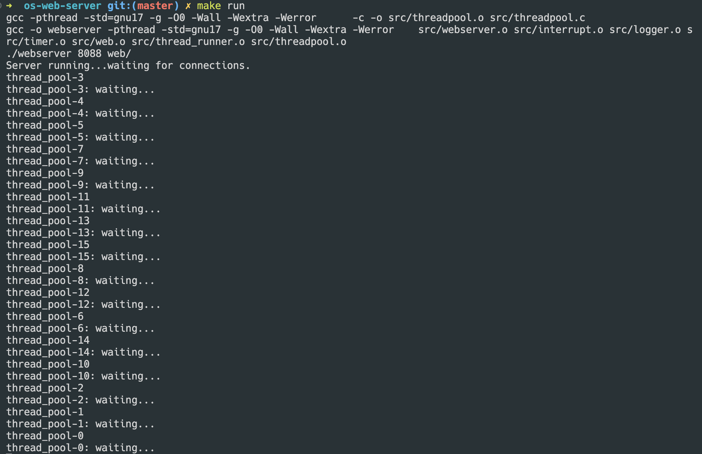
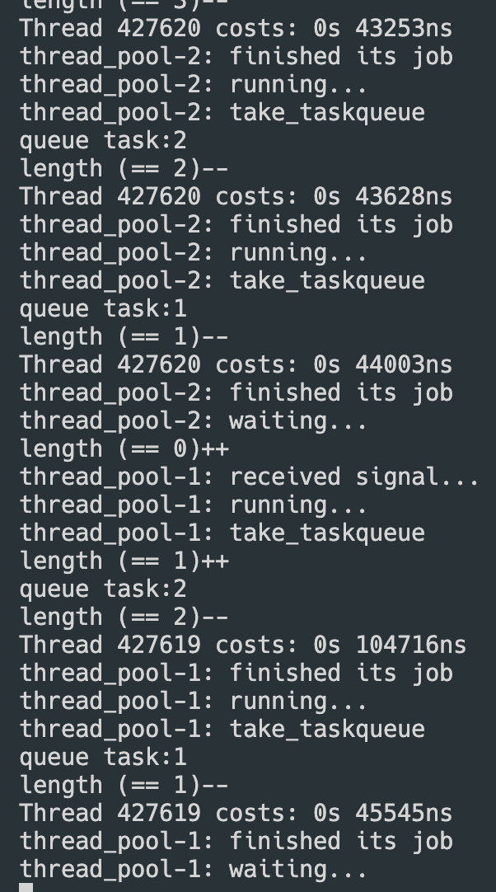
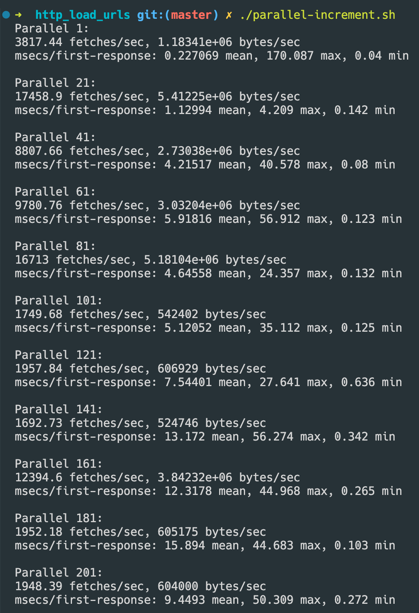
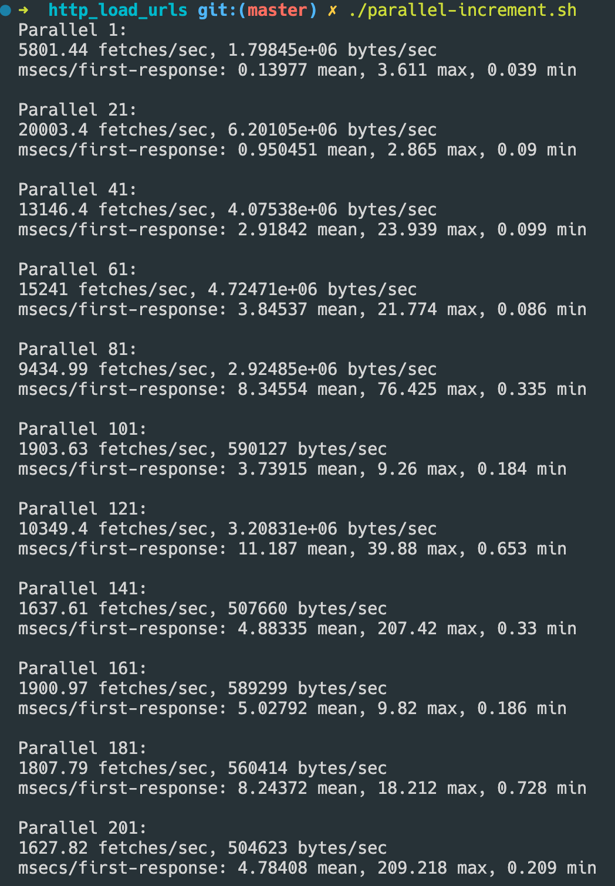
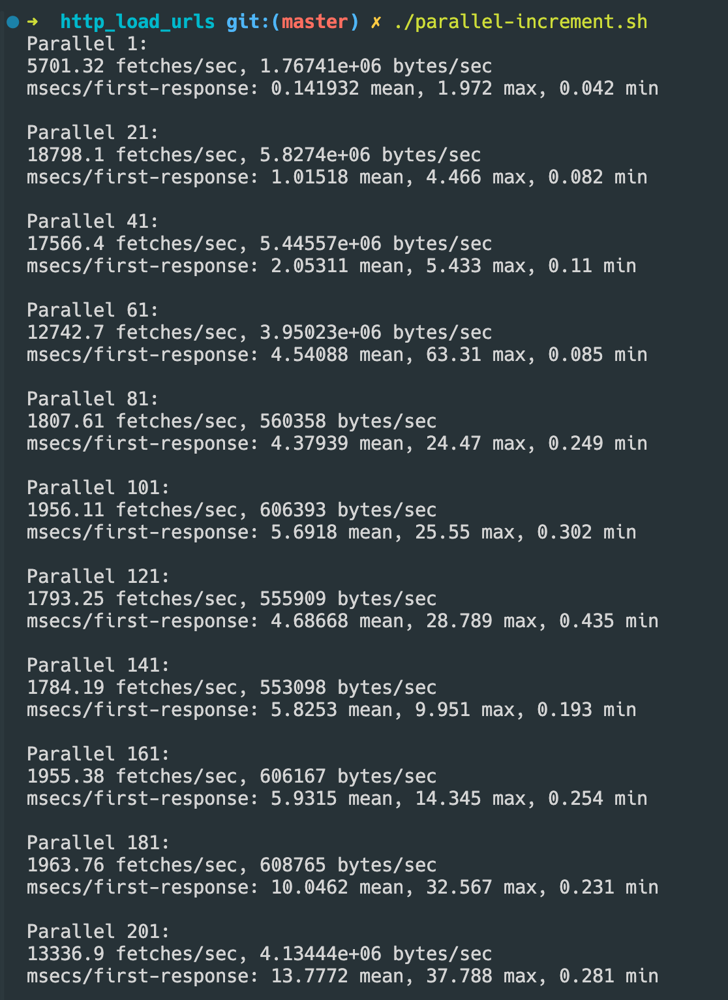
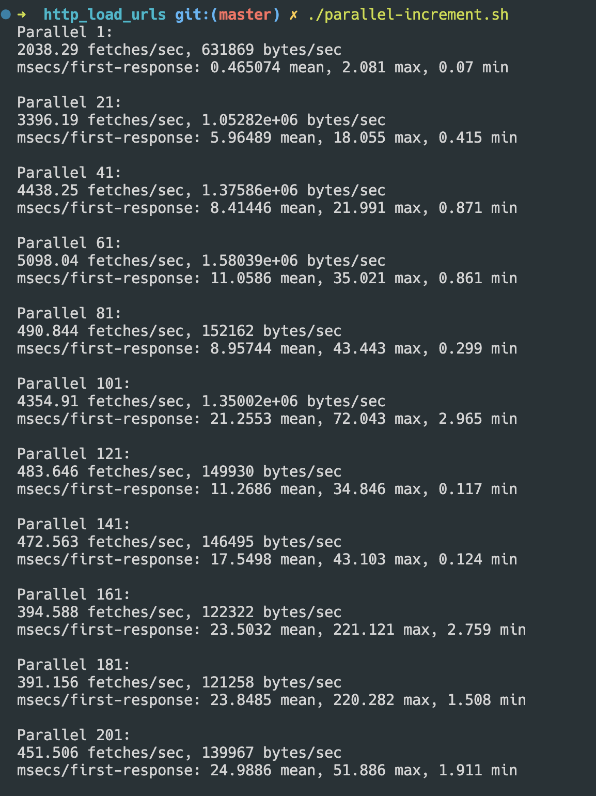

# 实验4

## 题目1

> 题目1.添补相应的程序代码到上面函数中“……”位置处。

可以从代码中看到需要补全的函数有两个：

- `void destroy_thread_pool(threadpool *pool)`
- `void *thread_do(thread *pthread)`

###  destroy_thread_pool

```c
// 销毁线程池 (需要补全)
void destroy_thread_pool(threadpool *pool) {
  // 需等待任务队列为空，并且运行线程执行完任务后，再销毁任务队列
  wait_thread_pool(pool);
  // 线程池不存活，不再接受任务
  pool->is_alive = false;

  // 销毁线程指针数组，并释放所有为线程池分配的内存
  // 销毁线程指针
  // 这里不用互斥锁读取 num_thread 是因为所有的子线程全部都退出了
  for (int i = 0; i < pool->num_threads; i++) {
    free(pool->threads[i]);
  }
  // 销毁线程数组
  free(pool->threads);

  // 销毁 lock
  if (pthread_mutex_destroy(&pool->thread_count_lock) != 0) {
    perror("pthread_mutex_destroy");
    exit(EXIT_FAILURE);
  }

  // 销毁 cond
  if (pthread_cond_destroy(&pool->threads_all_idle) != 0) {
    perror("pthread_mutex_destroy");
    exit(EXIT_FAILURE);
  }

  // 销毁任务队列
  destroy_taskqueue(&pool->queue);

  // 销毁线程池本身
  free(pool);
}
```

### thread_do

```c
// 线程运行的逻辑函数
void *thread_do(thread *pthread) {
  // 设置线程名字
  char thread_name[128] = {0};
  sprintf(thread_name, "thread_pool-%d", pthread->id);
  prctl(PR_SET_NAME, thread_name);
  printf("%s\n", thread_name);

  // 获得线程池
  threadpool *pool = pthread->pool;

  // 在线程池初始化时，用于已经创建线程的计数，执行 pool->num_threads++;
  pthread_mutex_lock(&pool->thread_count_lock);
  pool->num_threads++;
  pthread_mutex_unlock(&pool->thread_count_lock);

  // 线程一直循环往复运行，直到 pool->is_alive 变为 false
  while (pool->is_alive) {
    // 如果任务队列中还有任务，则继续运行，否则阻塞
    pthread_mutex_lock(&pool->queue.has_jobs->mutex);
    // 没任务的时候一直阻塞
    while (pool->queue.has_jobs->status == false) {
      // note: 这个 cond 要配合 pool->queue.has_jobs->status 的变化来使用
      printf("%s: waiting...\n", thread_name);
      pthread_cond_wait(&pool->queue.has_jobs->cond,
                        &pool->queue.has_jobs->mutex);
      printf("%s: received signal...\n", thread_name);
    }
    pthread_mutex_unlock(&pool->queue.has_jobs->mutex);
    printf("%s: running...\n", thread_name);

    if (pool->is_alive == false) {
      break;
    }

    // 执行到此位置，表明线程在工作，需要对工作线程数量进行计数
    pthread_mutex_lock(&pool->thread_count_lock);
    pool->num_working++;
    pthread_mutex_unlock(&pool->thread_count_lock);

    // take_taskqueue 从任务队列头部提取任务，并在队列中删除此任务
    printf("%s: take_taskqueue\n", thread_name);
    task *const current_task = take_taskqueue(&pool->queue);
    if (current_task == NULL) {
      continue;
    }

    // 从任务队列的队首提取任务并执行
    void (*const function)(void *) = current_task->function;
    void *const arg = current_task->arg;
    if (function == NULL) {
      printf("%s: Trying to call a null function\n", thread_name);
      free(current_task);
      continue;
    }

    function(arg);
    // free task
    free(current_task);

    // 执行到此位置，表明线程已经将任务执行完成，需更改工作线程数量
    pthread_mutex_lock(&pool->thread_count_lock);
    pool->num_working--;
    // 此处还需注意，当工作线程数量为 0 ，表示任务全部完成，要让阻塞在
    // wait_thread_pool() 函数上的线程继续运行
    if (pool->num_working == 0) {
      pthread_cond_signal(&pool->threads_all_idle);
    }
    pthread_mutex_unlock(&pool->thread_count_lock);

    printf("%s: finished its job\n", thread_name);
  }
  // 运行到此位置表明，线程将要退出，需更改当前线程池中的线程数量
  pthread_mutex_lock(&pool->thread_count_lock);
  pool->num_threads--;
  pthread_mutex_unlock(&pool->thread_count_lock);

  pthread_exit(NULL);
}
```

## 题目2

> 题目2.完成函数push_taskqueue，take_taskqueue，init_taskqueue和destory_taskqueue。

### init_taskqueue

```c
// 初始化任务队列
void init_taskqueue(taskqueue *queue) {
  // 将所有内存置 0
  memset(queue, 0, sizeof(*queue));

  // 初始化 mutex
  if (pthread_mutex_init(&queue->mutex, NULL) != 0) {
    perror("pthread_mutex_init init failed");
    exit(EXIT_FAILURE);
  }

  // 分配 dummy head
  queue->front = (task *)calloc(1, sizeof(task));
  queue->rear = (task *)calloc(1, sizeof(task));

  queue->front->next = queue->rear;
  queue->rear->next = queue->front;

  // 分配 has_jobs
  // ** 初始化互斥锁之前，必须将其所在的内存清零 **
  queue->has_jobs = (staconv *)calloc(1, sizeof(staconv));
  // 初始化 mutex
  if (pthread_mutex_init(&queue->has_jobs->mutex, NULL) != 0) {
    perror("pthread_mutex_init init failed");
    exit(EXIT_FAILURE);
  }
  // 初始化用于阻塞和唤醒线程池中线程的 cond:
  // 1. 初始化条件变量属性
  pthread_condattr_t cattr;
  if (pthread_condattr_init(&cattr) != 0) {
    perror("pthread_condattr_init failed");
    exit(EXIT_FAILURE);
  }
  // 2. 初始化条件变量
  if (pthread_cond_init(&queue->has_jobs->cond, &cattr) != 0) {
    perror("pthread_cond_init failed");
    exit(EXIT_FAILURE);
  }

  // status 初始化为无任务
  queue->has_jobs->status = false;

  // length 初始化为 0
  queue->length = 0;
}
```

### destroy_taskqueue

```c
// 销毁任务队列
void destroy_taskqueue(taskqueue *queue) {
  // 删除 has_jobs
  // 1. 释放mutex和cond
  if (pthread_mutex_destroy(&queue->has_jobs->mutex) != 0) {
    perror("pthread_mutex_destroy");
    exit(EXIT_FAILURE);
  }
  if (pthread_cond_destroy(&queue->has_jobs->cond) != 0) {
    perror("pthread_mutex_destroy");
    exit(EXIT_FAILURE);
  }
  // 2. 释放内存
  free(queue->has_jobs);

  // 删除 front 和 rear 的两个 dummyhead
  free(queue->front);
  free(queue->rear);

  // 释放 mutex
  if (pthread_mutex_destroy(&queue->mutex) != 0) {
    perror("pthread_mutex_destroy");
    exit(EXIT_FAILURE);
  }
}
```

### push_taskqueue

```c
// 将任务加入队列
void push_taskqueue(taskqueue *queue, task *curtask) {
  // 需要 lock 的参与
  pthread_mutex_lock(&queue->mutex);
  // 将参数的任务放入链表中的队列尾部
  // 将最后一个任务的 next 指向新任务
  queue->rear->next->next = curtask;
  // 将 rear 指向 新任务
  queue->rear->next = curtask;
  // 将新任务的 next 指向 rear
  curtask->next = queue->rear;

  // length++
  printf("length (== %d)++ \n", queue->length);
  queue->length++;

  pthread_mutex_lock(&queue->has_jobs->mutex);
  // 同时，将 has_jobs 的 status 设置为 true，进行 signal 操作
  if (queue->has_jobs->status == false) {
    queue->has_jobs->status = true;
    pthread_cond_signal(&queue->has_jobs->cond);
  }
  pthread_mutex_unlock(&queue->has_jobs->mutex);

  // 释放 lock
  pthread_mutex_unlock(&queue->mutex);
}
```

### take_taskqueue

```c
// take_taskqueue 从任务队列头部提取任务，并在队列中删除此任务
task *take_taskqueue(taskqueue *queue) {
  // 需要 lock 的参与
  pthread_mutex_lock(&queue->mutex);
  // 可能会有因为调度问题产生的 queue length 为 0 的情况
  // 具体是因为：当前线程由于调度问题有一段时间没有获取队列头的任务
  // 在这期间，其他线程跳过了条件检查（state == true）
  // 从而“帮忙”当前线程完成了任务，而当前线程仍然试图获取队列头任务
  // 如果队列长度为 0，则必定报错
  // 所以，增加该条件以解决该问题
  if (queue->length == 0) {
    pthread_mutex_unlock(&queue->mutex);
    return NULL;
  }
  
  // 将参数的任务从链表中的队列头部取出
  printf("queue task:%d\n", queue->length);
  task *const to_fetch_task = queue->front->next;
  // 将 dummyhead 的下一个设置为 to_fetch_task 的下一个
  if (queue->front == NULL) {
    printf("dereference a nullptr queue->front\n");
    exit(EXIT_FAILURE);
  }
  if (to_fetch_task == NULL) {
    printf("dereference a nullptr to_fetch_task\n");
    exit(EXIT_FAILURE);
  }
  queue->front->next = to_fetch_task->next;
  if (queue->length == 1) {
    queue->rear->next = queue->front;
  }
  // length--
  printf("length (== %d)-- \n", queue->length);
  queue->length--;

  // 由于length减少，如果 length 降为 0，那么 queue->has_jobs->status = false;
  pthread_mutex_lock(&queue->has_jobs->mutex);
  if (queue->length == 0) {
    queue->has_jobs->status = false;
  }
  pthread_mutex_unlock(&queue->has_jobs->mutex);

  // 释放 lock
  pthread_mutex_unlock(&queue->mutex);
  // 返回 task
  return to_fetch_task;
}
```

## 题目3 - 4

> 题目3.添加必要的程序代码，以最终完成线程池。

> 题目4.利用实现的线程池，替换实验3中Web服务的多线程模型。

增加了线程池模型后，需要在主函数进行修改。

1. 首先，需要在主函数对线程池初始化

```c
// 线程数量
#define NUM_THREADS 16

...
    
int main(int argc, char const *argv[]) {
  ...
   
  // 初始化线程池
  threadpool *const pool = init_thread_pool(NUM_THREADS);
      
  ...
}
```

2. 在不断accept的循环中，将原本负责新增线程的部分，替换为如下内容：

```c
  // 需要给 thread runner 传递的参数
    struct thread_runner_arg *const args =
        (struct thread_runner_arg *)calloc(1, sizeof(*args));
    args->socketfd = socketfd;
    args->hit = hit;

    // 创建 task
    task *const new_task = (task *)calloc(1, sizeof(task));
    new_task->next = NULL;
    new_task->function = (void *)thread_runner;
    new_task->arg = args;

    // 将 task 放入线程池中
    add_task_to_thread_pool(pool, new_task);
```

这样即可替换完成。

编译后，可以正常运行：



这里显示了15个线程都在对请求进行等待。

对该 web 服务器进行请求，程序会输出如下结果：



提供的输出结果主要展示了线程池中线程的任务处理过程、任务队列的变化以及线程执行时间等信息:

1. **任务处理过程**：

    - 程序使用了线程池(thread pool)来处理任务。首先，线程池中的某个线程从任务队列中取出一个任务并开始执行，执行完毕后再次从任务队列中取出任务，如此往复。
    
    - 另一个线程在空闲状态时接收到一个信号，开始从任务队列中取出任务执行，完成后再次进入等待状态。


2. **任务队列长度变化**：
    - 在输出信息中，通过”queue task:X”这样的语句可以看出任务队列中的任务数量在不同时间点发生了变化。当任务队列长度为0时，线程池中的某个线程会收到一个信号，此时任务队列长度会递增，然后线程池中的线程会取出任务执行。当线程执行完任务后，队列长度再次减少。


3. **线程执行时间**：
    - 输出中包含了每个线程处理任务的耗时情况，如”Thread 427620 costs: 0s 43628ns”。可以看出，不同线程在执行任务时消耗的时间略有不同，包括耗时长短以及不同的任务耗时。


4. **线程池状态**：
    - 线程池中的线程在处理完任务后会有不同的状态，包括运行中、完成任务、等待任务等状态。这些状态变化可以帮助我们了解线程池中线程的工作情况和任务执行情况。


## 题目5

> 题目5.调整线程池中线程个数参数，以达到Web服务并发性能最优。

使用 `parallels-increment.sh` 进行对 NUM_THREAD 不同的服务器进行测试：

```bash
#!/bin/zsh

for i in {1..201..20};
do
  echo "Parallel $i:"
  http_load -parallel $i -fetches 2000 urls.txt | grep -E '(fetches/sec|bytes/sec|msecs/first-response)'
  echo ''
done

```

### 4线程



### 8线程



### 16线程



从以上测试结果来看，8 线程的性能最好，因此设置线程为8 即可。

> 利用http_load及其它性能参数，分析和对比多线程模型与线程池模型在Web服务进程中的优点和缺点。

### 分析和对比多线程模型与线程池模型

以下是多线程模型：



#### 多线程模型

1. 优点

    - 更灵活：多线程模型中的线程可以根据需要动态创建和销毁，更加灵活适应不同的并发请求量。

    - 独立性：每个线程都是独立的，可以并行处理不同的请求，提高处理效率。

    - 快速响应：在低并发情况下，多线程模型能够快速响应请求，降低平均响应时间。

2. 缺点：

    - 资源消耗：多线程模型下线程的创建和销毁会消耗一定资源，如果并发数过大，可能导致系统资源耗尽。

    - 竞态条件：线程间共享数据时需要处理竞态条件，需要额外的线程同步机制，降低了系统性能。
    - 线程管理：需要管理大量的线程，容易出现线程泄漏、线程阻塞等问题，增加了系统复杂度。


#### 线程池模型：

1. 优点：

    - 资源管理：线程池能够提前创建一定数量的线程，减少了线程创建和销毁的开销，提高了资源利用率。

    - 减少竞争：线程池中的线程通过任务队列分配任务，减少了线程间的竞争，提高了系统的并发性能。

    - 限流控制：可以通过控制线程池的大小来限制并发请求数，防止系统过载而崩溃。

    - 统一管理：线程池统一管理线程的创建、销毁和复用，简化了线程管理，降低了系统复杂度。

2. 缺点：

    - 初始化开销：线程池需要初始化并维护一定数量的线程，会在启动时产生一定的开销。

    - 队列阻塞：如果任务队列中积压过多任务，可能会导致队列阻塞，影响系统的实时响应性。

    - 难以调优：线程池内部的线程分配策略和任务调度策略调优相对复杂，需要综合考虑系统负载、并发请求数等因素。


### 对比分析：

- 多线程模型相对更加灵活适应小规模、频繁变化的并发请求，适合对实时性要求较高的场景；而线程池模型适用于大规模、稳定的并发请求，在资源管理和并发控制方面有明显优势。

- 多线程模型需要更多关于线程管理的开销及优化，而线程池模型则更加侧重于任务管理和资源利用率的优化。

- 根据系统需求和场景选择合适的模型，有助于提高系统性能和稳定性。

多线程模型和线程池模型在Web服务进程中各有优劣，根据具体的应用场景和要求选择合适的模型进行应用，以达到最佳的性能和效果。

## 附录：主要代码

```c
// Server Code

// webserver.c

// The following main code from https://github.com/ankushagarwal/nweb*, but they
// are modified slightly

// to use POSIX features
#define _POSIX_C_SOURCE 200809L
#define _GNU_SOURCE

#include <arpa/inet.h>
#include <asm-generic/socket.h>
#include <bits/pthreadtypes.h>
#include <netinet/in.h>
#include <pthread.h>
#include <semaphore.h>
#include <stdio.h>
#include <stdlib.h>
#include <string.h>
#include <sys/socket.h>
#include <sys/types.h>
#include <time.h>
#include <unistd.h>

#include "include/interrupt.h"
#include "include/logger.h"
#include "include/thread_runner.h"
#include "include/threadpool.h"
#include "include/timer.h"
#include "include/types.h"
#include "include/web.h"

// extensions
struct file_extension extensions[] = {
    {"gif", "image/gif"},  {"jpg", "image/jpg"}, {"jpeg", "image/jpeg"},
    {"png", "image/png"},  {"ico", "image/ico"}, {"zip", "image/zip"},
    {"gz", "image/gz"},    {"tar", "image/tar"}, {"htm", "text/html"},
    {"html", "text/html"}, {NULL, NULL},
};

// semaphore init
sem_t *logging_semaphore = NULL;
sem_t *timer_semaphore = NULL;

// global timer pointer
struct timespec *global_thread_timer = NULL;
struct timespec *global_rsocket_timer = NULL;
struct timespec *global_wsocket_timer = NULL;
struct timespec *global_rfile_timer = NULL;
struct timespec *global_logger_timer = NULL;

// 子线程数初始化为 0
long thread_count = 0;

threadpool *global_pool = NULL;

// 解析命令参数
void argument_check(int argc, char const *argv[]);

// 捕捉 Ctrl+C 信号的 sigIntHandler
void sig_handler_init(void);

// 用来初始化信号量的函数
sem_t *semaphore_allocate_init(void);

// 全局计时器初始化
struct timespec *timer_init(void);

int main(int argc, char const *argv[]) {
  // 解析命令参数
  argument_check(argc, argv);

  // 捕捉 Ctrl+C 信号的 sigIntHandler
  sig_handler_init();

  // 初始化信号量
  logging_semaphore = semaphore_allocate_init();
  timer_semaphore = semaphore_allocate_init();

  // 全局计时器初始化
  global_thread_timer = timer_init();
  global_rsocket_timer = timer_init();
  global_wsocket_timer = timer_init();
  global_rfile_timer = timer_init();
  global_logger_timer = timer_init();

  // 建立服务端侦听 socket
  long listenfd;
  if ((listenfd = socket(AF_INET, SOCK_STREAM, 0)) < 0) {
    logger(ERROR, "system call", "socket", 0);
    perror("socket error");
    exit(EXIT_FAILURE);
  }

  const int enable = 1;
  if (setsockopt(listenfd, SOL_SOCKET, SO_REUSEADDR, &enable, sizeof(int)) <
      0) {
    perror("setsocket error");
    exit(EXIT_FAILURE);
  }

  const long port = atoi(argv[1]);
  if (port < 0 || port > 60000) {
    logger(ERROR, "Invalid port number (try 1->60000)", argv[1], 0);
    exit(EXIT_FAILURE);
  }

  static struct sockaddr_in serv_addr; // static = initialised to zeros
  serv_addr.sin_family = AF_INET;
  serv_addr.sin_addr.s_addr = htonl(INADDR_ANY);
  serv_addr.sin_port = htons(port);

  if (bind(listenfd, (struct sockaddr *)&serv_addr, sizeof(serv_addr)) < 0) {
    logger(ERROR, "system call", "bind", 0);
    perror("bind error");
    exit(EXIT_FAILURE);
  }

  if (listen(listenfd, LISTENQ) < 0) {
    logger(ERROR, "system call", "listen", 0);
    perror("listen error");
    exit(EXIT_FAILURE);
  }

  printf("%s\n", "Server running...waiting for connections.");

  static struct sockaddr_in cli_addr; // static = initialised to zeros
  socklen_t length = sizeof(cli_addr);

  // 初始化线程池
  threadpool *const pool = init_thread_pool(NUM_THREADS);
  global_pool = pool;

  for (long hit = 1;; hit++) {
    // Await a connection on socket FD.
    long socketfd;
    if ((socketfd = accept(listenfd, (struct sockaddr *)&cli_addr, &length)) <
        0) {
      logger(ERROR, "system call", "accept", 0);
      perror("accept error");
      exit(EXIT_FAILURE);
    }

    // 成功，放入线程池中
    // 需要给 thread runner 传递的参数
    struct thread_runner_arg *const args =
        (struct thread_runner_arg *)calloc(1, sizeof(*args));
    args->socketfd = socketfd;
    args->hit = hit;

    // 创建 task
    task *const new_task = (task *)calloc(1, sizeof(task));
    new_task->next = NULL;
    new_task->function = (void *)thread_runner;
    new_task->arg = args;

    // 将 task 放入线程池中›
    add_task_to_thread_pool(pool, new_task);

    // 创建线程成功，任务数增加
    thread_count++;
  }
}

void argument_check(int argc, char const *argv[]) {
  if (argc < 3 || argc > 3 || !strcmp(argv[1], "-?")) {
    printf(
        "hint: nweb Port-Number Top-Directory\t\tversion %d\n\n"
        "\tnweb is a small and very safe mini web server\n"
        "\tnweb only servers out file/web pages with extensions named below\n"
        "\t and only from the named directory or its sub-directories.\n"
        "\tThere is no fancy features = safe and secure.\n\n"
        "\tExample:webserver 8181 /home/nwebdir &\n\n"
        "\tOnly Supports:",
        VERSION);

    for (long i = 0; extensions[i].ext != 0; i++) {
      printf(" %s", extensions[i].ext);
    }

    printf(
        "\n\tNot Supported: URLs including \"..\", Java, Javascript, CGI\n"
        "\tNot Supported: directories / /etc /bin /lib /tmp /usr /dev /sbin \n"
        "\tNo warranty given or implied\n\tNigel Griffiths nag@uk.ibm.com\n");
    exit(EXIT_SUCCESS);
  }

  if (!strncmp(argv[2], "/", 2) || !strncmp(argv[2], "/etc", 5) ||
      !strncmp(argv[2], "/bin", 5) || !strncmp(argv[2], "/lib", 5) ||
      !strncmp(argv[2], "/tmp", 5) || !strncmp(argv[2], "/usr", 5) ||
      !strncmp(argv[2], "/dev", 5) || !strncmp(argv[2], "/sbin", 6)) {
    printf("ERROR: Bad top directory %s, see nweb -?\n", argv[2]);
    exit(EXIT_FAILURE);
  }

  if (chdir(argv[2]) == -1) {
    printf("ERROR: Can't Change to directory %s\n", argv[2]);
    exit(EXIT_FAILURE);
  }
}

sem_t *semaphore_allocate_init(void) {
  // place semaphore in shared memory
  sem_t *semaphore = (sem_t *)calloc(1, sizeof(*semaphore));

  // initialize semaphore
  if (sem_init(semaphore, 0, 1) < 0) {
    perror("sem_init failed");
    exit(EXIT_FAILURE);
  }

  // passing back
  return semaphore;
}

// 全局计时器初始化
struct timespec *timer_init(void) {
  return calloc(1, sizeof(struct timespec));
}
```

```c
// threadpool.h

#pragma once
#ifndef THREADPOOL_H
#define THREADPOOL_H

#include <bits/pthreadtypes.h>
#include <stdbool.h>

/* Queue status and conditional variable*/
typedef struct staconv {
  pthread_mutex_t mutex;
  pthread_cond_t cond; // 用于阻塞和唤醒线程池中线程

  // 表示任务队列状态：false 为无任务；true 为有任务
  bool status;
} staconv;

/* Task */
typedef struct task {
  struct task *next;           // 指向下一任务的指针
  void (*function)(void *arg); // 函数指针
  void *arg;                   // 函数参数指针
} task;

/* Task Queue */
typedef struct taskqueue {
  pthread_mutex_t mutex; // 用于互斥读/写任务队列
  task *front;           //指向队首
  task *rear;            //指向队尾

  staconv *has_jobs; //根据状态，阻塞线程
  int length;        //队列中任务个数
} taskqueue;

/* Thread Pool */
typedef struct threadpool {
  // 线程指针数组
  // an array of pointer to a struct thread
  struct thread **threads;

  volatile int num_threads;          // 线程池中线程数量 (静态)
  volatile int num_working;          // 目前正在工作的线程个数
  pthread_mutex_t thread_count_lock; // 线程池锁, 用于修改上面两个变量

  pthread_cond_t threads_all_idle; // 用于销毁线程的条件变量

  taskqueue queue; // 等待队列

  volatile bool is_alive; // 表示线程池是否还存活

} threadpool;

/* Thread */
typedef struct thread {
  int id;            // identifiers
  pthread_t pthread; // 封装的 POSIX 线程
  threadpool *pool;  // 与线程池绑定
} thread;

// constructor and destructor of the thread pool
// 线程池初始化函数
threadpool *init_thread_pool(int num_threads);
// 向线程池中添加任务
void add_task_to_thread_pool(struct threadpool *pool, struct task *curtask);
// 等待当前任务全部运行完
void wait_thread_pool(struct threadpool *pool);
// 获取线程池中线程数量
int get_num_of_thread_working(struct threadpool *pool);
// 创建线程
int create_thread(struct threadpool *pool, struct thread *pthread, int id, pthread_attr_t attr);
// 销毁线程池
void destroy_thread_pool(struct threadpool *pool);
// 线程运行的逻辑函数
void *thread_do(struct thread *pthread);

// task queue operations
// 初始化任务队列
void init_taskqueue(struct taskqueue *queue);
// 销毁任务队列
void destroy_taskqueue(struct taskqueue *queue);
// 将任务加入队列
void push_taskqueue(struct taskqueue *queue, struct task *curtask);
// take_taskqueue 从任务队列头部提取任务，并在队列中删除此任务
task *take_taskqueue(struct taskqueue *queue);

#endif
```

```c
// threadpool.c

#include <pthread.h>
#include <stdbool.h>
#include <stdio.h>
#include <stdlib.h>
#include <string.h>
#include <sys/prctl.h>

#include "include/threadpool.h"

threadpool *init_thread_pool(int num_threads) {
  // 创建线程池空间
  threadpool *pool = (threadpool *)calloc(1, sizeof(threadpool));
  pool->num_threads = 0;
  pool->num_working = 0;
  pool->is_alive = true;

  // 初始化互斥量
  if (pthread_mutex_init(&pool->thread_count_lock, NULL) != 0) {
    perror("pthread_mutex_init init failed");
    exit(EXIT_FAILURE);
  }

  // 初始化条件变量属性
  pthread_condattr_t cattr;
  if (pthread_condattr_init(&cattr) != 0) {
    perror("pthread_condattr_init failed");
    exit(EXIT_FAILURE);
  }

  // 初始化条件变量
  if (pthread_cond_init(&pool->threads_all_idle, &cattr) != 0) {
    perror("pthread_cond_init failed");
    exit(EXIT_FAILURE);
  }
  // 初始化任务队列
  init_taskqueue(&pool->queue);

  // 初始化线程的 attribute
  pthread_attr_t attr;
  if (pthread_attr_init(&attr) != 0) {
    perror("pthread_attr_init");
    exit(EXIT_FAILURE);
  }
  // 创建线程数组
  pool->threads = (thread **)calloc(num_threads, sizeof(thread *));
  //创建线程
  for (int i = 0; i < num_threads; i++) {
    create_thread(pool, pool->threads[i], i, attr);
  }

  // 等所有的线程创建完毕，在每个线程运行函数中将进行 pool->num_threads++操作
  // 因此，此处为忙等待，直到所有的线程创建完毕，并马上运行阻塞代码时才返回
  while (pool->num_threads != num_threads) {
    continue;
  }
  return pool;
}

// 向线程池中添加任务
void add_task_to_thread_pool(threadpool *pool, task *curtask) {
  push_taskqueue(&pool->queue, curtask);
}

// Wait until all working and all blocking task finished
// 等待当前任务全部运行完
void wait_thread_pool(threadpool *pool) {
  pthread_mutex_lock(&pool->thread_count_lock);
  while (pool->queue.length || pool->num_working) {
    // 该条件获得信号之前，该函数一直被阻塞。该函数会在被阻塞之前以原子方式释放相关的互斥锁
    // 并在返回之前以原子方式再次获取该互斥锁
    // note:
    // 所以，相应的，子线程需要在 pool->queue.length 或者 pool->num_working
    // 变化的时候进行 signal操作
    pthread_cond_wait(&pool->threads_all_idle, &pool->thread_count_lock);
  }
  pthread_mutex_unlock(&pool->thread_count_lock);
}

// 获取线程池中线程数量
int get_num_of_thread_working(threadpool *pool) { return pool->num_working; }

// 创建线程
int create_thread(threadpool *pool, thread *pthread, int id,
                  pthread_attr_t attr) {
  // 为 pthread 分配内存空间
  if ((pthread = (thread *)calloc(1, sizeof(thread))) == 0) {
    perror("calloc");
    return -1;
  }
  // 设置这个 thread 的属性
  pthread->pool = pool;
  pthread->id = id;
  // 创建线程
  pthread_create(&pthread->pthread, &attr, (void *)thread_do, pthread);
  pthread_detach(pthread->pthread);
  return 0;
}

// 销毁线程池 (需要补全)
void destroy_thread_pool(threadpool *pool) {
  // 需等待任务队列为空，并且运行线程执行完任务后，再销毁任务队列
  wait_thread_pool(pool);
  // 线程池不存活，不再接受任务
  pool->is_alive = false;

  // 销毁线程指针数组，并释放所有为线程池分配的内存
  // 销毁线程指针
  // 这里不用互斥锁读取 num_thread 是因为所有的子线程全部都退出了
  for (int i = 0; i < pool->num_threads; i++) {
    free(pool->threads[i]);
  }
  // 销毁线程数组
  free(pool->threads);

  // 销毁 lock
  if (pthread_mutex_destroy(&pool->thread_count_lock) != 0) {
    perror("pthread_mutex_destroy");
    exit(EXIT_FAILURE);
  }

  // 销毁 cond
  if (pthread_cond_destroy(&pool->threads_all_idle) != 0) {
    perror("pthread_cond_destroy");
    exit(EXIT_FAILURE);
  }

  // 销毁任务队列
  destroy_taskqueue(&pool->queue);

  // 销毁线程池本身
  free(pool);
}

// 线程运行的逻辑函数（需要补全）
void *thread_do(thread *pthread) {
  // 设置线程名字
  char thread_name[128] = {0};
  sprintf(thread_name, "thread_pool-%d", pthread->id);
  prctl(PR_SET_NAME, thread_name);
  printf("%s\n", thread_name);

  // 获得线程池
  threadpool *pool = pthread->pool;

  // 在线程池初始化时，用于已经创建线程的计数，执行 pool->num_threads++;
  pthread_mutex_lock(&pool->thread_count_lock);
  pool->num_threads++;
  pthread_mutex_unlock(&pool->thread_count_lock);

  // 线程一直循环往复运行，直到 pool->is_alive 变为 false
  while (pool->is_alive) {
    // 如果任务队列中还有任务，则继续运行，否则阻塞
    pthread_mutex_lock(&pool->queue.has_jobs->mutex);
    // 没任务的时候一直阻塞
    while (pool->queue.has_jobs->status == false) {
      // note: 这个 cond 要配合 pool->queue.has_jobs->status 的变化来使用
      printf("%s: waiting...\n", thread_name);
      pthread_cond_wait(&pool->queue.has_jobs->cond,
                        &pool->queue.has_jobs->mutex);
      printf("%s: received signal...\n", thread_name);
    }
    pthread_mutex_unlock(&pool->queue.has_jobs->mutex);
    printf("%s: running...\n", thread_name);

    if (pool->is_alive == false) {
      break;
    }

    // 执行到此位置，表明线程在工作，需要对工作线程数量进行计数
    pthread_mutex_lock(&pool->thread_count_lock);
    pool->num_working++;
    pthread_mutex_unlock(&pool->thread_count_lock);

    // take_taskqueue 从任务队列头部提取任务，并在队列中删除此任务
    printf("%s: take_taskqueue\n", thread_name);
    task *const current_task = take_taskqueue(&pool->queue);
    if (current_task == NULL) {
      continue;
    }

    // 从任务队列的队首提取任务并执行
    void (*const function)(void *) = current_task->function;
    void *const arg = current_task->arg;
    if (function == NULL) {
      printf("%s: Trying to call a null function\n", thread_name);
      free(current_task);
      continue;
    }

    function(arg);
    // free task
    free(current_task);

    // 执行到此位置，表明线程已经将任务执行完成，需更改工作线程数量
    pthread_mutex_lock(&pool->thread_count_lock);
    pool->num_working--;
    // 此处还需注意，当工作线程数量为 0 ，表示任务全部完成，要让阻塞在
    // wait_thread_pool() 函数上的线程继续运行
    if (pool->num_working == 0) {
      pthread_cond_signal(&pool->threads_all_idle);
    }
    pthread_mutex_unlock(&pool->thread_count_lock);

    printf("%s: finished its job\n", thread_name);
  }
  // 运行到此位置表明，线程将要退出，需更改当前线程池中的线程数量
  pthread_mutex_lock(&pool->thread_count_lock);
  pool->num_threads--;
  pthread_mutex_unlock(&pool->thread_count_lock);

  pthread_exit(NULL);
}

// task queue operations
// 初始化任务队列
void init_taskqueue(taskqueue *queue) {
  // 将所有内存置 0
  memset(queue, 0, sizeof(*queue));

  // 初始化 mutex
  if (pthread_mutex_init(&queue->mutex, NULL) != 0) {
    perror("pthread_mutex_init init failed");
    exit(EXIT_FAILURE);
  }

  // 分配 dummy head
  queue->front = (task *)calloc(1, sizeof(task));
  queue->rear = (task *)calloc(1, sizeof(task));

  queue->front->next = queue->rear;
  queue->rear->next = queue->front;

  // 分配 has_jobs
  // ** 初始化互斥锁之前，必须将其所在的内存清零 **
  queue->has_jobs = (staconv *)calloc(1, sizeof(staconv));
  // 初始化 mutex
  if (pthread_mutex_init(&queue->has_jobs->mutex, NULL) != 0) {
    perror("pthread_mutex_init init failed");
    exit(EXIT_FAILURE);
  }
  // 初始化用于阻塞和唤醒线程池中线程的 cond:
  // 1. 初始化条件变量属性
  pthread_condattr_t cattr;
  if (pthread_condattr_init(&cattr) != 0) {
    perror("pthread_condattr_init failed");
    exit(EXIT_FAILURE);
  }
  // 2. 初始化条件变量
  if (pthread_cond_init(&queue->has_jobs->cond, &cattr) != 0) {
    perror("pthread_cond_init failed");
    exit(EXIT_FAILURE);
  }

  // status 初始化为无任务
  queue->has_jobs->status = false;

  // length 初始化为 0
  queue->length = 0;
}

// 销毁任务队列
void destroy_taskqueue(taskqueue *queue) {
  // 删除 has_jobs
  // 1. 释放mutex和cond
  if (pthread_mutex_destroy(&queue->has_jobs->mutex) != 0) {
    perror("pthread_mutex_destroy");
    exit(EXIT_FAILURE);
  }
  if (pthread_cond_destroy(&queue->has_jobs->cond) != 0) {
    perror("pthread_cond_destroy");
    exit(EXIT_FAILURE);
  }
  // 2. 释放内存
  free(queue->has_jobs);

  // 删除 front 和 rear 的两个 dummyhead
  free(queue->front);
  free(queue->rear);

  // 释放 mutex
  if (pthread_mutex_destroy(&queue->mutex) != 0) {
    perror("pthread_mutex_destroy");
    exit(EXIT_FAILURE);
  }
}

// 将任务加入队列
void push_taskqueue(taskqueue *queue, task *curtask) {
  // 需要 lock 的参与
  pthread_mutex_lock(&queue->mutex);
  // 将参数的任务放入链表中的队列尾部
  // 将最后一个任务的 next 指向新任务
  queue->rear->next->next = curtask;
  // 将 rear 指向 新任务
  queue->rear->next = curtask;
  // 将新任务的 next 指向 rear
  curtask->next = queue->rear;

  // length++
  printf("length (== %d)++ \n", queue->length);
  queue->length++;

  pthread_mutex_lock(&queue->has_jobs->mutex);
  // 同时，将 has_jobs 的 status 设置为 true，进行 signal 操作
  if (queue->has_jobs->status == false) {
    queue->has_jobs->status = true;
    pthread_cond_signal(&queue->has_jobs->cond);
  }
  pthread_mutex_unlock(&queue->has_jobs->mutex);

  // 释放 lock
  pthread_mutex_unlock(&queue->mutex);
}

// take_taskqueue 从任务队列头部提取任务，并在队列中删除此任务
task *take_taskqueue(taskqueue *queue) {
  // 需要 lock 的参与
  pthread_mutex_lock(&queue->mutex);
  // 可能会有因为调度问题产生的 queue length 为 0 的情况
  // 具体是因为：当前线程由于调度问题有一段时间没有获取队列头的任务
  // 在这期间，其他线程跳过了条件检查（state == true）
  // 从而“帮忙”当前线程完成了任务，而当前线程仍然试图获取队列头任务
  // 如果队列长度为 0，则必定报错
  // 所以，增加该条件以解决该问题
  if (queue->length == 0) {
    pthread_mutex_unlock(&queue->mutex);
    return NULL;
  }

  // 将参数的任务从链表中的队列头部取出
  printf("queue task:%d\n", queue->length);
  task *const to_fetch_task = queue->front->next;
  // 将 dummyhead 的下一个设置为 to_fetch_task 的下一个
  if (queue->front == NULL) {
    printf("dereference a nullptr queue->front\n");
    exit(EXIT_FAILURE);
  }
  if (to_fetch_task == NULL) {
    printf("dereference a nullptr to_fetch_task\n");
    exit(EXIT_FAILURE);
  }
  queue->front->next = to_fetch_task->next;
  if (queue->length == 1) {
    queue->rear->next = queue->front;
  }
  // length--
  printf("length (== %d)-- \n", queue->length);
  queue->length--;

  // 由于length减少，如果 length 降为 0，那么 queue->has_jobs->status = false;
  pthread_mutex_lock(&queue->has_jobs->mutex);
  if (queue->length == 0) {
    queue->has_jobs->status = false;
  }
  pthread_mutex_unlock(&queue->has_jobs->mutex);

  // 释放 lock
  pthread_mutex_unlock(&queue->mutex);
  // 返回 task
  return to_fetch_task;
}
```

