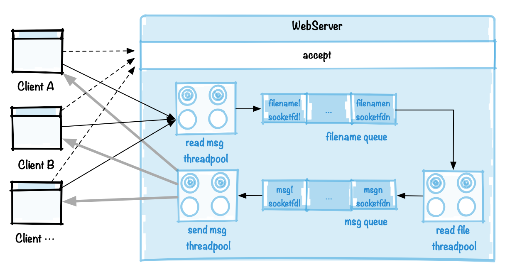
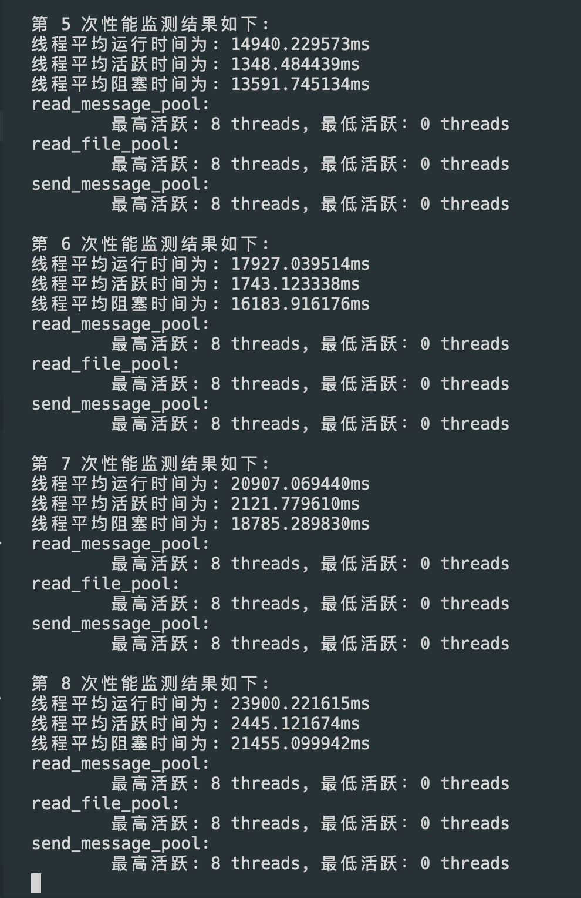
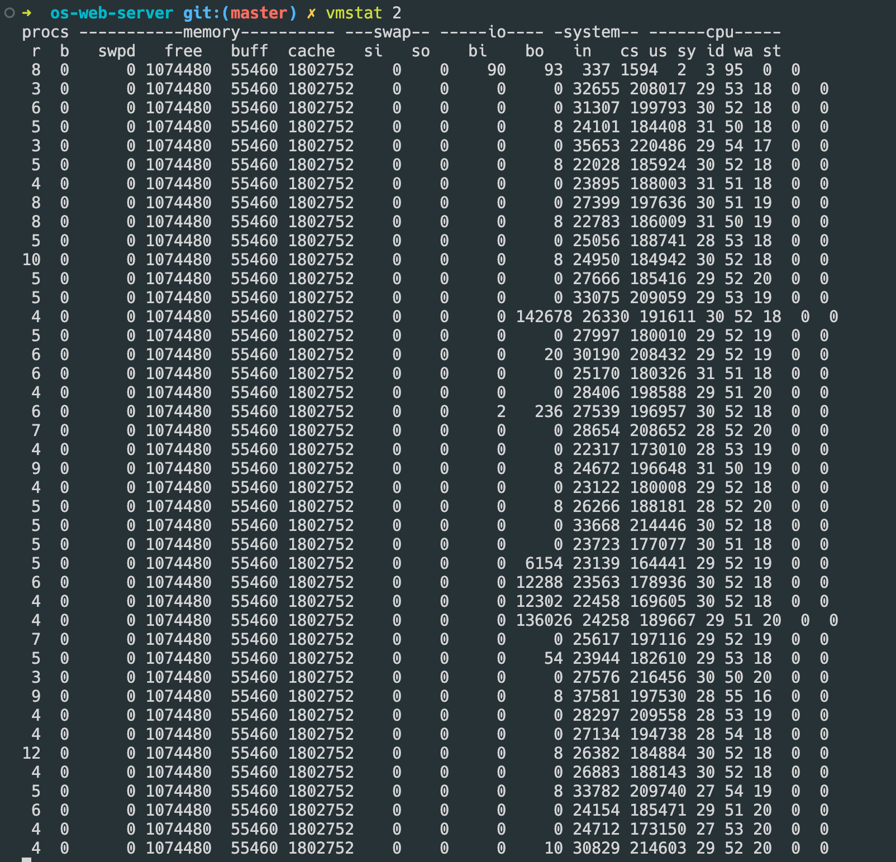
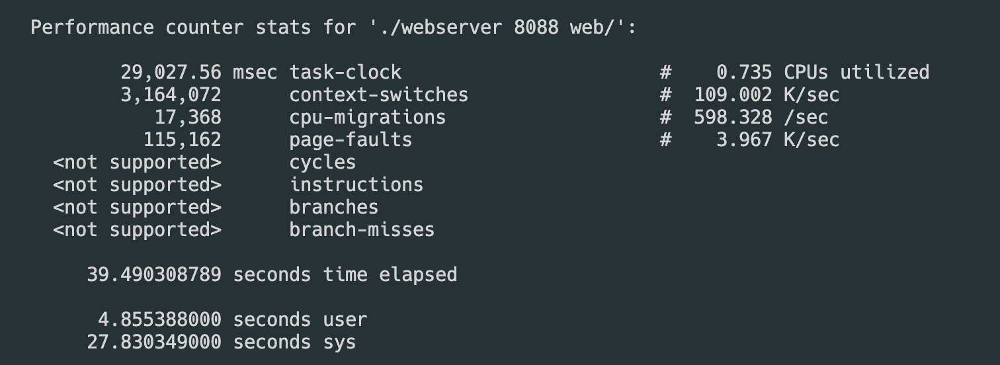
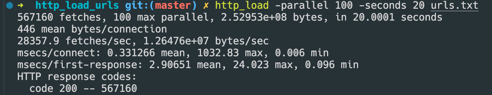

# 实验5

## 题目1
>  
> 题目1.实现上述的业务分割模型的Web服务程序。

对比之前的 Web 服务器模型（线程池模型）来看，该模型主要是将 web 服务器的 `read_message`, `read_file`, `send_message` 分割成了三个部分。由于目前服务器所执行的 `web()` 函数已经具有上述 3个功能，因此只需要将 `web()` 拆分并且稍微修改即可。

### read_message

```c
// 读消息
void read_message(struct read_message_args *const args) {
  const int socketfd = args->socketfd;
  const int hit = args->hit;

  // 释放传进来的参数
  free(args);

  // ** 记得完成回应后释放 buffer **
  char *const buffer = (char *)calloc(BUFSIZE + 1, sizeof(char)); // 设置缓冲区

  const int socket_read_ret =
      read(socketfd, buffer, BUFSIZE); // 从连接通道中读取客户端的请求消息
  if (socket_read_ret == 0 || socket_read_ret == -1) {
    // 如果读取客户端消息失败，则向客户端发送 HTTP 失败响应信息
    logger(FORBIDDEN, "failed to read browser request", "", socketfd);
    close(socketfd);
    return;
  }

  if (socket_read_ret > 0 && socket_read_ret < BUFSIZE) {
    // 设置有效字符串，即将字符串尾部表示为 0
    buffer[socket_read_ret] = 0;
  } else {
    buffer[0] = 0;
  }

  for (long i = 0; i < socket_read_ret; i++) {
    // 移除消息字符串中的“CF”和“LF”字符
    if (buffer[i] == '\r' || buffer[i] == '\n') {
      buffer[i] = '*';
    }
  }

  logger(LOG, "request", buffer, hit);

  // 判断客户端 HTTP 请求消息是否为 GET 类型，如果不是则给出相应的响应消息

  if (strncmp(buffer, "GET ", 4) && strncmp(buffer, "get ", 4)) {
    logger(FORBIDDEN, "Only simple GET operation supported", buffer, socketfd);
    close(socketfd);
    return;
  }

  int buflen = 0;
  for (long i = 4; i < BUFSIZE; i++) {
    // null terminate after the second space to ignore extra stuff
    if (buffer[i] == ' ') { // string is "GET URL " + lots of other stuff
      buffer[i] = 0;
      // set length of the buffer to i
      buflen = i;
      break;
    }
  }

  for (long j = 0; j < buflen - 1; j++) {
    // 在消息中检测路径，不允许路径中出现 '.'
    if (buffer[j] == '.' && buffer[j + 1] == '.') {
      logger(FORBIDDEN, "Parent directory (..) path names not supported",
             buffer, socketfd);
      close(socketfd);
      return;
    }
  }
  if (!strncmp(&buffer[0], "GET /\0", 6) ||
      !strncmp(&buffer[0], "get /\0", 6)) {
    // 如果请求消息中没有包含有效的文件名，则使用默认的文件名 index.html
    strcpy(buffer, "GET /index.html");
  }

  // 根据预定义在 extensions 中的文件类型，检查请求的文件类型是否本服务器支持

  buflen = strlen(buffer);
  const char *filetype = NULL;

  for (long i = 0; extensions[i].ext != 0; i++) {
    long len = strlen(extensions[i].ext);
    if (!strncmp(&buffer[buflen - len], extensions[i].ext, len)) {
      filetype = extensions[i].filetype;
      break;
    }
  }

  if (filetype == NULL) {
    logger(FORBIDDEN, "file extension type not supported", buffer, socketfd);
    close(socketfd);
    return;
  }

  // 接下来，调用 read_file

  // 设定参数
  struct read_file_args *const next_args =
      (struct read_file_args *)malloc(sizeof(*next_args));
  // ** 记得完成回应后释放 buffer **
  next_args->buffer = buffer;
  next_args->socketfd = socketfd;
  next_args->filetype = filetype;
  next_args->hit = hit;

  // 创建 task
  task *const new_task = (task *)malloc(sizeof(task));
  new_task->next = NULL;
  new_task->function = (void *)read_file;
  new_task->arg = next_args;

  // 送进 filename queue
  add_task_to_thread_pool(read_file_pool, new_task);

  return;
}
```

 `read_message` 主要负责处理客户端的请求消息。具体功能包括：

1. **读取消息内容**：从客户端发送的套接字中读取请求消息内容。
2. **处理消息格式**：对消息内容进行处理，包括去除回车换行字符，并检查消息类型是否为 GET 请求。
3. **校验路径安全性**：检查请求的路径是否包含父目录(”..”)或其他不安全字符，确保服务器的安全性。
4. **确定文件类型**：根据请求的路径和预定义的文件类型(extension)进行匹配，确定请求的文件类型是否服务器支持。
5. **准备调用 `read_file`**：将处理后的参数传递给下一个处理任务 read_file，并将该任务传递给线程池进行处理。

### read_file

```c
// 打开文件，读文件，调用 send message
void read_file(struct read_file_args *const args) {
  // 获得参数内容
  char *const buffer = args->buffer;
  const int socketfd = args->socketfd;
  const char *const filetype = args->filetype;
  const int hit = args->hit;

  // 释放参数
  free(args);

  // 打开文件
  int filefd = -1;
  if ((filefd = open(&buffer[5], O_RDONLY)) == -1) { // 打开指定的文件名
    logger(NOTFOUND, "failed to open file", &buffer[5], socketfd);
    close(socketfd);
    return;
  }

  logger(LOG, "SEND", &buffer[5], hit);

  off_t len = lseek(filefd, (off_t)0, SEEK_END); // 通过 lseek 获取文件长度
  lseek(filefd, (off_t)0, SEEK_SET); // 将文件指针移到文件首位置

  sprintf(buffer,
          "HTTP/1.1 200 OK\n"
          "Server: nweb/%d.0\n"
          "Content-Length: %ld\n"
          "Connection: close\n"
          "Content-Type: %s",
          VERSION, len, filetype); // Header without a blank line

  logger(LOG, "Header", buffer, hit);

  sprintf(buffer,
          "HTTP/1.1 200 OK\n"
          "Server: nweb/%d.0\n"
          "Content-Length: %ld\n"
          "Connection: close\n"
          "Content-Type: %s\n\n",
          VERSION, len, filetype); // Header + a blank line

  // 准备调用 send_message
  struct send_mesage_args *const next_args =
      (struct send_mesage_args *)malloc(sizeof(*next_args));
  next_args->filefd = filefd;
  next_args->socketfd = socketfd;
  next_args->buffer = buffer;

  // 创建 task
  task *const new_task = (task *)malloc(sizeof(task));
  new_task->next = NULL;
  new_task->function = (void *)send_mesage;
  new_task->arg = next_args;

  // write to socketfd;
  add_task_to_thread_pool(send_message_pool, new_task);

  return;
}

// 发送消息
void send_mesage(struct send_mesage_args *const args) {
  const int filefd = args->filefd;
  const int socketfd = args->socketfd;
  char *const buffer = args->buffer;

  // 释放传进来的参数
  free(args);

  // 使用信号量保证回应的连续性
  if (sem_wait(output_sempaphore) < 0) {
    perror("sem_wait");
    exit(EXIT_FAILURE);
  }

  // CRITICAL SECTION BEGINS

  // 写 header
  write(socketfd, buffer, strlen(buffer));

  // 写 body
  // 不停地从文件里读取文件内容，并通过 socket 通道向客户端返回文件内容
  int bytes_to_write = -1;
  while ((bytes_to_write = read(filefd, buffer, BUFSIZE)) > 0) {
    write(socketfd, buffer, bytes_to_write);
  }

  // CRITICAL SECTION ENDS
  if (sem_post(output_sempaphore) < 0) {
    perror("sem_post");
    exit(EXIT_FAILURE);
  }

  // 读取文件失败
  if (bytes_to_write < 0) {
    perror("read error");
    close(filefd);
    close(socketfd);
    return;
  }

  // 关闭文件，关闭 socket
  close(filefd);
  close(socketfd);

  // 释放 buffer
  free(buffer);

  return;
}
```

`read_file` 主要负责以下操作：

1. **打开文件**：通过调用 open 函数打开指定的文件，如果打开失败则记录日志并关闭套接字。
2. **获取文件长度**：通过 lseek 函数获取文件的长度，并将文件指针移到文件开始位置。
3. **生成 HTTP 响应头**：根据服务器版本号、文件长度、连接状态和文件类型生成 HTTP 响应的头部信息。
4. **准备调用** **`send_message`**：为下一个处理任务 send_message 准备传递的参数，并创建新的任务结构体。
5. **将任务添加到线程池**：将新生成的任务添加到线程池 send_message_pool 中等待执行。

### send_message

```c
// 发送消息
void send_mesage(struct send_mesage_args *const args) {
  const int filefd = args->filefd;
  const int socketfd = args->socketfd;
  char *const buffer = args->buffer;

  // 释放传进来的参数
  free(args);

  // 使用信号量保证回应的连续性
  if (sem_wait(output_sempaphore) < 0) {
    perror("sem_wait");
    exit(EXIT_FAILURE);
  }

  // CRITICAL SECTION BEGINS

  // 写 header
  write(socketfd, buffer, strlen(buffer));

  // 写 body
  // 不停地从文件里读取文件内容，并通过 socket 通道向客户端返回文件内容
  int bytes_to_write = -1;
  while ((bytes_to_write = read(filefd, buffer, BUFSIZE)) > 0) {
    write(socketfd, buffer, bytes_to_write);
  }

  // CRITICAL SECTION ENDS
  if (sem_post(output_sempaphore) < 0) {
    perror("sem_post");
    exit(EXIT_FAILURE);
  }

  // 读取文件失败
  if (bytes_to_write < 0) {
    perror("read error");
    close(filefd);
    close(socketfd);
    return;
  }

  // 关闭文件，关闭 socket
  close(filefd);
  close(socketfd);

  // 释放 buffer
  free(buffer);

  return;
}
```

`send_mesage` 主要负责以下操作：

1. **写入 Header**：将生成的 HTTP 响应头信息写入到客户端套接字中，通知客户端即将发送的内容长度和类型。
2. **发送文件内容**：从文件中读取内容，并通过套接字通道向客户端持续发送文件内容，直到文件内容全部发送完成。
3. **处理读取文件失败**：如果文件读取失败，则记录错误日志并关闭文件和套接字。
4. **关闭文件和 `socket`**：在文件和内容发送完成后，关闭文件描述符和客户端套接字，释放资源。
5. **释放 buffer**：释放用于存储消息内容的缓冲区内存。

## 题目2

>  题目2.在程序里面设置性能监测代码，通过定时打印这些性能参数，能够分析此Web服务程序的运行状态。例如，线程池中线程平均活跃时间及其阻塞时间，线程最高活跃数量、最低活跃数量、平均活跃数量；消息队列中消息的长度等。除此以外还可以利用相关系统命令来监测系统的I/O、内存、CPU等设备性能。

要实现如上功能，我的思路是设置一个新线程来运行函数monitor，monitor 的具体作用是每 3 秒对

- 线程平均运行时间
- 线程平均阻塞时间
- 线程平均活跃时间

以及

- 每个线程池的最高活跃线程数量
- 每个线程池的最低活跃线程数量

进行监控，并且输出结果。

具体实现如下：

```c
// timer variables initialization
struct timespec thread_active_time = (struct timespec){
    .tv_sec = 0,
    .tv_nsec = 0,
};

struct timespec thread_block_time = (struct timespec){
    .tv_sec = 0,
    .tv_nsec = 0,
};

// 监测性能用的 monitor (单独新增一个线程用于计时)
void *monitor(void) {
  // 持续运行，其中每次睡眠 3s
  for (unsigned long count = 1;; count++) {
    sleep(3);
    printf("\n第 %lu 次性能监测结果如下:\n", count);
    // 计算时间关系 (总时间 -> 平均时间)
    const double average_thread_active_time =
        timespec_to_double_in_ms(thread_active_time) / (3.0 * NUM_THREADS);
    const double average_thread_block_time =
        timespec_to_double_in_ms(thread_block_time) / (3.0 * NUM_THREADS);
    const double average_thread_running_time =
        average_thread_active_time + average_thread_block_time;
    // 输出线程的平均活跃时间，阻塞时间
    printf("线程平均运行时间为: %fms\n", average_thread_running_time);
    printf("线程平均活跃时间为: %fms\n", average_thread_active_time);
    printf("线程平均阻塞时间为: %fms\n", average_thread_block_time);

    // 计算每个线程池的最高活跃线程数和最低活跃线程数
    pthread_mutex_lock(&read_message_pool->thread_count_lock);
    const int max_read_message_thread_working =
        read_message_pool->max_num_working;
    const int min_read_message_thread_working =
        read_message_pool->min_num_working;
    pthread_mutex_unlock(&read_message_pool->thread_count_lock);

    // 输出各个线程池的最高活跃线程数和最低活跃线程数
    printf("read_message_pool:\n\t"
           "最高活跃: %d threads, 最低活跃：%d threads\n",
           max_read_message_thread_working, min_read_message_thread_working);

    pthread_mutex_lock(&read_file_pool->thread_count_lock);
    const int max_read_file_thread_working = read_file_pool->max_num_working;
    const int min_read_file_thread_working = read_file_pool->min_num_working;
    pthread_mutex_unlock(&read_file_pool->thread_count_lock);

    printf("read_file_pool:\n\t"
           "最高活跃: %d threads, 最低活跃：%d threads\n",
           max_read_file_thread_working, min_read_file_thread_working);

    pthread_mutex_lock(&send_message_pool->thread_count_lock);
    const int max_send_message_thread_working =
        send_message_pool->max_num_working;
    const int min_send_message_thread_working =
        send_message_pool->min_num_working;
    pthread_mutex_unlock(&send_message_pool->thread_count_lock);

    printf("send_message_pool:\n\t"
           "最高活跃: %d threads, 最低活跃：%d threads\n",
           max_send_message_thread_working, min_send_message_thread_working);
  }

  return NULL;
}

// 线程活跃时间相加（会在 thread_do 中调用）
// source: given argument
// destination: thread_active_time
void thread_active_time_add(const struct timespec source) {
  if (sem_wait(thread_active_time_sempaphore) < 0) {
    perror("sem_wait");
    exit(EXIT_FAILURE);
  }
  thread_active_time = timer_add(thread_active_time, source);
  if (sem_post(thread_active_time_sempaphore) < 0) {
    perror("sem_post");
    exit(EXIT_FAILURE);
  }
}

// 线程阻塞时间相加（会在 thread_do 中调用)
// source: given argument
// destination: thread_block_time
void thread_block_time_add(const struct timespec source) {
  if (sem_wait(thread_block_time_sempaphore) < 0) {
    perror("sem_wait");
    exit(EXIT_FAILURE);
  }
  thread_block_time = timer_add(thread_block_time, source);
  if (sem_post(thread_block_time_sempaphore) < 0) {
    perror("sem_post");
    exit(EXIT_FAILURE);
  }
}
```

并且，在 `thread_do` (每个线程运行的逻辑函数) 中增加计时功能：

```c
// 线程运行的逻辑函数
void *thread_do(thread *pthread) {
  // 设置线程名字
  char thread_name[128] = {0};
  sprintf(thread_name, "thread_pool-%d", pthread->id);
  prctl(PR_SET_NAME, thread_name);
  printf("%s\n", thread_name);

  // 获得线程池
  threadpool *pool = pthread->pool;

  // 在线程池初始化时，用于已经创建线程的计数，执行 pool->num_threads++;
  pthread_mutex_lock(&pool->thread_count_lock);
  pool->num_threads++;
  pthread_mutex_unlock(&pool->thread_count_lock);

  // 线程一直循环往复运行，直到 pool->is_alive 变为 false
  while (pool->is_alive) {
    // 如果任务队列中还有任务，则继续运行，否则阻塞
    pthread_mutex_lock(&pool->queue.has_jobs->mutex);
    // 没任务的时候一直阻塞

    // 阻塞开始时间：
    struct timespec block_start_t;
    clock_gettime(CLOCK_REALTIME, &block_start_t);

    while (pool->queue.has_jobs->status == false) {
      // note: 这个 cond 要配合 pool->queue.has_jobs->status 的变化来使用
      // printf("%s: waiting...\n", thread_name);
      pthread_cond_wait(&pool->queue.has_jobs->cond,
                        &pool->queue.has_jobs->mutex);
      // printf("%s: received signal...\n", thread_name);
    }

    // 阻塞结束时间：
    struct timespec block_end_t;
    clock_gettime(CLOCK_REALTIME, &block_end_t);
    // 时间差
    const struct timespec block_diff = timer_diff(block_start_t, block_end_t);
    thread_block_time_add(block_diff);

    pthread_mutex_unlock(&pool->queue.has_jobs->mutex);

    // 线程开始活跃，计算活跃时间
    // 活跃开始时间：
    struct timespec active_start_t;
    clock_gettime(CLOCK_REALTIME, &active_start_t);

    // printf("%s: running...\n", thread_name);

    if (pool->is_alive == false) {
      break;
    }

    // 执行到此位置，表明线程在工作，需要对工作线程数量进行计数
    pthread_mutex_lock(&pool->thread_count_lock);
    // 修改之前，确定最大和最小线程工作数量
    pool->max_num_working = MAX(pool->max_num_working, pool->num_working);
    pool->min_num_working = MIN(pool->min_num_working, pool->num_working);
    // 然后再执行：
    pool->num_working++;
    pthread_mutex_unlock(&pool->thread_count_lock);

    // take_taskqueue 从任务队列头部提取任务，并在队列中删除此任务
    // printf("%s: take_taskqueue\n", thread_name);
    task *const current_task = take_taskqueue(&pool->queue);
    if (current_task == NULL) {
      // printf("%s: Found a null task!\n", thread_name);
      // 执行到此位置，表明线程已经将任务执行完成，需更改工作线程数量
      pthread_mutex_lock(&pool->thread_count_lock);
      // 修改之前，确定最大和最小线程工作数量
      pool->max_num_working = MAX(pool->max_num_working, pool->num_working);
      pool->min_num_working = MIN(pool->min_num_working, pool->num_working);
      pool->num_working--;
      // 此处还需注意，当工作线程数量为 0 ，表示任务全部完成，要让阻塞在
      // wait_thread_pool() 函数上的线程继续运行
      if (pool->num_working == 0) {
        pthread_cond_signal(&pool->threads_all_idle);
      }
      pthread_mutex_unlock(&pool->thread_count_lock);
      continue;
    }

    // 从任务队列的队首提取任务并执行
    void *(*const function)(void *) = current_task->function;
    void *const arg = current_task->arg;
    if (function == NULL) {
      // 执行到此位置，表明线程已经将任务执行完成，需更改工作线程数量
      pthread_mutex_lock(&pool->thread_count_lock);
      // 修改之前，确定最大和最小线程工作数量
      pool->max_num_working = MAX(pool->max_num_working, pool->num_working);
      pool->min_num_working = MIN(pool->min_num_working, pool->num_working);
      pool->num_working--;
      // 此处还需注意，当工作线程数量为 0 ，表示任务全部完成，要让阻塞在
      // wait_thread_pool() 函数上的线程继续运行
      if (pool->num_working == 0) {
        pthread_cond_signal(&pool->threads_all_idle);
      }
      pthread_mutex_unlock(&pool->thread_count_lock);

      free(current_task);
      continue;
    }
    // printf("%s: function: %p, (arg: %p)\n", thread_name, function, arg);
    function(arg);
    // free task
    free(current_task);

    // 执行到此位置，表明线程已经将任务执行完成，需更改工作线程数量
    pthread_mutex_lock(&pool->thread_count_lock);
    // 修改之前，确定最大和最小线程工作数量
    pool->max_num_working = MAX(pool->max_num_working, pool->num_working);
    pool->min_num_working = MIN(pool->min_num_working, pool->num_working);
    pool->num_working--;
    // 此处还需注意，当工作线程数量为 0 ，表示任务全部完成，要让阻塞在
    // wait_thread_pool() 函数上的线程继续运行
    if (pool->num_working == 0) {
      pthread_cond_signal(&pool->threads_all_idle);
    }
    pthread_mutex_unlock(&pool->thread_count_lock);

    // printf("%s: finished its job\n", thread_name);

    // 线程活跃结束
    // 活跃结束时间：
    struct timespec active_end_t;
    clock_gettime(CLOCK_REALTIME, &active_end_t);
    // 时间差
    const struct timespec active_diff =
        timer_diff(active_start_t, active_end_t);
    thread_active_time_add(active_diff);
  }
  // 运行到此位置表明，线程将要退出，需更改当前线程池中的线程数量
  pthread_mutex_lock(&pool->thread_count_lock);
  pool->num_threads--;
  pthread_mutex_unlock(&pool->thread_count_lock);

  pthread_exit(NULL);
}
```

运行结果如下：



vmstat 监测如下：



使用 `perf` 对 webserver 进行监控：

```bash
sudo perf stat ./webserver 8088 web/
```

同时，使用 `http_load` 进行压力测试：

```bash
http_load -parallel 100 -seconds 20 urls.txt
```

测试结束后，perf 的输出为：



而 `http_load` 的输出为：



## 题目3

> 题目3.通过上述的性能参数和系统命令，对Web服务程序进行逻辑分析，发现当前程序存在性能瓶颈的原因。进而通过控制各个线程池中的线程数量和消息队列长度，来改善此程序的性能。

### 从程序内 `monitor` 的输出结果来看：

线程拥有较长的运行时间和阻塞时间，可能需要优化线程处理逻辑、减少线程阻塞时间。

### 从 perf 的输出结果来看：

1. **task-clock**：web 服务器的任务时钟运行了约 29027.56 毫秒。
2. **context-switches**：服务器发生了约 3164,072 次上下文切换。
3. **cpu-migrations**：服务器发生了约 17368 次 CPU 迁移。
4. **page-faults**：服务器发生了约 115162 次页面错误。
5. **time elapsed**：总共运行了约 39.49 秒。
6. **user/sys**：用户态时间为约 4.86 秒，内核态时间为约 27.83 秒。

可以知道输出有如下问题：

1. **CPU利用率**：任务时钟(task-clock)为29,027.56毫秒，而只有0.735个CPU被利用。这说明CPU的利用率相对较低，即CPU没有充分利用其计算资源，可能存在一些瓶颈导致CPU无法高效工作。
2. **上下文切换和CPU迁移**：

    - 上下文切换(context-switches)数量高达3164072次，每秒平均发生109002次上下文切换，这可能是由于进程间频繁切换导致CPU资源浪费。

    - CPU迁移(cpu-migrations)数量为17368次，每秒平均发生598.328次CPU迁移，这也会带来额外的开销和影响CPU性能。


3. **页面错误**：页面错误(page-faults)数量为115162次，每秒平均产生3,967次页面错误。页面错误通常会导致磁盘IO操作，当频繁发生时，会影响性能。

- 可能的性能瓶颈包括：

    - CPU利用率低，需要进一步优化代码、减少不必要的计算和IO操作，以提高CPU利用率。
    - 高频的上下文切换和CPU迁移，可能需要优化调度算法或减少进程间通信频率，以减少上下文切换和CPU迁移的次数。
    - 页面错误数量较高，可能需要优化内存访问模式或者磁盘IO操作，以减少页面错误的发生，提高性能。

### 从 http_load 的结果来看：

1. **Fetches 和 并行请求**：

    -  服务器在20秒内处理了567160次请求。

    -  最大并行请求数为100。

    - 平均每连接传输的字节数为446字节。

2. **处理速率**：

    - 服务器平均每秒处理了约28357.9次请求。

    - 平均每秒传输的字节数为约12647600字节 (约12 MB)。

3. **连接延迟**：
    - 平均连接建立时间为约0.33毫秒，最大连接建立时间为约1032.83毫秒，最小连接建立时间为约0.006毫秒。
    - 平均首次响应时间为约2.91毫秒，最大首次响应时间为约24.02毫秒，最小首次响应时间为约0.096毫秒。

4. **HTTP 响应状态码**：

所有请求的HTTP响应状态码均为200，表示成功。

其中，最大连接建立时间为约1032.83毫秒，说明服务器有时候会因为调度问题产生性能的不稳定。

### 总结

服务器最大的多问题就在于阻塞时间，因此缩短阻塞时间很重要。

线程池大小和消息队列长度是影响系统性能的重要参数，需要合理设置以保证系统的高效运行。

1. **线程池大小**：线程池大小直接影响着系统的并发处理能力。如果线程池的大小设置得过小，会导致在高并发场景下无法充分利用系统资源，请求可能会被延迟处理或者丢失，从而影响系统的响应速度和性能表现。另一方面，如果线程池的大小设置过大，虽然能够处理更多的请求，但会占用过多的内存和CPU资源，可能导致系统负载过高，甚至引发性能下降。因此，需要根据系统负载和资源情况合理设置线程池大小，以平衡系统的并发处理能力和资源利用效率。
2. **消息队列长度**：消息队列长度决定了系统能够缓存等待处理的请求的数量。如果消息队列长度设置得过短，当请求到达速率超过系统处理速率时，新的请求可能会因为消息队列已满而被丢弃，造成请求丢失和系统性能下降。相反，如果消息队列长度设置得过长，会消耗过多的内存资源，并可能导致请求的等待时间过长，从而影响系统的响应速度。因此，消息队列长度需要根据系统处理能力和负载情况进行合理设置，以平衡系统的吞吐能力和内存资源利用率。

## 程序源代码

```v
// webserver.c

// Server Code

// webserver.c

// The following main code from https://github.com/ankushagarwal/nweb*, but they
// are modified slightly

// to use POSIX features
#define _POSIX_C_SOURCE 200809L
#define _GNU_SOURCE

#include <arpa/inet.h>
#include <asm-generic/socket.h>
#include <bits/pthreadtypes.h>
#include <netinet/in.h>
#include <pthread.h>
#include <semaphore.h>
#include <stdio.h>
#include <stdlib.h>
#include <string.h>
#include <sys/socket.h>
#include <sys/types.h>
#include <time.h>
#include <unistd.h>

#include "include/business.h"
#include "include/interrupt.h"
#include "include/logger.h"
#include "include/threadpool.h"
#include "include/timer.h"
#include "include/types.h"

// extensions
struct file_extension extensions[] = {
    {"gif", "image/gif"}, {"jpg", "image/jpg"},   {"jpeg", "image/jpeg"},
    {"png", "image/png"}, {"webp", "image/webp"}, {"ico", "image/ico"},
    {"zip", "image/zip"}, {"gz", "image/gz"},     {"tar", "image/tar"},
    {"htm", "text/html"}, {"html", "text/html"},  {"css", "text/css"},
    {NULL, NULL},
};

// semaphore definitions
sem_t *logging_semaphore = NULL;
sem_t *output_sempaphore = NULL;
sem_t *thread_active_time_sempaphore = NULL;
sem_t *thread_block_time_sempaphore = NULL;

// 线程池全局指针，分别代表三种不同的业务
threadpool *read_message_pool = NULL;
threadpool *read_file_pool = NULL;
threadpool *send_message_pool = NULL;

// 解析命令参数
void argument_check(int argc, char const *argv[]);

// 捕捉 Ctrl+C 信号的 sigIntHandler
void sig_handler_init(void);

// 用来初始化信号量的函数
sem_t *semaphore_allocate_init(void);

int main(int argc, char const *argv[]) {
  // 解析命令参数
  argument_check(argc, argv);

  // 建立服务端侦听 socket
  long listenfd;
  if ((listenfd = socket(AF_INET, SOCK_STREAM, 0)) < 0) {
    logger(ERROR, "system call", "socket", 0);
    perror("socket error");
    exit(EXIT_FAILURE);
  }

  const int enable = 1;
  if (setsockopt(listenfd, SOL_SOCKET, SO_REUSEADDR, &enable, sizeof(int)) <
      0) {
    perror("setsocket error");
    exit(EXIT_FAILURE);
  }

  const long port = atoi(argv[1]);
  if (port < 0 || port > 60000) {
    logger(ERROR, "Invalid port number (try 1->60000)", argv[1], 0);
    exit(EXIT_FAILURE);
  }

  static struct sockaddr_in serv_addr; // static = initialised to zeros
  serv_addr.sin_family = AF_INET;
  serv_addr.sin_addr.s_addr = htonl(INADDR_ANY);
  serv_addr.sin_port = htons(port);

  if (bind(listenfd, (struct sockaddr *)&serv_addr, sizeof(serv_addr)) < 0) {
    logger(ERROR, "system call", "bind", 0);
    perror("bind error");
    exit(EXIT_FAILURE);
  }

  if (listen(listenfd, LISTENQ) < 0) {
    logger(ERROR, "system call", "listen", 0);
    perror("listen error");
    exit(EXIT_FAILURE);
  }

  printf("%s\n", "Server running...waiting for connections.");

  static struct sockaddr_in cli_addr; // static = initialised to zeros
  socklen_t length = sizeof(cli_addr);

  // 捕捉 Ctrl+C 信号的 sigIntHandler
  sig_handler_init();

  // 初始化信号量
  logging_semaphore = semaphore_allocate_init();
  output_sempaphore = semaphore_allocate_init();
  thread_active_time_sempaphore = semaphore_allocate_init();
  thread_block_time_sempaphore = semaphore_allocate_init();

  // 初始化3个线程池
  read_message_pool = init_thread_pool(NUM_THREADS);
  read_file_pool = init_thread_pool(NUM_THREADS);
  send_message_pool = init_thread_pool(NUM_THREADS);

  // 创建一个 monitor 线程来监控性能
  pthread_t monitor_thread;
  pthread_create(&monitor_thread, NULL, (void *)monitor, NULL);
  pthread_detach(monitor_thread);

  for (long hit = 1;; hit++) {
    // Await a connection on socket FD.
    long socketfd;
    if ((socketfd = accept(listenfd, (struct sockaddr *)&cli_addr, &length)) <
        0) {
      logger(ERROR, "system call", "accept", 0);
      perror("accept error");
      exit(EXIT_FAILURE);
    }

    // 成功，放入线程池中
    // 需要给 thread runner 传递的参数
    struct read_message_args *const next_args =
        (struct read_message_args *)malloc(sizeof(*next_args));
    next_args->socketfd = socketfd;
    next_args->hit = hit;

    // 创建 task
    task *const new_task = (task *)malloc(sizeof(task));
    new_task->next = NULL;
    new_task->function = (void *)read_message;
    new_task->arg = next_args;

    // 将 task 放入 read_message 线程池中
    add_task_to_thread_pool(read_message_pool, new_task);
  }
}

void argument_check(int argc, char const *argv[]) {
  if (argc < 3 || argc > 3 || !strcmp(argv[1], "-?")) {
    printf(
        "hint: nweb Port-Number Top-Directory\t\tversion %d\n\n"
        "\tnweb is a small and very safe mini web server\n"
        "\tnweb only servers out file/web pages with extensions named below\n"
        "\t and only from the named directory or its sub-directories.\n"
        "\tThere is no fancy features = safe and secure.\n\n"
        "\tExample:webserver 8181 /home/nwebdir &\n\n"
        "\tOnly Supports:",
        VERSION);

    for (long i = 0; extensions[i].ext != 0; i++) {
      printf(" %s", extensions[i].ext);
    }

    printf(
        "\n\tNot Supported: URLs including \"..\", Java, Javascript, CGI\n"
        "\tNot Supported: directories / /etc /bin /lib /tmp /usr /dev /sbin \n"
        "\tNo warranty given or implied\n\tNigel Griffiths nag@uk.ibm.com\n");
    exit(EXIT_SUCCESS);
  }

  if (!strncmp(argv[2], "/", 2) || !strncmp(argv[2], "/etc", 5) ||
      !strncmp(argv[2], "/bin", 5) || !strncmp(argv[2], "/lib", 5) ||
      !strncmp(argv[2], "/tmp", 5) || !strncmp(argv[2], "/usr", 5) ||
      !strncmp(argv[2], "/dev", 5) || !strncmp(argv[2], "/sbin", 6)) {
    printf("ERROR: Bad top directory %s, see nweb -?\n", argv[2]);
    exit(EXIT_FAILURE);
  }

  if (chdir(argv[2]) == -1) {
    printf("ERROR: Can't Change to directory %s\n", argv[2]);
    exit(EXIT_FAILURE);
  }
}

sem_t *semaphore_allocate_init(void) {
  // place semaphore in shared memory
  sem_t *semaphore = (sem_t *)calloc(1, sizeof(*semaphore));

  // initialize semaphore
  if (sem_init(semaphore, 0, 1) < 0) {
    perror("sem_init failed");
    exit(EXIT_FAILURE);
  }

  // passing back
  return semaphore;
}
```

```c
// business.c

#include <fcntl.h>
#include <semaphore.h>
#include <stddef.h>
#include <stdio.h>
#include <stdlib.h>
#include <string.h>
#include <sys/types.h>
#include <unistd.h>

#include "include/business.h"
#include "include/logger.h"
#include "include/threadpool.h"
#include "include/types.h"

// 读消息
void *read_message(struct read_message_args *const args) {
  const int socketfd = args->socketfd;
  const int hit = args->hit;

  // 释放传进来的参数
  free(args);

  // ** 记得完成回应后释放 buffer **
  char *const buffer = (char *)calloc(BUFSIZE + 1, sizeof(char)); // 设置缓冲区

  const int socket_read_ret =
      read(socketfd, buffer, BUFSIZE); // 从连接通道中读取客户端的请求消息
  if (socket_read_ret == 0 || socket_read_ret == -1) {
    // 如果读取客户端消息失败，则向客户端发送 HTTP 失败响应信息
    logger(FORBIDDEN, "failed to read browser request", "", socketfd);
    close(socketfd);
    return NULL;
  }

  if (socket_read_ret > 0 && socket_read_ret < BUFSIZE) {
    // 设置有效字符串，即将字符串尾部表示为 0
    buffer[socket_read_ret] = 0;
  } else {
    buffer[0] = 0;
  }

  for (long i = 0; i < socket_read_ret; i++) {
    // 移除消息字符串中的“CF”和“LF”字符
    if (buffer[i] == '\r' || buffer[i] == '\n') {
      buffer[i] = '*';
    }
  }

  logger(LOG, "request", buffer, hit);

  // 判断客户端 HTTP 请求消息是否为 GET 类型，如果不是则给出相应的响应消息

  if (strncmp(buffer, "GET ", 4) && strncmp(buffer, "get ", 4)) {
    logger(FORBIDDEN, "Only simple GET operation supported", buffer, socketfd);
    close(socketfd);
    return NULL;
  }

  int buflen = 0;
  for (long i = 4; i < BUFSIZE; i++) {
    // null terminate after the second space to ignore extra stuff
    if (buffer[i] == ' ') { // string is "GET URL " + lots of other stuff
      buffer[i] = 0;
      // set length of the buffer to i
      buflen = i;
      break;
    }
  }

  for (long j = 0; j < buflen - 1; j++) {
    // 在消息中检测路径，不允许路径中出现 '.'
    if (buffer[j] == '.' && buffer[j + 1] == '.') {
      logger(FORBIDDEN, "Parent directory (..) path names not supported",
             buffer, socketfd);
      close(socketfd);
      return NULL;
    }
  }
  if (!strncmp(&buffer[0], "GET /\0", 6) ||
      !strncmp(&buffer[0], "get /\0", 6)) {
    // 如果请求消息中没有包含有效的文件名，则使用默认的文件名 index.html
    strcpy(buffer, "GET /index.html");
  }

  // 根据预定义在 extensions 中的文件类型，检查请求的文件类型是否本服务器支持

  buflen = strlen(buffer);
  const char *filetype = NULL;

  for (long i = 0; extensions[i].ext != 0; i++) {
    long len = strlen(extensions[i].ext);
    if (!strncmp(&buffer[buflen - len], extensions[i].ext, len)) {
      filetype = extensions[i].filetype;
      break;
    }
  }

  if (filetype == NULL) {
    logger(FORBIDDEN, "file extension type not supported", buffer, socketfd);
    close(socketfd);
    return NULL;
  }

  // 接下来，调用 read_file

  // 设定参数
  struct read_file_args *const next_args =
      (struct read_file_args *)malloc(sizeof(*next_args));
  // ** 记得完成回应后释放 buffer **
  next_args->buffer = buffer;
  next_args->socketfd = socketfd;
  next_args->filetype = filetype;
  next_args->hit = hit;

  // 创建 task
  task *const new_task = (task *)malloc(sizeof(task));
  new_task->next = NULL;
  new_task->function = (void *)read_file;
  new_task->arg = next_args;

  // 送进 filename queue
  add_task_to_thread_pool(read_file_pool, new_task);

  return NULL;
}

// 打开文件，读文件，调用 send message
void *read_file(struct read_file_args *const args) {
  // 获得参数内容
  char *const buffer = args->buffer;
  const int socketfd = args->socketfd;
  const char *const filetype = args->filetype;
  const int hit = args->hit;

  // 释放参数
  free(args);

  // 打开文件
  int filefd = -1;
  if ((filefd = open(&buffer[5], O_RDONLY)) == -1) { // 打开指定的文件名
    logger(NOTFOUND, "failed to open file", &buffer[5], socketfd);
    close(socketfd);
    return NULL;
  }

  logger(LOG, "SEND", &buffer[5], hit);

  off_t len = lseek(filefd, (off_t)0, SEEK_END); // 通过 lseek 获取文件长度
  lseek(filefd, (off_t)0, SEEK_SET); // 将文件指针移到文件首位置

  sprintf(buffer,
          "HTTP/1.1 200 OK\n"
          "Server: nweb/%d.0\n"
          "Content-Length: %ld\n"
          "Connection: close\n"
          "Content-Type: %s",
          VERSION, len, filetype); // Header without a blank line

  logger(LOG, "Header", buffer, hit);

  sprintf(buffer,
          "HTTP/1.1 200 OK\n"
          "Server: nweb/%d.0\n"
          "Content-Length: %ld\n"
          "Connection: close\n"
          "Content-Type: %s\n\n",
          VERSION, len, filetype); // Header + a blank line

  // 准备调用 send_message
  struct send_mesage_args *const next_args =
      (struct send_mesage_args *)malloc(sizeof(*next_args));
  next_args->filefd = filefd;
  next_args->socketfd = socketfd;
  next_args->buffer = buffer;

  // 创建 task
  task *const new_task = (task *)malloc(sizeof(task));
  new_task->next = NULL;
  new_task->function = (void *)send_mesage;
  new_task->arg = next_args;

  // write to socketfd;
  add_task_to_thread_pool(send_message_pool, new_task);

  return NULL;
}

// 发送消息
void *send_mesage(struct send_mesage_args *const args) {
  const int filefd = args->filefd;
  const int socketfd = args->socketfd;
  char *const buffer = args->buffer;

  // 释放传进来的参数
  free(args);

  // 使用信号量保证回应的连续性
  if (sem_wait(output_sempaphore) < 0) {
    perror("sem_wait");
    exit(EXIT_FAILURE);
  }

  // CRITICAL SECTION BEGINS

  // 写 header
  write(socketfd, buffer, strlen(buffer));

  // 写 body
  // 不停地从文件里读取文件内容，并通过 socket 通道向客户端返回文件内容
  int bytes_to_write = -1;
  while ((bytes_to_write = read(filefd, buffer, BUFSIZE)) > 0) {
    write(socketfd, buffer, bytes_to_write);
  }

  // CRITICAL SECTION ENDS
  if (sem_post(output_sempaphore) < 0) {
    perror("sem_post");
    exit(EXIT_FAILURE);
  }

  // 关闭文件，关闭 socket
  close(filefd);
  close(socketfd);
 
  // 释放 buffer
  free(buffer);

  return NULL;
}
```

```c
// timer.c

#include <bits/time.h>
#include <glib.h>
#include <limits.h>
#include <pthread.h>
#include <semaphore.h>
#include <stdbool.h>
#include <stdio.h>
#include <stdlib.h>
#include <time.h>
#include <unistd.h>

#include "include/threadpool.h"
#include "include/timer.h"
#include "include/types.h"

// 计时函数, 用来计算时间差
struct timespec timer_diff(const struct timespec start,
                           const struct timespec end) {
  struct timespec result;
  if ((end.tv_nsec - start.tv_nsec) < 0) {
    result.tv_sec = end.tv_sec - start.tv_sec - 1;
    result.tv_nsec = 1000000000 + end.tv_nsec - start.tv_nsec;
    return result;
  }

  result.tv_sec = end.tv_sec - start.tv_sec;
  result.tv_nsec = end.tv_nsec - start.tv_nsec;
  return result;
}

// 用来计算时间之和
struct timespec timer_add(const struct timespec time1,
                          const struct timespec time2) {
  struct timespec result;
  if ((time1.tv_nsec + time2.tv_nsec) >= 1000000000) {
    result.tv_sec = time1.tv_sec + time2.tv_sec + 1;
    result.tv_nsec = time1.tv_nsec + time2.tv_nsec - 1000000000;
    return result;
  }

  result.tv_sec = time1.tv_sec + time2.tv_sec;
  result.tv_nsec = time1.tv_nsec + time2.tv_nsec;
  return result;
}

// 用来将 timespec 转换为以毫秒为单位的 double
double timespec_to_double_in_ms(const struct timespec time) {
  return time.tv_sec * 1000.0 + time.tv_nsec / 1000000.0;
}

// timer variables initialization
struct timespec thread_active_time = (struct timespec){
    .tv_sec = 0,
    .tv_nsec = 0,
};

struct timespec thread_block_time = (struct timespec){
    .tv_sec = 0,
    .tv_nsec = 0,
};

// 监测性能用的 monitor (单独新增一个线程用于计时)
void *monitor(void) {
  // 持续运行，其中每次睡眠 3s
  for (unsigned long count = 1;; count++) {
    sleep(3);
    printf("\n第 %lu 次性能监测结果如下:\n", count);
    // 计算时间关系 (总时间 -> 平均时间)
    const double average_thread_active_time =
        timespec_to_double_in_ms(thread_active_time) / (3.0 * NUM_THREADS);
    const double average_thread_block_time =
        timespec_to_double_in_ms(thread_block_time) / (3.0 * NUM_THREADS);
    const double average_thread_running_time =
        average_thread_active_time + average_thread_block_time;
    // 输出线程的平均活跃时间，阻塞时间
    printf("线程平均运行时间为: %fms\n", average_thread_running_time);
    printf("线程平均活跃时间为: %fms\n", average_thread_active_time);
    printf("线程平均阻塞时间为: %fms\n", average_thread_block_time);

    // 计算每个线程池的最高活跃线程数和最低活跃线程数
    pthread_mutex_lock(&read_message_pool->thread_count_lock);
    const int max_read_message_thread_working =
        read_message_pool->max_num_working;
    const int min_read_message_thread_working =
        read_message_pool->min_num_working;
    pthread_mutex_unlock(&read_message_pool->thread_count_lock);

    // 输出各个线程池的最高活跃线程数和最低活跃线程数
    printf("read_message_pool:\n\t"
           "最高活跃: %d threads, 最低活跃：%d threads\n",
           max_read_message_thread_working, min_read_message_thread_working);

    pthread_mutex_lock(&read_file_pool->thread_count_lock);
    const int max_read_file_thread_working = read_file_pool->max_num_working;
    const int min_read_file_thread_working = read_file_pool->min_num_working;
    pthread_mutex_unlock(&read_file_pool->thread_count_lock);

    printf("read_file_pool:\n\t"
           "最高活跃: %d threads, 最低活跃：%d threads\n",
           max_read_file_thread_working, min_read_file_thread_working);

    pthread_mutex_lock(&send_message_pool->thread_count_lock);
    const int max_send_message_thread_working =
        send_message_pool->max_num_working;
    const int min_send_message_thread_working =
        send_message_pool->min_num_working;
    pthread_mutex_unlock(&send_message_pool->thread_count_lock);

    printf("send_message_pool:\n\t"
           "最高活跃: %d threads, 最低活跃：%d threads\n",
           max_send_message_thread_working, min_send_message_thread_working);
  }

  return NULL;
}

// 线程活跃时间相加（会在 thread_do 中调用）
// source: given argument
// destination: thread_active_time
void thread_active_time_add(const struct timespec source) {
  if (sem_wait(thread_active_time_sempaphore) < 0) {
    perror("sem_wait");
    exit(EXIT_FAILURE);
  }
  thread_active_time = timer_add(thread_active_time, source);
  if (sem_post(thread_active_time_sempaphore) < 0) {
    perror("sem_post");
    exit(EXIT_FAILURE);
  }
}

// 线程阻塞时间相加（会在 thread_do 中调用)
// source: given argument
// destination: thread_block_time
void thread_block_time_add(const struct timespec source) {
  if (sem_wait(thread_block_time_sempaphore) < 0) {
    perror("sem_wait");
    exit(EXIT_FAILURE);
  }
  thread_block_time = timer_add(thread_block_time, source);
  if (sem_post(thread_block_time_sempaphore) < 0) {
    perror("sem_post");
    exit(EXIT_FAILURE);
  }
}
```

```c
// threadpool.c

#include <bits/time.h>
#include <glib.h>
#include <limits.h>
#include <pthread.h>
#include <stdbool.h>
#include <stdio.h>
#include <stdlib.h>
#include <string.h>
#include <sys/prctl.h>
#include <time.h>

#include "include/threadpool.h"
#include "include/timer.h"

threadpool *init_thread_pool(int num_threads) {
  // 创建线程池空间
  threadpool *pool = (threadpool *)calloc(1, sizeof(threadpool));
  pool->num_threads = 0;
  pool->num_working = 0;
  pool->max_num_working = 0;
  pool->min_num_working = INT_MAX;
  pool->is_alive = true;

  // 初始化互斥量
  if (pthread_mutex_init(&pool->thread_count_lock, NULL) != 0) {
    perror("pthread_mutex_init init failed");
    exit(EXIT_FAILURE);
  }

  // 初始化条件变量属性
  pthread_condattr_t cattr;
  if (pthread_condattr_init(&cattr) != 0) {
    perror("pthread_condattr_init failed");
    exit(EXIT_FAILURE);
  }

  // 初始化条件变量
  if (pthread_cond_init(&pool->threads_all_idle, &cattr) != 0) {
    perror("pthread_cond_init failed");
    exit(EXIT_FAILURE);
  }
  // 初始化任务队列
  init_taskqueue(&pool->queue);

  // 初始化线程的 attribute
  pthread_attr_t attr;
  if (pthread_attr_init(&attr) != 0) {
    perror("pthread_attr_init");
    exit(EXIT_FAILURE);
  }
  // 创建线程数组
  pool->threads = (thread **)calloc(num_threads, sizeof(thread *));
  //创建线程
  for (int i = 0; i < num_threads; i++) {
    create_thread(pool, &pool->threads[i], i, attr);
  }

  // 等所有的线程创建完毕，在每个线程运行函数中将进行 pool->num_threads++操作
  // 因此，此处为忙等待，直到所有的线程创建完毕，并马上运行阻塞代码时才返回
  while (pool->num_threads != num_threads) {
    continue;
  }
  return pool;
}

// 向线程池中添加任务
void add_task_to_thread_pool(threadpool *pool, task *curtask) {
  push_taskqueue(&pool->queue, curtask);
}

// Wait until all working and all blocking task finished
// 等待当前任务全部运行完
void wait_thread_pool(threadpool *pool) {
  pthread_mutex_lock(&pool->queue.has_jobs->mutex);
  pool->queue.has_jobs->status = false;
  pthread_cond_broadcast(&pool->queue.has_jobs->cond);
  pthread_mutex_unlock(&pool->queue.has_jobs->mutex);

  pthread_mutex_lock(&pool->thread_count_lock);
  while (pool->queue.length || pool->num_working) {
    // 该条件获得信号之前，该函数一直被阻塞。该函数会在被阻塞之前以原子方式释放相关的互斥锁
    // 并在返回之前以原子方式再次获取该互斥锁
    // note:
    // 所以，相应的，子线程需要在 pool->queue.length 或者 pool->num_working
    // 变化的时候进行 signal操作
    pthread_cond_wait(&pool->threads_all_idle, &pool->thread_count_lock);
  }
  pthread_mutex_unlock(&pool->thread_count_lock);
}

// 获取线程池中线程数量
int get_num_of_thread_working(threadpool *pool) { return pool->num_working; }

// 创建线程
int create_thread(threadpool *pool, thread **pthread, int id,
                  pthread_attr_t attr) {
  // 为 pthread 分配内存空间
  if ((*pthread = (thread *)calloc(1, sizeof(thread))) == 0) {
    perror("calloc");
    return -1;
  }
  // 设置这个 thread 的属性
  (*pthread)->pool = pool;
  (*pthread)->id = id;
  // 创建线程
  pthread_create(&(*pthread)->pthread, &attr, (void *)thread_do, *pthread);
  pthread_detach((*pthread)->pthread);
  return 0;
}

// 销毁线程池
void destroy_thread_pool(threadpool *pool) {
  // 线程池不存活，不再接受任务
  pool->is_alive = false;

  // 等待结束
  wait_thread_pool(pool);

  // 销毁任务队列
  destroy_taskqueue(&pool->queue);

  // 销毁线程指针数组，并释放所有为线程池分配的内存
  // 销毁线程指针
  // 这里不用互斥锁读取 num_thread 是因为所有的子线程全部都退出了
  for (int i = 0; i < pool->num_threads; i++) {
    free(pool->threads[i]);
  }
  // 销毁线程数组
  free(pool->threads);

  // 销毁线程池本身
  free(pool);
}

// 线程运行的逻辑函数
void *thread_do(thread *pthread) {
  // 设置线程名字
  char thread_name[128] = {0};
  sprintf(thread_name, "thread_pool-%d", pthread->id);
  prctl(PR_SET_NAME, thread_name);
  printf("%s\n", thread_name);

  // 获得线程池
  threadpool *pool = pthread->pool;

  // 在线程池初始化时，用于已经创建线程的计数，执行 pool->num_threads++;
  pthread_mutex_lock(&pool->thread_count_lock);
  pool->num_threads++;
  pthread_mutex_unlock(&pool->thread_count_lock);

  // 线程一直循环往复运行，直到 pool->is_alive 变为 false
  while (pool->is_alive) {
    // 如果任务队列中还有任务，则继续运行，否则阻塞
    pthread_mutex_lock(&pool->queue.has_jobs->mutex);
    // 没任务的时候一直阻塞

    // 阻塞开始时间：
    struct timespec block_start_t;
    clock_gettime(CLOCK_REALTIME, &block_start_t);

    while (pool->queue.has_jobs->status == false) {
      // note: 这个 cond 要配合 pool->queue.has_jobs->status 的变化来使用
      // printf("%s: waiting...\n", thread_name);
      pthread_cond_wait(&pool->queue.has_jobs->cond,
                        &pool->queue.has_jobs->mutex);
      // printf("%s: received signal...\n", thread_name);
    }

    // 阻塞结束时间：
    struct timespec block_end_t;
    clock_gettime(CLOCK_REALTIME, &block_end_t);
    // 时间差
    const struct timespec block_diff = timer_diff(block_start_t, block_end_t);
    thread_block_time_add(block_diff);

    pthread_mutex_unlock(&pool->queue.has_jobs->mutex);

    // 线程开始活跃，计算活跃时间
    // 活跃开始时间：
    struct timespec active_start_t;
    clock_gettime(CLOCK_REALTIME, &active_start_t);

    // printf("%s: running...\n", thread_name);

    if (pool->is_alive == false) {
      break;
    }

    // 执行到此位置，表明线程在工作，需要对工作线程数量进行计数
    pthread_mutex_lock(&pool->thread_count_lock);
    // 修改之前，确定最大和最小线程工作数量
    pool->max_num_working = MAX(pool->max_num_working, pool->num_working);
    pool->min_num_working = MIN(pool->min_num_working, pool->num_working);
    // 然后再执行：
    pool->num_working++;
    pthread_mutex_unlock(&pool->thread_count_lock);

    // take_taskqueue 从任务队列头部提取任务，并在队列中删除此任务
    // printf("%s: take_taskqueue\n", thread_name);
    task *const current_task = take_taskqueue(&pool->queue);
    if (current_task == NULL) {
      // printf("%s: Found a null task!\n", thread_name);
      // 执行到此位置，表明线程已经将任务执行完成，需更改工作线程数量
      pthread_mutex_lock(&pool->thread_count_lock);
      // 修改之前，确定最大和最小线程工作数量
      pool->max_num_working = MAX(pool->max_num_working, pool->num_working);
      pool->min_num_working = MIN(pool->min_num_working, pool->num_working);
      pool->num_working--;
      // 此处还需注意，当工作线程数量为 0 ，表示任务全部完成，要让阻塞在
      // wait_thread_pool() 函数上的线程继续运行
      if (pool->num_working == 0) {
        pthread_cond_signal(&pool->threads_all_idle);
      }
      pthread_mutex_unlock(&pool->thread_count_lock);
      continue;
    }

    // 从任务队列的队首提取任务并执行
    void *(*const function)(void *) = current_task->function;
    void *const arg = current_task->arg;
    if (function == NULL) {
      // 执行到此位置，表明线程已经将任务执行完成，需更改工作线程数量
      pthread_mutex_lock(&pool->thread_count_lock);
      // 修改之前，确定最大和最小线程工作数量
      pool->max_num_working = MAX(pool->max_num_working, pool->num_working);
      pool->min_num_working = MIN(pool->min_num_working, pool->num_working);
      pool->num_working--;
      // 此处还需注意，当工作线程数量为 0 ，表示任务全部完成，要让阻塞在
      // wait_thread_pool() 函数上的线程继续运行
      if (pool->num_working == 0) {
        pthread_cond_signal(&pool->threads_all_idle);
      }
      pthread_mutex_unlock(&pool->thread_count_lock);

      free(current_task);
      continue;
    }
    // printf("%s: function: %p, (arg: %p)\n", thread_name, function, arg);
    function(arg);
    // free task
    free(current_task);

    // 执行到此位置，表明线程已经将任务执行完成，需更改工作线程数量
    pthread_mutex_lock(&pool->thread_count_lock);
    // 修改之前，确定最大和最小线程工作数量
    pool->max_num_working = MAX(pool->max_num_working, pool->num_working);
    pool->min_num_working = MIN(pool->min_num_working, pool->num_working);
    pool->num_working--;
    // 此处还需注意，当工作线程数量为 0 ，表示任务全部完成，要让阻塞在
    // wait_thread_pool() 函数上的线程继续运行
    if (pool->num_working == 0) {
      pthread_cond_signal(&pool->threads_all_idle);
    }
    pthread_mutex_unlock(&pool->thread_count_lock);

    // printf("%s: finished its job\n", thread_name);

    // 线程活跃结束
    // 活跃结束时间：
    struct timespec active_end_t;
    clock_gettime(CLOCK_REALTIME, &active_end_t);
    // 时间差
    const struct timespec active_diff =
        timer_diff(active_start_t, active_end_t);
    thread_active_time_add(active_diff);
  }
  // 运行到此位置表明，线程将要退出，需更改当前线程池中的线程数量
  pthread_mutex_lock(&pool->thread_count_lock);
  pool->num_threads--;
  pthread_mutex_unlock(&pool->thread_count_lock);

  pthread_exit(NULL);
}

// task queue operations
// 初始化任务队列
void init_taskqueue(taskqueue *queue) {
  // 将所有内存置 0
  memset(queue, 0, sizeof(*queue));

  // 初始化 mutex
  if (pthread_mutex_init(&queue->mutex, NULL) != 0) {
    perror("pthread_mutex_init init failed");
    exit(EXIT_FAILURE);
  }

  // 分配 dummy head
  queue->front = (task *)calloc(1, sizeof(task));
  queue->rear = (task *)calloc(1, sizeof(task));

  queue->front->next = queue->rear;
  queue->rear->next = queue->front;

  // 分配 has_jobs
  // ** 初始化互斥锁之前，必须将其所在的内存清零 **
  queue->has_jobs = (staconv *)calloc(1, sizeof(staconv));
  // 初始化 mutex
  if (pthread_mutex_init(&queue->has_jobs->mutex, NULL) != 0) {
    perror("pthread_mutex_init init failed");
    exit(EXIT_FAILURE);
  }
  // 初始化用于阻塞和唤醒线程池中线程的 cond:
  // 1. 初始化条件变量属性
  pthread_condattr_t cattr;
  if (pthread_condattr_init(&cattr) != 0) {
    perror("pthread_condattr_init failed");
    exit(EXIT_FAILURE);
  }
  // 2. 初始化条件变量
  if (pthread_cond_init(&queue->has_jobs->cond, &cattr) != 0) {
    perror("pthread_cond_init failed");
    exit(EXIT_FAILURE);
  }

  // status 初始化为无任务
  queue->has_jobs->status = false;

  // length 初始化为 0
  queue->length = 0;
}

// 销毁任务队列
void destroy_taskqueue(taskqueue *queue) {
  // 删除 has_jobs
  // 1. 释放mutex和cond
  // if (pthread_mutex_destroy(&queue->has_jobs->mutex) != 0) {
  //   perror("pthread_mutex_destroy");
  //   exit(EXIT_FAILURE);
  // }
  // if (pthread_cond_destroy(&queue->has_jobs->cond) != 0) {
  //   perror("pthread_cond_destroy");
  //   exit(EXIT_FAILURE);
  // }
  // 2. 释放内存
  free(queue->has_jobs);

  // 删除 front 和 rear 的两个 dummyhead
  free(queue->front);
  free(queue->rear);

  // 释放 mutex
  if (pthread_mutex_destroy(&queue->mutex) != 0) {
    perror("pthread_mutex_destroy");
    exit(EXIT_FAILURE);
  }
}

// 将任务加入队列
void push_taskqueue(taskqueue *queue, task *curtask) {
  // 需要 lock 的参与
  pthread_mutex_lock(&queue->mutex);
  // 将参数的任务放入链表中的队列尾部
  // 将最后一个任务的 next 指向新任务
  queue->rear->next->next = curtask;
  // 将 rear 指向 新任务
  queue->rear->next = curtask;
  // 将新任务的 next 指向 rear
  curtask->next = queue->rear;

  // length++
  // printf("length (== %d)++ \n", queue->length);
  queue->length++;

  pthread_mutex_lock(&queue->has_jobs->mutex);
  // 同时，将 has_jobs 的 status 设置为 true，进行 signal 操作
  if (queue->has_jobs->status == false) {
    queue->has_jobs->status = true;
    pthread_cond_signal(&queue->has_jobs->cond);
  }
  pthread_mutex_unlock(&queue->has_jobs->mutex);

  // 释放 lock
  pthread_mutex_unlock(&queue->mutex);
}

// take_taskqueue 从任务队列头部提取任务，并在队列中删除此任务
task *take_taskqueue(taskqueue *queue) {
  // 需要 lock 的参与
  pthread_mutex_lock(&queue->mutex);
  // 可能会有因为调度问题产生的 queue length 为 0 的情况
  // 具体是因为：当前线程由于调度问题有一段时间没有获取队列头的任务
  // 在这期间，其他线程跳过了条件检查（state == true）
  // 从而“帮忙”当前线程完成了任务，而当前线程仍然试图获取队列头任务
  // 如果队列长度为 0，则必定报错
  // 所以，增加该条件以解决该问题
  if (queue->length == 0) {
    pthread_mutex_unlock(&queue->mutex);
    return NULL;
  }

  // 将参数的任务从链表中的队列头部取出
  // printf("queue task:%d\n", queue->length);
  task *const to_fetch_task = queue->front->next;
  // 将 dummyhead 的下一个设置为 to_fetch_task 的下一个
  if (queue->front == NULL) {
    // printf("dereference a nullptr queue->front\n");
    exit(EXIT_FAILURE);
  }
  if (to_fetch_task == NULL) {
    // printf("dereference a nullptr to_fetch_task\n");
    exit(EXIT_FAILURE);
  }
  queue->front->next = to_fetch_task->next;
  if (queue->length == 1) {
    queue->rear->next = queue->front;
  }
  // length--
  // printf("length (== %d)-- \n", queue->length);
  queue->length--;

  // 释放 lock
  pthread_mutex_unlock(&queue->mutex);

  // 由于length减少，如果 length 降为 0，那么 queue->has_jobs->status = false;
  // printf("pthread_mutex_lock(&queue->has_jobs->mutex)\n");
  pthread_mutex_lock(&queue->has_jobs->mutex);
  // printf("pthread_mutex_lock(&queue->has_jobs->mutex) ends.\n");
  if (queue->length == 0) {
    queue->has_jobs->status = false;
  }
  // printf("pthread_mutex_unlock(&queue->has_jobs->mutex)\n");
  pthread_mutex_unlock(&queue->has_jobs->mutex);
  // printf("pthread_mutex_unlock(&queue->has_jobs->mutex) ends.\n");

  // 返回 task
  return to_fetch_task;
}
```

