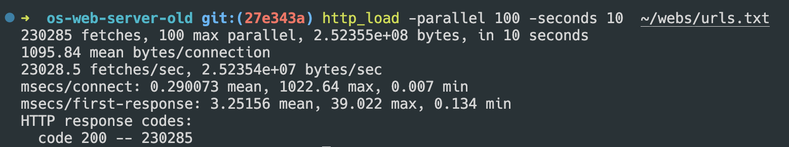
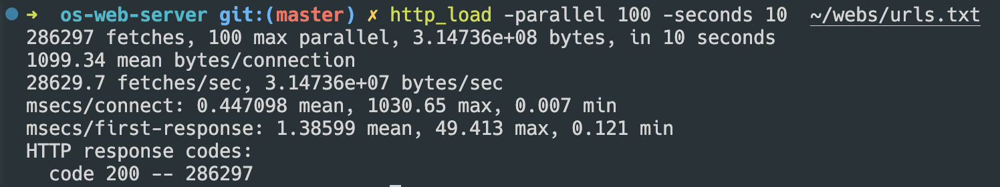
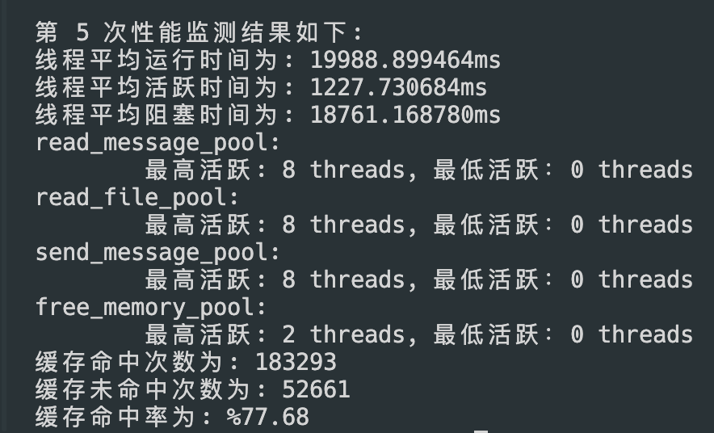
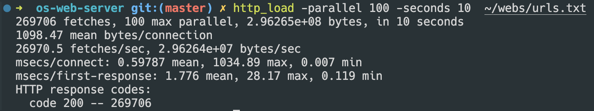
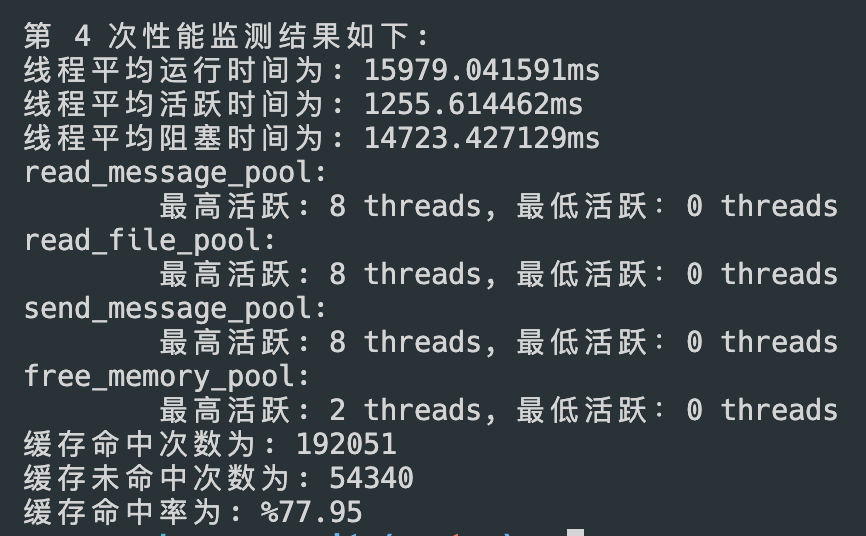

# 实验6

## 题目1

> 题⽬1根据在本节介绍的基于hash缓存结构和各种缓存替换算法，设计不同的缓存管理辅助结构（例如，队列，堆）等来实现LRU、LFU替换算法。
### 实现缓存结构
对于 hash 缓存结构的实现，可以使用 `glib` 的 hash 表来实现，其中实现查找特定路径的字符串的时间复杂度为 $O(1)$

- hash 表的 key 是文件的路径字符串

- hash 表的 value 是一个被称作 handle 的结构体。

    在缓存替换算法的实现过程中，`handle` 扮演着关键角色。它不仅用于缓存文件内容，还包含了管理这些内容所需的各种信息和机制。具体来说，`handle` 主要有以下几个作用：
    
    1. **缓存文件路径**：`handle` 包含了文件的路径字符串，这用于标识缓存中的文件。
    2. **缓存文件内容**：`handle` 包含指向文件内容的指针。对于大文件，这些内容会被分割成多个部分存储在链表中，以便更有效地管理内存。
    3. **读者计数**：`handle` 维护了一个读者计数器，记录有多少线程正在读取该缓存内容。这有助于确保在缓存内容被释放前，所有读者都已经完成读取操作。
    4. **互斥锁和条件变量**：为了管理并发访问，`handle` 包含了互斥锁和条件变量。这些同步机制确保了在多线程环境中对缓存内容的安全访问。

    ```c
    // 缓存文件的 handle，含有键值对，哈希表用
    struct cached_file_handle {
      char *path_to_file; // 代表文件的路径
      // 文件的起始链表节点
      // 对于大文件，单个的buffer不够储存，使用 list 存储内容
      GList *contents;
    
      // 读者数量
      int readers_count;
      // 释放 content 时的锁
      pthread_mutex_t content_free_lock;
      pthread_cond_t content_has_reader;
    };
    
    // 初始化该 handle
    struct cached_file_handle *cached_file_handle_init(const char *path_to_file) {
      struct cached_file_handle *handle =
          (struct cached_file_handle *)calloc(1, sizeof(*handle));
      // 复制 path_to_file的 string
      handle->path_to_file = strdup(path_to_file);
      handle->contents = NULL;
      handle->readers_count = 0;
      // 初始化各个 mutex
      if (pthread_mutex_init(&handle->content_free_lock, NULL) != 0) {
        perror("pthread_mutex_init failed");
        exit(EXIT_FAILURE);
      }
    
      // 初始化条件变量属性
      pthread_condattr_t cattr;
      if (pthread_condattr_init(&cattr) != 0) {
        perror("pthread_condattr_init failed");
        exit(EXIT_FAILURE);
      }
    
      // 初始化条件变量
      if (pthread_cond_init(&handle->content_has_reader, &cattr) != 0) {
        perror("pthread_cond_init failed");
        exit(EXIT_FAILURE);
      }
    
      return handle;
    }
    
    // 给 cached_file_handle 加上 content
    void cached_file_handle_add_content(struct cached_file_handle *const handle,
                                        char *content, const size_t content_size) {
      struct string_fragment *new_fragment =
          (struct string_fragment *)malloc(sizeof(*new_fragment));
    
      // strdup 会在数据为 0 的时候停止，不能使用（尤其针对 binary 例如图片）
      // "new_fragment->content = strndup(content, content_size + 8);" is wrong!
      // 所以改用 malloc 加 memcpy的形式
      new_fragment->content = (char *)malloc((content_size + 8) * sizeof(char));
      memcpy(new_fragment->content, content, content_size);
    
      new_fragment->size = content_size;
    
      handle->contents = g_list_append(handle->contents, new_fragment);
    }
    
    // 释放 handle
    void cached_file_handle_free(gpointer handle_passed) {
      task *new_task = (task *)malloc(sizeof(task));
      new_task->next = NULL;
      new_task->function = cached_file_handle_free_thread_do;
      new_task->arg = handle_passed;
    
      add_task_to_thread_pool(free_memory_pool, new_task);
    }
    
    void *cached_file_handle_free_thread_do(gpointer handle_passed) {
      struct cached_file_handle *handle =
          (struct cached_file_handle *)handle_passed;
      // 避免释放的时候仍然有进程读取该 handle 的问题
      pthread_mutex_lock(&handle->content_free_lock);
      // 等待直到没有读者
      while (handle->readers_count > 0) {
        pthread_cond_wait(&handle->content_has_reader, &handle->content_free_lock);
      }
    
      // 1. 释放 contents
      g_list_free_full(handle->contents, string_fragment_free);
    
      // 2. 释放 path to file
      free(handle->path_to_file);
    
      pthread_mutex_unlock(&handle->content_free_lock);
    
      // 3. 释放 handle
      free(handle);
    
      return NULL;
    }
    ```
    
    `GList *contents` 是指向文件内容的列表，而列表中的每个元素均指向一个 `string_fragment` ，其中的内容是字符串的地址和字符串的长度。
    
    `GList *contents` 是 `handle` 结构体中的一个关键字段，用于存储文件的内容。在缓存系统中，有时需要缓存大文件，而直接将整个文件内容存储在一个连续的内存块中可能会导致内存管理复杂化和效率降低。为了解决这个问题，`contents` 字段采用了链表结构来存储文件内容。
    
    1. **分段存储文件内容**：
        - `GList *contents` 是一个指向 `GList` 类型的指针，`GList` 是一个双向链表结构。
        - 每个链表节点 (`GList`) 包含一部分文件内容的数据块（通常是定长的数据块）。
        - 通过链表的方式，将一个大文件分成多个小数据块存储在链表的各个节点中。
    2. **高效的内存管理**：
        - 链表结构允许文件内容的动态增长和缩减，方便内存的分配和释放。
        - 避免了大块连续内存的分配问题，减少了内存碎片和分配失败的可能性。
    3. **并发访问控制**：
        - 使用链表可以更方便地控制并发访问，因为每个节点可以单独锁定和管理。
        - 当多个线程访问同一个文件时，可以通过对链表节点的细粒度锁定，减少锁的竞争，提高并发性能。
    4. **简化缓存管理**：
        - 链表结构便于在缓存替换算法中进行操作，例如 LRU 或 LFU 算法在替换文件时，可以通过遍历链表快速找到需要替换的文件部分。
        - 方便对文件内容的部分更新和删除操作。
    
    `GList` 是 GLib 库中的一个数据结构，用于实现双向链表。以下是 `GList` 的定义：
    
    ```c
    typedef struct _GList GList;
    
    struct _GList {
      void *data; // 指向存储的数据（文件内容块）
      GList *next; // 指向下一个节点
      GList *prev; // 指向前一个节点
    };
    ```
    
    `string_fragment`结构体用于存储文件内容的片段，并将这些片段链接到一个列表中，以应对文件内容较大时单个缓冲区不足的情况。
    
    `string_fragment`结构体包含两个主要成员：
    
    1. `char *content`：指向存储内容的字符指针。
    2. `size_t size`：内容的大小。
    
    在缓存替换算法中，这些片段被链接到一个`GList *contents`列表中，从而组成整个文件的缓存内容。每当一个文件被读取时，如果该文件在缓存中不存在，则会创建一个新的`string_fragment`结构体并将其内容和大小添加到`GList *contents`列表中。
    
    具体实现如下：
    
    ```c
    // content 中指针指向的每个小字符串碎片
    struct string_fragment {
      // 内容
      char *content;
      // 内容长度
      size_t size;
    };
    
    // 释放字符串碎片
    void string_fragment_free(void *string_fragment_passed) {
      struct string_fragment *string_fragment =
          (struct string_fragment *)string_fragment_passed;
    
      // 释放字符串
      free(string_fragment->content);
    
      // 释放自身
      free(string_fragment);
    }
    ```

#### 程序的运行逻辑

首先，程序会从哈希表中查找当前要访问的文件名，以确定该文件是否已经被缓存。如果在哈希表中找到对应的文件名，程序会从缓存中提取该文件的内容。具体来说，程序会从与文件名关联的 `handle` 结构体中读取存储在 `string_fragment` 链表中的缓存数据。每个 `string_fragment` 包含文件内容的一个片段，包括片段的地址和长度。程序会依次读取这些片段，并将它们发送给 `write` 函数，以便将文件内容传递给客户端或其他下游模块。利用缓存可以避免重复读取文件，从而显著提升文件读取的效率和系统响应速度。

如果哈希表中没有找到当前的文件名，程序则会按照传统方式从文件系统中读取文件内容。在读取文件内容之前，程序会创建一个新的 `handle` 结构体。这个 `handle` 结构体用于存储新读取的文件内容及其相关信息。具体来说，程序会将文件内容分割成多个片段，每个片段存储在一个 `string_fragment` 结构体中。每个 `string_fragment` 结构体包含一个指向内容片段的指针和片段的长度。随后，这些 `string_fragment` 结构体被链接到 `handle` 的 `contents` 链表中，形成一个完整的文件内容缓存。

通过这种方式，程序不仅可以将文件内容发送给 `write` 函数，还能将文件内容缓存起来，以便在后续访问中快速读取。同时，程序会更新哈希表，将新缓存的文件信息记录下来。这样，当同一文件再次被访问时，程序可以直接从缓存中读取内容，而无需重复从文件系统中读取，从而显著提高系统性能。

```c
// 打开文件，读文件，调用 send message
void *read_file(struct read_file_args *const args) {
  // 获得参数内容
  char *const buffer = args->buffer;
  const int socketfd = args->socketfd;
  const char *const filetype = args->filetype;
  const int hit = args->hit;

  // 释放参数
  free(args);

  pthread_mutex_lock(cache_hash_table_mutex);
  // 从 hash table 中寻找文件名
  struct cached_file_handle *found_handle =
      g_hash_table_lookup(cache_hash_table, &buffer[5]);

  // 如果文件名找到，无需读文件，直接进行 send_cached_message
  if (found_handle != NULL) {
    // cache hit 的次数增加
    cache_hit_times++;
    // 将要使用该 handle 的任务增加一个
    pthread_mutex_lock(&found_handle->content_free_lock);
    found_handle->readers_count++;
    pthread_mutex_unlock(&found_handle->content_free_lock);
    pthread_mutex_unlock(cache_hash_table_mutex);

    // log，然后释放当前 buffer
    logger(LOG, "SEND_CACHED", &buffer[5], hit);
    free(buffer);

    // 创建新任务执行 send_cached_message
    struct send_cached_message_args *const next_args =
        (struct send_cached_message_args *)malloc(sizeof(*next_args));
    next_args->socketfd = socketfd;
    next_args->handle = found_handle;

    task *new_task = (task *)malloc(sizeof(task));
    new_task->next = NULL;
    new_task->function = (void *)send_cached_message;
    new_task->arg = next_args;

    add_task_to_thread_pool(send_message_pool, new_task);

    return NULL;
  }

  // 没有找到需要打开文件，读文件，再进行 发送消息：(cache miss)
  cache_miss_times++;
  pthread_mutex_unlock(cache_hash_table_mutex);

  // 打开文件
  int filefd = -1;
  if ((filefd = open(&buffer[5], O_RDONLY)) == -1) { // 打开指定的文件名
    logger(NOTFOUND, "failed to open file", &buffer[5], socketfd);
    close(socketfd);
    return NULL;
  }

  logger(LOG, "SEND", &buffer[5], hit);

  // 文件存在，创建新的 handle，准备放入
  struct cached_file_handle *new_handle = cached_file_handle_init(&buffer[5]);

  off_t len = lseek(filefd, (off_t)0, SEEK_END); // 通过 lseek 获取文件长度
  lseek(filefd, (off_t)0, SEEK_SET); // 将文件指针移到文件首位置

  sprintf(buffer,
          "HTTP/1.1 200 OK\n"
          "Server: nweb/%d.0\n"
          "Content-Length: %ld\n"
          "Connection: close\n"
          "Content-Type: %s",
          VERSION, len, filetype); // Header without a blank line

  logger(LOG, "Header", buffer, hit);

  sprintf(buffer,
          "HTTP/1.1 200 OK\n"
          "Server: nweb/%d.0\n"
          "Content-Length: %ld\n"
          "Connection: close\n"
          "Content-Type: %s\n\n",
          VERSION, len, filetype); // Header + a blank line

  // 准备调用 send_message
  struct send_mesage_args *const next_args =
      (struct send_mesage_args *)malloc(sizeof(*next_args));
  next_args->filefd = filefd;
  next_args->socketfd = socketfd;
  next_args->buffer = buffer;
  next_args->handle = new_handle;

  // 创建 task
  task *const new_task = (task *)malloc(sizeof(task));
  new_task->next = NULL;
  new_task->function = (void *)send_mesage;
  new_task->arg = next_args;

  // write to socketfd;
  add_task_to_thread_pool(send_message_pool, new_task);

  return NULL;
}
```

```c
// 发送消息
void *send_mesage(struct send_mesage_args *const args) {
  const int filefd = args->filefd;
  const int socketfd = args->socketfd;
  char *const buffer = args->buffer;
  struct cached_file_handle *const handle = args->handle;

  // 释放传进来的参数
  free(args);

  // 使用信号量保证回应的连续性
  if (sem_wait(output_sempaphore) < 0) {
    perror("sem_wait");
    exit(EXIT_FAILURE);
  }

  // CRITICAL SECTION BEGINS

  const size_t header_length = strlen(buffer);
  // 写 header
  write(socketfd, buffer, header_length);
  // 同时放进 handle 内
  cached_file_handle_add_content(handle, buffer, header_length);

  // 不停地从文件里读取文件内容，并通过 socket 通道向客户端返回文件内容
  int bytes_to_write = -1;
  while ((bytes_to_write = read(filefd, buffer, BUFSIZE)) > 0) {
    // 写 body
    write(socketfd, buffer, bytes_to_write);
    // 同时放进 handle 内
    cached_file_handle_add_content(handle, buffer, bytes_to_write);
  }

  // 关闭文件，关闭 socket
  close(filefd);
  close(socketfd);

  // 释放 buffer
  free(buffer);

  // 将新的 handle 放入 hash 表中
  pthread_mutex_lock(cache_hash_table_mutex);

  // 检查是否已经存在该 entry
  if (g_hash_table_contains(cache_hash_table, handle->path_to_file)) {
    // 丢弃当前 handle
    cached_file_handle_free(handle);
  } else {
    // 否则，执行 加入 操作
  	g_hash_table_insert(cache_hash_table, handle->path_to_file, handle);
  }

  pthread_mutex_unlock(cache_hash_table_mutex);

  // CRITICAL SECTION ENDS
  if (sem_post(output_sempaphore) < 0) {
    perror("sem_post");
    exit(EXIT_FAILURE);
  }

  return NULL;
}

// 发送已经缓存的消息
void *send_cached_message(struct send_cached_message_args *const args) {
  // 获得 handle 和 socket fd
  const int socketfd = args->socketfd;
  struct cached_file_handle *handle = args->handle;
  free(args);

  // 使用信号量保证回应的连续性
  if (sem_wait(output_sempaphore) < 0) {
    perror("sem_wait");
    exit(EXIT_FAILURE);
  }

  // CRITICAL SECTION BEGINS
  GList *ptr = handle->contents;

  // 不停地 content list 读取文件内容，并通过 socket 通道向客户端返回文件内容
  while (ptr != NULL) {
    // printf("ptr: %p\n", ptr);

    // 写 body
    write(socketfd, ((struct string_fragment *)(ptr->data))->content,
          ((struct string_fragment *)(ptr->data))->size);
    ptr = ptr->next;
  }

  // 关闭 socketfd 这个很重要！！！不加就是在吃系统资源
  close(socketfd);

  // 将要使用该 handle 的任务减少一个
  pthread_mutex_lock(&handle->content_free_lock);
  handle->readers_count--;
  // 如果为 0，即可释放
  if (handle->readers_count == 0) {
    pthread_cond_signal(&handle->content_has_reader);
  }
  pthread_mutex_unlock(&handle->content_free_lock);

  // CRITICAL SECTION ENDS
  if (sem_post(output_sempaphore) < 0) {
    perror("sem_post");
    exit(EXIT_FAILURE);
  }

  return NULL;
}
```

### 实现缓存替换算法
在 LRU（最近最少使用）和 LFU（最少使用）缓存替换算法中，核心思想是找到需要被替换的缓存单元。具体来说，LRU 替换的是最近最少使用的缓存单元，其标志是时间戳最小；而 LFU 替换的是使用次数最少的缓存单元。为了有效实现这些替换策略，需要在查找和更新缓存单元时保持较高的效率。

#### 堆结构的缺点

- **查找最小值的时间复杂度**：堆的优势在于它可以在 $O(1)$ 时间内找到最小值，这是因为最小值总是位于堆顶。
- **搜索特定元素并更新的时间复杂度**：堆在查找和更新特定元素时并不高效，其时间复杂度为 $O(n)$ 。这是因为堆并不支持快速查找特定元素的位置，需要遍历整个堆。

最终，综合查找最小值和更新特定元素的操作，堆的整体时间复杂度为 $O(n)$。

#### 二叉排序树的分析

考虑到堆结构在查找和更新特定元素方面的效率较低，可以采用平衡二叉排序树来实现缓存替换算法。

- **查找最小值的时间复杂度**：平衡二叉排序树可以在 $O(log(n))$时间内找到最小值。这是因为最小值总是位于树的最左边节点，可以通过沿着左子树查找迅速定位。
- **查找和修改的时间复杂度**：平衡二叉排序树在查找和修改特定元素时同样具有 $O(log(n))$的时间复杂度。通过树结构，能够快速定位元素并进行更新。

通过使用 `glib` 提供的平衡二叉排序树，我们可以在 $O(log(n))$ 时间复杂度内高效地实现 LRU 和 LFU 的缓存替换策略，从而提高缓存系统的性能和效率。

首先，每个 handle 均需要储存 LRU 和 LFU 所需要的信息:

```c
 // 缓存文件的 handle，含有键值对，哈希表用
 struct cached_file_handle {
   char *path_to_file; // 代表文件的路径
   // 文件的起始链表节点
   // 对于大文件，单个的buffer不够储存，使用 list 存储内容
   GList *contents;
 
   // 读者数量
   int readers_count;
   // 释放 content 时的锁
   pthread_mutex_t content_free_lock;
   pthread_cond_t content_has_reader;
 
 #ifdef USE_LRU
   // LRU: 最近使用时间
   struct timespec recent_used_time;
   // 读写最近使用时间的锁
   pthread_mutex_t recent_used_time_mutex;
 #endif
 
 #ifdef USE_LFU
   // LRU: 最近使用次数
   unsigned long used_times;
   // 读写最近使用时间的锁
   pthread_mutex_t used_times_mutex;
 #endif
 };
```

- 对于 LRU 和 LFU 算法，每个算法均会给出一个平衡二叉排序树，其中存放的节点储存排序所需要的信息(最近使用时间/最近使用次数)，而排序所需要的逻辑由 `tree_node_cmp` 函数给出。

- 二叉树的节点数量和哈希表的入口数量是同步更新的，当哈希表入口数量满，需要删除一个文件的缓存的时候，二叉树中的节点也会被同步删除。

- 添加互斥锁以保证 hash 表和二叉排序树同时只被唯一的线程所访问。

#### LRU 算法所需的数据结构和函数

在缓存替换算法中，LRU（Least Recently Used，最近最少使用）算法通过记录和比较文件的最近使用时间，决定哪些文件应该被替换。

1. **LRU Tree**:
    - `extern GTree *LRU_tree;`
    - LRU 算法所用的平衡二叉树，用于存储和排序文件的最近使用时间。
2. **互斥锁**:
    - `extern pthread_mutex_t *LRU_tree_mutex;`
    - 用于确保在多线程环境中，对 LRU Tree 的访问是线程安全的。
3. **LRU Tree Node**:
    - `struct LRU_tree_node { struct timespec recent_used_time; char *path_to_file; };`
    - 储存文件路径及其最近使用时间的结构体。
    - `recent_used_time` 保存文件的最近使用时间。
    - `path_to_file` 保存文件路径。
4. **节点销毁函数**:
    - `void LRU_tree_node_destroy(gpointer node) { free(node); }`
    - 用于释放节点内存。
5. **更新 LRU Tree**:
    - `void LRU_tree_update(struct LRU_tree_node *new_node, struct timespec last_used_time)`
    - 将新的节点插入到 LRU Tree 中，如果该文件的节点已经存在，则更新其最近使用时间。
    - 包含互斥锁操作以确保线程安全。
6. **节点比较函数**:
    - `gint LRU_tree_node_cmp(gconstpointer a, gconstpointer b, gpointer user_data)`
    - 比较两个节点的最近使用时间，以便在二叉树中进行排序。
7. **LRU 替换算法**:
    - `void LRU_replace(struct cached_file_handle *handle)`
    - 当缓存满时，使用该函数找到并替换最近未使用的文件。
    - 记录当前文件的最近使用时间，并将其更新到 LRU Tree 中。
    - 如果缓存未满，直接将新文件加入缓存；如果缓存已满，删除 LRU Tree 和哈希表中最近未使用的文件，再加入新文件。

```c
// LRU utilities
#ifdef USE_LRU

// LRU 算法所用的 tree
extern GTree *LRU_tree;
// LRU 算法所用的 tree 的互斥锁
extern pthread_mutex_t *LRU_tree_mutex;

// LRU 算法所用的 tree node
struct LRU_tree_node {
  struct timespec recent_used_time;
  char *path_to_file;
};

// 销毁 node
void LRU_tree_node_destroy(gpointer node) { free(node); }

// 插入 node 到 LRU tree 中 (如果使用时间已经存在,则更新)
void LRU_tree_update(struct LRU_tree_node *new_node,
                     struct timespec last_used_time) {
  struct LRU_tree_node temp_node;
  temp_node.recent_used_time = last_used_time;
  temp_node.path_to_file = new_node->path_to_file;

  pthread_mutex_lock(LRU_tree_mutex);
  g_tree_remove(LRU_tree, &temp_node);
  g_tree_insert(LRU_tree, new_node, NULL);
  pthread_mutex_unlock(LRU_tree_mutex);
}

// Tree 中 node 的比较函数
gint LRU_tree_node_cmp(gconstpointer a, gconstpointer b, gpointer user_data) {
  struct LRU_tree_node *const a_node = (struct LRU_tree_node *)a;
  struct LRU_tree_node *const b_node = (struct LRU_tree_node *)b;
  // ignore user data
  (void)user_data;

  if (a_node->recent_used_time.tv_sec == b_node->recent_used_time.tv_sec) {
    return a_node->recent_used_time.tv_nsec - b_node->recent_used_time.tv_nsec;
  }
  return a_node->recent_used_time.tv_sec - b_node->recent_used_time.tv_sec;
}

// LRU替换算法
void LRU_replace(struct cached_file_handle *handle) {
  // 记录最近使用时间
  pthread_mutex_lock(&handle->recent_used_time_mutex);
  struct timespec last_used_time = handle->recent_used_time;
  clock_gettime(CLOCK_REALTIME, &handle->recent_used_time);

  // 创建新 node 节点, 准备更新到 LRU tree 中
  struct LRU_tree_node *new_node =
      (struct LRU_tree_node *)malloc(sizeof(*new_node));
  new_node->recent_used_time = handle->recent_used_time;
  new_node->path_to_file = handle->path_to_file;
  pthread_mutex_unlock(&handle->recent_used_time_mutex);

  // 如果 hash 表未满，则直接加入
  if (g_hash_table_size(cache_hash_table) < MAX_HASH_TABLE_SIZE) {
    g_hash_table_insert(cache_hash_table, handle->path_to_file, handle);
    // 更新 LRU Tree
    LRU_tree_update(new_node, last_used_time);
    return;
  }

  // 否则, 替换最近未使用过的
  pthread_mutex_lock(LRU_tree_mutex);
  struct LRU_tree_node *least_recent_used_key =
      g_tree_node_key(g_tree_node_first(LRU_tree));
  char *const path_to_file = least_recent_used_key->path_to_file;

  // 删除 tree 中 节点
  g_tree_remove(LRU_tree, least_recent_used_key);
  pthread_mutex_unlock(LRU_tree_mutex);

  // 删除 hash 表中对应的内容
  g_hash_table_remove(cache_hash_table, path_to_file);

  // 加入新内容
  g_hash_table_insert(cache_hash_table, handle->path_to_file, handle);
  // 更新 LRU Tree
  LRU_tree_update(new_node, last_used_time);
}

#endif
```

#### LFU 算法所需的数据结构和函数

LFU（Least Frequently Used，最少使用）算法通过记录和比较文件的使用次数，决定哪些文件应该被替换。

1. **LFU Tree**:
    - `extern GTree *LFU_tree;`
    - LFU 算法所用的平衡二叉树，用于存储和排序文件的使用次数。
2. **互斥锁**:
    - `extern pthread_mutex_t *LFU_tree_mutex;`
    - 用于确保在多线程环境中，对 LFU Tree 的访问是线程安全的。
3. **LFU Tree Node**:
    - `struct LFU_tree_node { unsigned long used_times; char *path_to_file; };`
    - 储存文件路径及其使用次数的结构体。
    - `used_times` 保存文件的使用次数。
    - `path_to_file` 保存文件路径。
4. **节点销毁函数**:
    - `void LFU_tree_node_destroy(gpointer node) { free(node); }`
    - 用于释放节点内存。
5. **更新 LFU Tree**:
    - `void LFU_tree_update(struct LFU_tree_node *new_node, unsigned long last_used_times)`
    - 将新的节点插入到 LFU Tree 中，如果该文件的节点已经存在，则更新其使用次数。
    - 包含互斥锁操作以确保线程安全。
6. **节点比较函数**:
    - `gint LFU_tree_node_cmp(gconstpointer a, gconstpointer b, gpointer user_data)`
    - 比较两个节点的使用次数，以便在二叉树中进行排序。
7. **LFU 替换算法**:
    - `void LFU_replace(struct cached_file_handle *handle)`
    - 当缓存满时，使用该函数找到并替换使用次数最少的文件。
    - 记录当前文件的使用次数，并将其更新到 LFU Tree 中。
    - 如果缓存未满，直接将新文件加入缓存；如果缓存已满，删除 LFU Tree 和哈希表中使用次数最少的文件，再加入新文件。

以下是 LFU 算法所需要的数据结构和函数，需要注意的是，这里的 LFU tree node 及其排序逻辑与 LRU 的相比，只是比较的量从使用时间戳大小变为了使用次数。

```c
#ifdef USE_LFU

// LFU utilities

// LFU 算法所用的 tree
extern GTree *LFU_tree;
// LFU 算法所用的 tree 的互斥锁
extern pthread_mutex_t *LFU_tree_mutex;

// LRU 算法所用的 tree node
struct LFU_tree_node {
  unsigned long used_times;
  char *path_to_file;
};

// 销毁 node
void LFU_tree_node_destroy(gpointer node) { free(node); }

// 插入 node 到 LFU tree 中 (如果使用时间已经存在,则更新)
void LFU_tree_update(struct LFU_tree_node *new_node,
                     unsigned long last_used_times) {
  struct LFU_tree_node temp_node;
  temp_node.used_times = last_used_times;
  temp_node.path_to_file = new_node->path_to_file;

  pthread_mutex_lock(LFU_tree_mutex);
  g_tree_remove(LFU_tree, &temp_node);
  g_tree_insert(LFU_tree, new_node, NULL);
  pthread_mutex_unlock(LFU_tree_mutex);
}

// Tree 中 node 的比较函数
gint LFU_tree_node_cmp(gconstpointer a, gconstpointer b, gpointer user_data) {
  struct LFU_tree_node *const a_node = (struct LFU_tree_node *)a;
  struct LFU_tree_node *const b_node = (struct LFU_tree_node *)b;
  // ignore user data
  (void)user_data;

  if (a_node->used_times == b_node->used_times) {
    return strcmp(a_node->path_to_file, b_node->path_to_file);
  }
  return a_node->used_times - b_node->used_times;
}

// LFU替换算法
void LFU_replace(struct cached_file_handle *handle) {
  // 记录最近使用次数
  pthread_mutex_lock(&handle->used_times_mutex);
  unsigned long last_used_times = handle->used_times;
  handle->used_times++;

  // 创建新 node 节点, 准备更新到 LFU tree 中
  struct LFU_tree_node *new_node =
      (struct LFU_tree_node *)malloc(sizeof(*new_node));
  new_node->used_times = handle->used_times;
  new_node->path_to_file = handle->path_to_file;
  pthread_mutex_unlock(&handle->used_times_mutex);

  // 如果 hash 表未满，则直接加入
  unsigned int table_size = g_hash_table_size(cache_hash_table);
  if (table_size < MAX_HASH_TABLE_SIZE) {
    g_hash_table_insert(cache_hash_table, handle->path_to_file, handle);
    // 更新 LFU Tree
    LFU_tree_update(new_node, last_used_times);
    return;
  }

  // 否则, 替换最近未使用过的
  pthread_mutex_lock(LFU_tree_mutex);
  struct LFU_tree_node *least_frequent_used_key =
      g_tree_node_key(g_tree_node_first(LFU_tree));
  char *const path_to_file = least_frequent_used_key->path_to_file;
  // 删除 tree 中 节点
  g_tree_remove(LFU_tree, least_frequent_used_key);
  pthread_mutex_unlock(LFU_tree_mutex);

  // 删除 hash 表中对应的内容
  g_hash_table_remove(cache_hash_table, path_to_file);

  // 加入新内容
  // printf("Inserting: %s\n", handle->path_to_file);
  g_hash_table_insert(cache_hash_table, handle->path_to_file, handle);
  // 更新 LFU Tree
  LFU_tree_update(new_node, last_used_times);
}

#endif
```

#### 修改程序运行逻辑

接下来，需要在 `business.c` 中修改 `send_message` 和 `send_cached_message` 的逻辑

- 在 `send_message` 中，需要在完成记录文件的同时，将缓存的 handle 通过替换算法加入 hash 表，而非直接加入 hash 表：

```c
  // 检查是否已经存在该 entry
  if (g_hash_table_contains(cache_hash_table, handle->path_to_file)) {
    // 如存在，则丢弃当前 handle
    cached_file_handle_free(handle);
  } else {
    // 否则，执行 LRU / LFU 操作
#ifdef USE_LRU
    LRU_replace(handle);
#endif

#ifdef USE_LFU
    LFU_replace(handle);
#endif
  }

  pthread_mutex_unlock(cache_hash_table_mutex);
```

- 在 `send_cached_message` 中，需要在每次访问缓存数据的时候，更新 handle 的信息，并且更新 LRU/LFU 树来确保排序的正确性：

```c
#ifdef USE_LRU
  // 更新 handle 的使用时间
  pthread_mutex_lock(&handle->recent_used_time_mutex);
  struct timespec last_used_time = handle->recent_used_time;
  clock_gettime(CLOCK_REALTIME, &handle->recent_used_time);

  // 创建新 node 节点, 准备更新到 LRU tree 中
  struct LRU_tree_node *new_node =
      (struct LRU_tree_node *)malloc(sizeof(*new_node));
  new_node->recent_used_time = handle->recent_used_time;
  new_node->path_to_file = handle->path_to_file;
  pthread_mutex_unlock(&handle->recent_used_time_mutex);

  // 更新 LRU Tree
  LRU_tree_update(new_node, last_used_time);
#endif

#ifdef USE_LFU
  // 更新 handle 的使用次数
  pthread_mutex_lock(&handle->used_times_mutex);
  unsigned long last_used_times = handle->used_times;
  handle->used_times++;

  // 创建新 node 节点, 准备更新到 LFU tree 中
  struct LFU_tree_node *new_node =
      (struct LFU_tree_node *)malloc(sizeof(*new_node));
  new_node->used_times = handle->used_times;
  new_node->path_to_file = handle->path_to_file;
  pthread_mutex_unlock(&handle->used_times_mutex);

  // 更新 LFU Tree
  LFU_tree_update(new_node, last_used_times);
#endif
```

- 最后，在 `main` 函数中，初始化所需的平衡二叉排序树和哈希表：

```c
  // 初始化 cache_hash_table 及其互斥锁
  cache_hash_table_init();

  // 初始化 LRU/LFU Tree 及其互斥锁
#ifdef USE_LRU
  LRU_tree_init();
#endif

#ifdef USE_LFU
  LFU_tree_init();
#endif
```

函数的定义如下：

```c
#ifdef USE_LRU
// 初始化 LRU Tree
void LRU_tree_init(void) {
  LRU_tree =
      g_tree_new_full(LRU_tree_node_cmp, NULL, LRU_tree_node_destroy, NULL);
  // 初始化LRU 算法所用的 tree 的互斥锁
  LRU_tree_mutex = (pthread_mutex_t *)calloc(1, sizeof(pthread_mutex_t));
  if (pthread_mutex_init(LRU_tree_mutex, NULL) != 0) {
    perror("pthread_mutex_init failed");
    exit(EXIT_FAILURE);
  }
}
#endif

#ifdef USE_LFU
// 初始化 LRU Tree
void LFU_tree_init(void) {
  LFU_tree =
      g_tree_new_full(LFU_tree_node_cmp, NULL, LFU_tree_node_destroy, NULL);
  // 初始化LRU 算法所用的 tree 的互斥锁
  LFU_tree_mutex = (pthread_mutex_t *)calloc(1, sizeof(pthread_mutex_t));
  if (pthread_mutex_init(LFU_tree_mutex, NULL) != 0) {
    perror("pthread_mutex_init failed");
    exit(EXIT_FAILURE);
  }
}
#endif
```

## 题目2

> 题⽬2.通过实验来评估各个替换算法的好坏，通过服务器缓存命中率、客户端获得请求内容的平均时间等参数，来说明有⽆Web⽂件缓存对Web服务的影响。

将给定的 100000 个网页放入 `~/webs/web` 文件夹，然后在 `~/webs` 放入测试的 `urls.txt` 。

其中，`urls.txt` 可以由 `filenameintotxt.sh`  生成：

```bash
#!/bin/zsh

for entry in {0..20000..1};
do
  echo "http://127.0.0.1:8088/$entry.html" >> urls.txt
done
```

这里仅对前 20000 个网页进行压力测试。

运行 web 服务器，再进行 http_load，即可对 web 服务器进行测试。

首先，启动 web 服务器：

```bash
./webserver 8088 ~/webs/web
```

然后，在命令行输入如下命令，对各种web服务器模型进行测试：

```bash
http_load -parallel 100 -seconds 10 ~/webs/urls.txt
```

### 无缓存模型

使用100个最大并行的10秒测试，测试结果为：



- 由于没有涉及到缓存，故不考虑缓存命中率
- 客户端获得请求内容的平均时间 `msecs/first-response` 是 3.25156ms

###  有缓存模型

#### LRU

使用100个最大并行的10秒测试，测试结果为：





- 缓存命中率为 $\%77.68$
- 客户端获得请求内容的平均时间 `msecs/first-response` 是 1.38599ms

#### LFU

使用100个最大并行的10秒测试，测试结果为：





- 缓存命中率为 $\%77.95$
- 客户端获得请求内容的平均时间 `msecs/first-response` 是 1.776ms

### 总结

通过实验结果可以看出，使用缓存的Web服务器在性能上有显著的提升。

#### 无缓存模型

- 客户端获得请求内容的平均时间 `msecs/first-response` 是 3.25156ms。

#### 有缓存模型

1. **LRU缓存模型**
    - 缓存命中率为 77.68%
    - 客户端获得请求内容的平均时间 `msecs/first-response` 是 1.38599ms
2. **LFU缓存模型**
    - 缓存命中率为 77.95%
    - 客户端获得请求内容的平均时间 `msecs/first-response` 是 1.776ms

#### 性能分析

- **缓存命中率**: 由于有缓存模型可以存储和重复使用之前访问过的文件，显著提高了缓存命中率，这直接减少了从磁盘读取文件的次数，提升了访问速度。
- **响应时间**: 有缓存模型的平均响应时间明显低于无缓存模型，特别是LRU模型的表现最佳，其响应时间为1.38599ms。

### 结论

在此实验环境下，使用缓存显著提高了Web服务器的性能，特别是LRU缓存模型在提高缓存命中率和减少响应时间方面效果最好。因此，推荐在类似的Web服务环境中使用缓存替换算法来优化性能。

## 题目3

> 题⽬3.根据以上实验数据来说明这些替换算法在实验环境中的应⽤效果，从中找到更为适合此实验环境的替换算法，并说明原因（为什么这个替换算法好？与其它置换算法相⽐，好在何处？）。

### 替换算法的应用效果分析

在实验中，我们对比了无缓存、LRU缓存和LFU缓存的Web服务器性能。通过实验结果，可以看到有缓存模型（特别是LRU和LFU算法）在提升服务器性能方面具有显著效果。

1. **无缓存模型**
    - 客户端获得请求内容的平均时间为3.25156ms。
2. **LRU缓存模型**
    - 缓存命中率为77.68%。
    - 客户端获得请求内容的平均时间为1.38599ms。
3. **LFU缓存模型**
    - 缓存命中率为77.95%。
    - 客户端获得请求内容的平均时间为1.776ms。

### 替换算法的比较

通过以上数据可以看出：

- **缓存命中率**：LRU和LFU的缓存命中率非常接近，分别为77.68%和77.95%。这说明两者在缓存数据的有效性上差别不大。
- **平均响应时间**：LRU的平均响应时间为1.38599ms，优于LFU的1.776ms。这表明在实验环境下，LRU算法更能有效地减少客户端的等待时间。

### 适合此实验环境的替换算法

根据实验数据，LRU缓存替换算法在此实验环境中表现更佳：

1. **较低的平均响应时间**：LRU算法能够更快地响应客户端请求，这对于提高用户体验至关重要。
2. **简单且有效**：LRU算法的实现相对简单，并且能在大多数情况下提供良好的性能。

### LRU算法的优势

与LFU算法相比，LRU在实验中表现出以下优势：

1. **快速响应**：由于LRU算法倾向于保留最近访问的数据，因此它更能适应短期的访问模式变化，从而在大多数情况下提供更快的响应时间。
2. **管理简单**：LRU算法的实现和维护相对简单，适合在实际应用中快速部署和优化。

### 结论

所以，LRU缓存替换算法在此实验环境中表现最佳，其显著降低了客户端的平均响应时间，提升了Web服务器的整体性能。

## 附录： `cache.c` 和 `business.c` 的代码

```c
// cache.c

#include <bits/time.h>
#include <glib.h>
#include <pthread.h>
#include <stdbool.h>
#include <stddef.h>
#include <stdio.h>
#include <stdlib.h>
#include <string.h>
#include <time.h>

#include "include/cache.h"
#include "include/threadpool.h"
#include "include/types.h"

// 初始化该 handle
struct cached_file_handle *cached_file_handle_init(const char *path_to_file) {
  struct cached_file_handle *handle =
      (struct cached_file_handle *)calloc(1, sizeof(*handle));
  // 复制 path_to_file的 string
  handle->path_to_file = strdup(path_to_file);
  handle->contents = NULL;
  handle->readers_count = 0;
#ifdef USE_LRU
  handle->recent_used_time.tv_sec = handle->recent_used_time.tv_nsec = 0;
#endif

#ifdef USE_LFU
  handle->used_times = 0;
#endif

  // 初始化各个 mutex
  if (pthread_mutex_init(&handle->content_free_lock, NULL) != 0) {
    perror("pthread_mutex_init failed");
    exit(EXIT_FAILURE);
  }

#ifdef USE_LRU
  if (pthread_mutex_init(&handle->recent_used_time_mutex, NULL) != 0) {
    perror("pthread_mutex_init failed");
    exit(EXIT_FAILURE);
  }
#endif

#ifdef USE_LFU
  if (pthread_mutex_init(&handle->used_times_mutex, NULL) != 0) {
    perror("pthread_mutex_init failed");
    exit(EXIT_FAILURE);
  }
#endif

  // 初始化条件变量属性
  pthread_condattr_t cattr;
  if (pthread_condattr_init(&cattr) != 0) {
    perror("pthread_condattr_init failed");
    exit(EXIT_FAILURE);
  }

  // 初始化条件变量
  if (pthread_cond_init(&handle->content_has_reader, &cattr) != 0) {
    perror("pthread_cond_init failed");
    exit(EXIT_FAILURE);
  }

  return handle;
}

// 给 cached_file_handle 加上 content
void cached_file_handle_add_content(struct cached_file_handle *const handle,
                                    char *content, const size_t content_size) {
  struct string_fragment *new_fragment =
      (struct string_fragment *)malloc(sizeof(*new_fragment));

  // strdup 会在数据为 0 的时候停止，不能使用（尤其针对 binary 例如图片）
  // "new_fragment->content = strndup(content, content_size + 8);" is wrong!
  // 所以改用 malloc 加 memcpy的形式
  new_fragment->content = (char *)malloc((content_size + 8) * sizeof(char));
  memcpy(new_fragment->content, content, content_size);

  new_fragment->size = content_size;

  handle->contents = g_list_append(handle->contents, new_fragment);
}

// 释放 handle
void cached_file_handle_free(gpointer handle_passed) {
  task *new_task = (task *)malloc(sizeof(task));
  new_task->next = NULL;
  new_task->function = cached_file_handle_free_thread_do;
  new_task->arg = handle_passed;

  add_task_to_thread_pool(free_memory_pool, new_task);
}

void *cached_file_handle_free_thread_do(gpointer handle_passed) {
  struct cached_file_handle *handle =
      (struct cached_file_handle *)handle_passed;
  // 避免释放的时候仍然有进程读取该 handle 的问题
  pthread_mutex_lock(&handle->content_free_lock);
  // 等待直到没有读者
  while (handle->readers_count > 0) {
    pthread_cond_wait(&handle->content_has_reader, &handle->content_free_lock);
  }

  // 1. 释放 contents
  g_list_free_full(handle->contents, string_fragment_free);

  // 2. 释放 path to file
  free(handle->path_to_file);

  pthread_mutex_unlock(&handle->content_free_lock);

  // 3. 释放 handle
  free(handle);

  return NULL;
}

// 释放字符串碎片
void string_fragment_free(void *string_fragment_passed) {
  struct string_fragment *string_fragment =
      (struct string_fragment *)string_fragment_passed;

  // 释放字符串
  free(string_fragment->content);

  // 释放自身
  free(string_fragment);
}

#ifdef USE_LRU

// 销毁 node
void LRU_tree_node_destroy(gpointer node) { free(node); }

// 插入 node 到 LRU tree 中 (如果使用时间已经存在,则更新)
void LRU_tree_update(struct LRU_tree_node *new_node,
                     struct timespec last_used_time) {
  struct LRU_tree_node temp_node;
  temp_node.recent_used_time = last_used_time;
  temp_node.path_to_file = new_node->path_to_file;

  pthread_mutex_lock(LRU_tree_mutex);
  g_tree_remove(LRU_tree, &temp_node);
  g_tree_insert(LRU_tree, new_node, NULL);
  pthread_mutex_unlock(LRU_tree_mutex);
}

// Tree 中 node 的比较函数
gint LRU_tree_node_cmp(gconstpointer a, gconstpointer b, gpointer user_data) {
  struct LRU_tree_node *const a_node = (struct LRU_tree_node *)a;
  struct LRU_tree_node *const b_node = (struct LRU_tree_node *)b;
  // ignore user data
  (void)user_data;

  if (a_node->recent_used_time.tv_sec == b_node->recent_used_time.tv_sec) {
    return a_node->recent_used_time.tv_nsec - b_node->recent_used_time.tv_nsec;
  }
  return a_node->recent_used_time.tv_sec - b_node->recent_used_time.tv_sec;
}

// LRU替换算法
void LRU_replace(struct cached_file_handle *handle) {
  // 记录最近使用时间
  pthread_mutex_lock(&handle->recent_used_time_mutex);
  struct timespec last_used_time = handle->recent_used_time;
  clock_gettime(CLOCK_REALTIME, &handle->recent_used_time);

  // 创建新 node 节点, 准备更新到 LRU tree 中
  struct LRU_tree_node *new_node =
      (struct LRU_tree_node *)malloc(sizeof(*new_node));
  new_node->recent_used_time = handle->recent_used_time;
  new_node->path_to_file = handle->path_to_file;
  pthread_mutex_unlock(&handle->recent_used_time_mutex);

  // 如果 hash 表未满，则直接加入
  if (g_hash_table_size(cache_hash_table) < MAX_HASH_TABLE_SIZE) {
    g_hash_table_insert(cache_hash_table, handle->path_to_file, handle);
    // 更新 LRU Tree
    LRU_tree_update(new_node, last_used_time);
    return;
  }

  // 否则, 替换最近未使用过的
  pthread_mutex_lock(LRU_tree_mutex);
  struct LRU_tree_node *least_recent_used_key =
      g_tree_node_key(g_tree_node_first(LRU_tree));
  char *const path_to_file = least_recent_used_key->path_to_file;

  // 删除 tree 中 节点
  g_tree_remove(LRU_tree, least_recent_used_key);
  pthread_mutex_unlock(LRU_tree_mutex);

  // 删除 hash 表中对应的内容
  g_hash_table_remove(cache_hash_table, path_to_file);

  // 加入新内容
  g_hash_table_insert(cache_hash_table, handle->path_to_file, handle);
  // 更新 LRU Tree
  LRU_tree_update(new_node, last_used_time);
}

#endif

#ifdef USE_LFU

// 销毁 node
void LFU_tree_node_destroy(gpointer node) { free(node); }

// 插入 node 到 LFU tree 中 (如果使用时间已经存在,则更新)
void LFU_tree_update(struct LFU_tree_node *new_node,
                     unsigned long last_used_times) {
  struct LFU_tree_node temp_node;
  temp_node.used_times = last_used_times;
  temp_node.path_to_file = new_node->path_to_file;

  pthread_mutex_lock(LFU_tree_mutex);
  g_tree_remove(LFU_tree, &temp_node);
  g_tree_insert(LFU_tree, new_node, NULL);
  pthread_mutex_unlock(LFU_tree_mutex);
}

// Tree 中 node 的比较函数
gint LFU_tree_node_cmp(gconstpointer a, gconstpointer b, gpointer user_data) {
  struct LFU_tree_node *const a_node = (struct LFU_tree_node *)a;
  struct LFU_tree_node *const b_node = (struct LFU_tree_node *)b;
  // ignore user data
  (void)user_data;

  if (a_node->used_times == b_node->used_times) {
    return strcmp(a_node->path_to_file, b_node->path_to_file);
  }
  return a_node->used_times - b_node->used_times;
}

// LFU替换算法
void LFU_replace(struct cached_file_handle *handle) {
  // 记录最近使用次数
  pthread_mutex_lock(&handle->used_times_mutex);
  unsigned long last_used_times = handle->used_times;
  handle->used_times++;

  // 创建新 node 节点, 准备更新到 LFU tree 中
  struct LFU_tree_node *new_node =
      (struct LFU_tree_node *)malloc(sizeof(*new_node));
  new_node->used_times = handle->used_times;
  new_node->path_to_file = handle->path_to_file;
  pthread_mutex_unlock(&handle->used_times_mutex);

  // 如果 hash 表未满，则直接加入
  unsigned int table_size = g_hash_table_size(cache_hash_table);
  if (table_size < MAX_HASH_TABLE_SIZE) {
    g_hash_table_insert(cache_hash_table, handle->path_to_file, handle);
    // 更新 LFU Tree
    LFU_tree_update(new_node, last_used_times);
    return;
  }

  // 否则, 替换最近未使用过的
  pthread_mutex_lock(LFU_tree_mutex);
  struct LFU_tree_node *least_frequent_used_key =
      g_tree_node_key(g_tree_node_first(LFU_tree));
  char *const path_to_file = least_frequent_used_key->path_to_file;

  // 删除 tree 中 节点
  g_tree_remove(LFU_tree, least_frequent_used_key);
  pthread_mutex_unlock(LFU_tree_mutex);

  // 删除 hash 表中对应的内容
  g_hash_table_remove(cache_hash_table, path_to_file);

  // 加入新内容
  // printf("Inserting: %s\n", handle->path_to_file);
  g_hash_table_insert(cache_hash_table, handle->path_to_file, handle);
  // 更新 LFU Tree
  LFU_tree_update(new_node, last_used_times);
}

#endif
```

```c
// business.c

#include <bits/time.h>
#include <fcntl.h>
#include <pthread.h>
#include <semaphore.h>
#include <stdbool.h>
#include <stddef.h>
#include <stdio.h>
#include <stdlib.h>
#include <string.h>
#include <sys/types.h>
#include <time.h>
#include <unistd.h>

#include "include/business.h"
#include "include/cache.h"
#include "include/logger.h"
#include "include/threadpool.h"
#include "include/types.h"

#if !defined(USE_LRU) && !defined(USE_LFU)
#error "Please select an page replacement algorithm(USE_LRU or USE_LFU)."
#endif

// 读消息
void *read_message(struct read_message_args *const args) {
  const int socketfd = args->socketfd;
  const int hit = args->hit;

  // 释放传进来的参数
  free(args);

  // ** 记得完成回应后释放 buffer **
  char *const buffer = (char *)calloc(BUFSIZE + 1, sizeof(char)); // 设置缓冲区

  const int socket_read_ret =
      read(socketfd, buffer, BUFSIZE); // 从连接通道中读取客户端的请求消息
  if (socket_read_ret == 0 || socket_read_ret == -1) {
    // 如果读取客户端消息失败，则向客户端发送 HTTP 失败响应信息
    logger(FORBIDDEN, "failed to read browser request", "", socketfd);
    close(socketfd);
    return NULL;
  }

  if (socket_read_ret > 0 && socket_read_ret < BUFSIZE) {
    // 设置有效字符串，即将字符串尾部表示为 0
    buffer[socket_read_ret] = 0;
  } else {
    buffer[0] = 0;
  }

  for (long i = 0; i < socket_read_ret; i++) {
    // 移除消息字符串中的“CF”和“LF”字符
    if (buffer[i] == '\r' || buffer[i] == '\n') {
      buffer[i] = '*';
    }
  }

  logger(LOG, "request", buffer, hit);

  // 判断客户端 HTTP 请求消息是否为 GET 类型，如果不是则给出相应的响应消息

  if (strncmp(buffer, "GET ", 4) && strncmp(buffer, "get ", 4)) {
    logger(FORBIDDEN, "Only simple GET operation supported", buffer, socketfd);
    close(socketfd);
    return NULL;
  }

  int buflen = 0;
  for (long i = 4; i < BUFSIZE; i++) {
    // null terminate after the second space to ignore extra stuff
    if (buffer[i] == ' ') { // string is "GET URL " + lots of other stuff
      buffer[i] = 0;
      // set length of the buffer to i
      buflen = i;
      break;
    }
  }

  for (long j = 0; j < buflen - 1; j++) {
    // 在消息中检测路径，不允许路径中出现 '.'
    if (buffer[j] == '.' && buffer[j + 1] == '.') {
      logger(FORBIDDEN, "Parent directory (..) path names not supported",
             buffer, socketfd);
      close(socketfd);
      return NULL;
    }
  }
  if (!strncmp(&buffer[0], "GET /\0", 6) ||
      !strncmp(&buffer[0], "get /\0", 6)) {
    // 如果请求消息中没有包含有效的文件名，则使用默认的文件名 index.html
    strcpy(buffer, "GET /index.html");
  }

  // 根据预定义在 extensions 中的文件类型，检查请求的文件类型是否本服务器支持

  buflen = strlen(buffer);
  const char *filetype = NULL;

  for (long i = 0; extensions[i].ext != 0; i++) {
    long len = strlen(extensions[i].ext);
    if (!strncmp(&buffer[buflen - len], extensions[i].ext, len)) {
      filetype = extensions[i].filetype;
      break;
    }
  }

  if (filetype == NULL) {
    logger(FORBIDDEN, "file extension type not supported", buffer, socketfd);
    close(socketfd);
    return NULL;
  }

  // 接下来，调用 read_file

  // 设定参数
  struct read_file_args *const next_args =
      (struct read_file_args *)malloc(sizeof(*next_args));
  // ** 记得完成回应后释放 buffer **
  next_args->buffer = buffer;
  next_args->socketfd = socketfd;
  next_args->filetype = filetype;
  next_args->hit = hit;

  // 创建 task
  task *const new_task = (task *)malloc(sizeof(task));
  new_task->next = NULL;
  new_task->function = (void *)read_file;
  new_task->arg = next_args;

  // 送进 filename queue
  add_task_to_thread_pool(read_file_pool, new_task);

  return NULL;
}

// 打开文件，读文件，调用 send message
void *read_file(struct read_file_args *const args) {
  // 获得参数内容
  char *const buffer = args->buffer;
  const int socketfd = args->socketfd;
  const char *const filetype = args->filetype;
  const int hit = args->hit;

  // 释放参数
  free(args);

  pthread_mutex_lock(cache_hash_table_mutex);
  // 从 hash table 中寻找文件名
  struct cached_file_handle *found_handle =
      g_hash_table_lookup(cache_hash_table, &buffer[5]);

  // 如果文件名找到，无需读文件，直接进行 send_cached_message
  if (found_handle != NULL) {
    // cache hit 的次数增加
    cache_hit_times++;
    // 将要使用该 handle 的任务增加一个
    pthread_mutex_lock(&found_handle->content_free_lock);
    found_handle->readers_count++;
    pthread_mutex_unlock(&found_handle->content_free_lock);
    pthread_mutex_unlock(cache_hash_table_mutex);

    // log，然后释放当前 buffer
    logger(LOG, "SEND_CACHED", &buffer[5], hit);
    free(buffer);

    // 创建新任务执行 send_cached_message
    struct send_cached_message_args *const next_args =
        (struct send_cached_message_args *)malloc(sizeof(*next_args));
    next_args->socketfd = socketfd;
    next_args->handle = found_handle;

    task *new_task = (task *)malloc(sizeof(task));
    new_task->next = NULL;
    new_task->function = (void *)send_cached_message;
    new_task->arg = next_args;

    add_task_to_thread_pool(send_message_pool, new_task);

    return NULL;
  }

  // 没有找到需要打开文件，读文件，再进行 发送消息：(cache miss)
  cache_miss_times++;
  pthread_mutex_unlock(cache_hash_table_mutex);

  // 打开文件
  int filefd = -1;
  if ((filefd = open(&buffer[5], O_RDONLY)) == -1) { // 打开指定的文件名
    logger(NOTFOUND, "failed to open file", &buffer[5], socketfd);
    close(socketfd);
    return NULL;
  }

  logger(LOG, "SEND", &buffer[5], hit);

  // 文件存在，创建新的 handle，准备放入
  struct cached_file_handle *new_handle = cached_file_handle_init(&buffer[5]);

  off_t len = lseek(filefd, (off_t)0, SEEK_END); // 通过 lseek 获取文件长度
  lseek(filefd, (off_t)0, SEEK_SET); // 将文件指针移到文件首位置

  sprintf(buffer,
          "HTTP/1.1 200 OK\n"
          "Server: nweb/%d.0\n"
          "Content-Length: %ld\n"
          "Connection: close\n"
          "Content-Type: %s",
          VERSION, len, filetype); // Header without a blank line

  logger(LOG, "Header", buffer, hit);

  sprintf(buffer,
          "HTTP/1.1 200 OK\n"
          "Server: nweb/%d.0\n"
          "Content-Length: %ld\n"
          "Connection: close\n"
          "Content-Type: %s\n\n",
          VERSION, len, filetype); // Header + a blank line

  // 准备调用 send_message
  struct send_mesage_args *const next_args =
      (struct send_mesage_args *)malloc(sizeof(*next_args));
  next_args->filefd = filefd;
  next_args->socketfd = socketfd;
  next_args->buffer = buffer;
  next_args->handle = new_handle;

  // 创建 task
  task *const new_task = (task *)malloc(sizeof(task));
  new_task->next = NULL;
  new_task->function = (void *)send_mesage;
  new_task->arg = next_args;

  // write to socketfd;
  add_task_to_thread_pool(send_message_pool, new_task);

  return NULL;
}

// 发送消息
void *send_mesage(struct send_mesage_args *const args) {
  const int filefd = args->filefd;
  const int socketfd = args->socketfd;
  char *const buffer = args->buffer;
  struct cached_file_handle *const handle = args->handle;

  // 释放传进来的参数
  free(args);

  // 使用信号量保证回应的连续性
  if (sem_wait(output_sempaphore) < 0) {
    perror("sem_wait");
    exit(EXIT_FAILURE);
  }

  // CRITICAL SECTION BEGINS

  const size_t header_length = strlen(buffer);
  // 写 header
  write(socketfd, buffer, header_length);
  // 同时放进 handle 内
  cached_file_handle_add_content(handle, buffer, header_length);

  // 不停地从文件里读取文件内容，并通过 socket 通道向客户端返回文件内容
  int bytes_to_write = -1;
  while ((bytes_to_write = read(filefd, buffer, BUFSIZE)) > 0) {
    // 写 body
    write(socketfd, buffer, bytes_to_write);
    // 同时放进 handle 内
    cached_file_handle_add_content(handle, buffer, bytes_to_write);
  }

  // 关闭文件，关闭 socket
  close(filefd);
  close(socketfd);

  // 释放 buffer
  free(buffer);

  // 将新的 handle 放入 hash 表中
  pthread_mutex_lock(cache_hash_table_mutex);

  // 检查是否已经存在该 entry
  if (g_hash_table_contains(cache_hash_table, handle->path_to_file)) {
    // 丢弃当前 handle
    cached_file_handle_free(handle);
  } else {
    // 否则，执行 LRU / LFU 操作
#ifdef USE_LRU
    LRU_replace(handle);
#endif

#ifdef USE_LFU
    LFU_replace(handle);
#endif
  }

  pthread_mutex_unlock(cache_hash_table_mutex);

  // CRITICAL SECTION ENDS
  if (sem_post(output_sempaphore) < 0) {
    perror("sem_post");
    exit(EXIT_FAILURE);
  }

  return NULL;
}

// 发送已经缓存的消息
void *send_cached_message(struct send_cached_message_args *const args) {
  // 获得 handle 和 socket fd
  const int socketfd = args->socketfd;
  struct cached_file_handle *handle = args->handle;
  free(args);

#ifdef USE_LRU
  // 更新 handle 的使用时间
  pthread_mutex_lock(&handle->recent_used_time_mutex);
  struct timespec last_used_time = handle->recent_used_time;
  clock_gettime(CLOCK_REALTIME, &handle->recent_used_time);

  // 创建新 node 节点, 准备更新到 LRU tree 中
  struct LRU_tree_node *new_node =
      (struct LRU_tree_node *)malloc(sizeof(*new_node));
  new_node->recent_used_time = handle->recent_used_time;
  new_node->path_to_file = handle->path_to_file;
  pthread_mutex_unlock(&handle->recent_used_time_mutex);

  // 更新 LRU Tree
  LRU_tree_update(new_node, last_used_time);
#endif

#ifdef USE_LFU
  // 更新 handle 的使用次数
  pthread_mutex_lock(&handle->used_times_mutex);
  unsigned long last_used_times = handle->used_times;
  handle->used_times++;

  // 创建新 node 节点, 准备更新到 LFU tree 中
  struct LFU_tree_node *new_node =
      (struct LFU_tree_node *)malloc(sizeof(*new_node));
  new_node->used_times = handle->used_times;
  new_node->path_to_file = handle->path_to_file;
  pthread_mutex_unlock(&handle->used_times_mutex);

  // 更新 LFU Tree
  LFU_tree_update(new_node, last_used_times);
#endif

  // 使用信号量保证回应的连续性
  if (sem_wait(output_sempaphore) < 0) {
    perror("sem_wait");
    exit(EXIT_FAILURE);
  }

  // CRITICAL SECTION BEGINS
  GList *ptr = handle->contents;

  // 不停地 content list 读取文件内容，并通过 socket 通道向客户端返回文件内容
  while (ptr != NULL) {
    // 写 body
    write(socketfd, ((struct string_fragment *)(ptr->data))->content,
          ((struct string_fragment *)(ptr->data))->size);
    ptr = ptr->next;
  }

  // 关闭 socketfd 这个很重要！！！不加就是在吃系统资源
  close(socketfd);

  // 将要使用该 handle 的任务减少一个
  pthread_mutex_lock(&handle->content_free_lock);
  handle->readers_count--;
  // 如果为 0，即可释放
  if (handle->readers_count == 0) {
    pthread_cond_signal(&handle->content_has_reader);
  }
  pthread_mutex_unlock(&handle->content_free_lock);

  // CRITICAL SECTION ENDS
  if (sem_post(output_sempaphore) < 0) {
    perror("sem_post");
    exit(EXIT_FAILURE);
  }

  return NULL;
}
```

