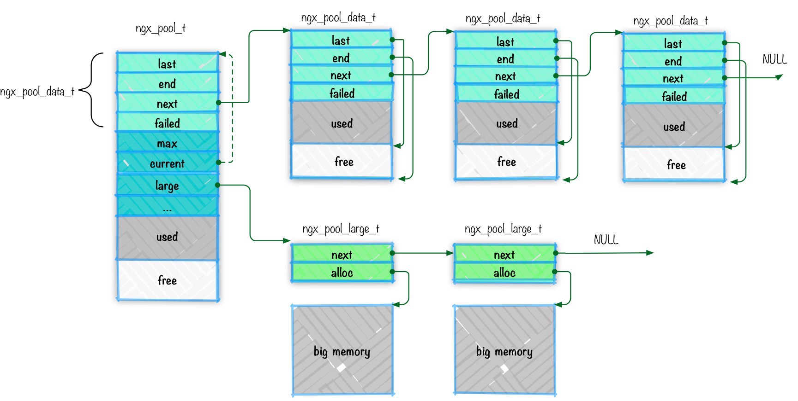
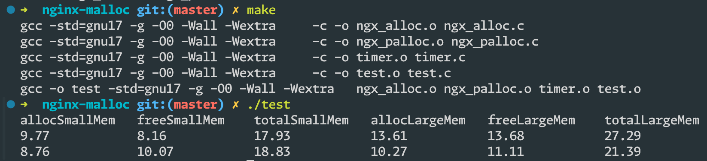
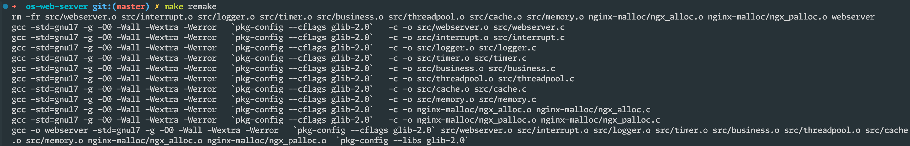
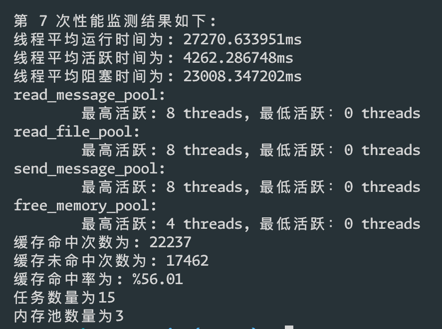
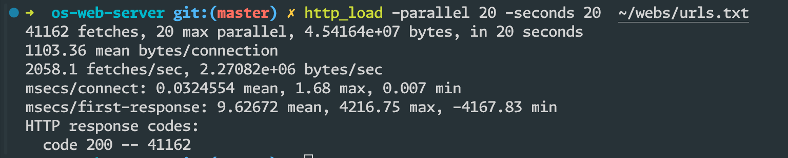

# 实验7

## 题目1

> 题⽬1.查询tcmalloc相关材料，写出其组织和管理内存的结构，并说明其为什么在多线程环境下管理内存（分配和释放内存）的效率⽐ptmalloc⾼？

### TCMalloc 内存管理结构及其优势

#### TCMalloc 的内存管理结构

##### 页面堆 (PageHeap): 从操作系统以固定大小单位（通常为 8KB，称为内存区间 (span)）分配内存。

```c++
class PageHeap final : public PageAllocatorInterface {
 public:
  explicit PageHeap(MemoryTag tag);
  // for testing
  PageHeap(PageMap* map, MemoryTag tag);
  ~PageHeap() override = default;

  // Allocate a run of "n" pages. These would used for allocating 'num_objects'
  // objects. Returns zero if out of memory.  Caller should not pass "n == 0" --
  // instead, n should have been rounded up already.  The returned memory is
  // backed.
  Span* New(Length n, SpanAllocInfo span_alloc_info)
      ABSL_LOCKS_EXCLUDED(pageheap_lock) override;

  // As New, but the returned span is aligned to a <align>-page boundary.
  // <align> must be a power of two.
  Span* NewAligned(Length n, Length align, SpanAllocInfo span_alloc_info)
      ABSL_LOCKS_EXCLUDED(pageheap_lock) override;

  // Delete the span "[p, p+n-1]".
  // REQUIRES: span was returned by earlier call to New() and
  //           has not yet been deleted.
  void Delete(Span* span, size_t objects_per_span)
      ABSL_EXCLUSIVE_LOCKS_REQUIRED(pageheap_lock) override;

  inline BackingStats stats() const
      ABSL_EXCLUSIVE_LOCKS_REQUIRED(pageheap_lock) override {
    return stats_;
  }

  void GetSmallSpanStats(SmallSpanStats* result)
      ABSL_EXCLUSIVE_LOCKS_REQUIRED(pageheap_lock) override;

  void GetLargeSpanStats(LargeSpanStats* result)
      ABSL_EXCLUSIVE_LOCKS_REQUIRED(pageheap_lock) override;

  // Try to release at least num_pages for reuse by the OS.  Returns
  // the actual number of pages released, which may be less than
  // num_pages if there weren't enough pages to release. The result
  // may also be larger than num_pages since page_heap might decide to
  // release one large range instead of fragmenting it into two
  // smaller released and unreleased ranges.
  Length ReleaseAtLeastNPages(Length num_pages, PageReleaseReason reason)
      ABSL_EXCLUSIVE_LOCKS_REQUIRED(pageheap_lock) override;

  PageReleaseStats GetReleaseStats() const
      ABSL_EXCLUSIVE_LOCKS_REQUIRED(pageheap_lock) override;

  // Prints stats about the page heap to *out.
  void Print(Printer* out) ABSL_LOCKS_EXCLUDED(pageheap_lock) override;

  void PrintInPbtxt(PbtxtRegion* region)
      ABSL_LOCKS_EXCLUDED(pageheap_lock) override;

 private:
  // We segregate spans of a given size into two circular linked
  // lists: one for normal spans, and one for spans whose memory
  // has been returned to the system.
  struct SpanListPair {
    SpanList normal;
    SpanList returned;
  };

  // List of free spans of length >= kMaxPages
  SpanListPair large_ ABSL_GUARDED_BY(pageheap_lock);

  // Array mapping from span length to a doubly linked list of free spans
  SpanListPair free_[kMaxPages.raw_num()] ABSL_GUARDED_BY(pageheap_lock);

  // Statistics on system, free, and unmapped bytes
  BackingStats stats_ ABSL_GUARDED_BY(pageheap_lock);

  Span* SearchFreeAndLargeLists(Length n, bool* from_returned)
      ABSL_EXCLUSIVE_LOCKS_REQUIRED(pageheap_lock);

  bool GrowHeap(Length n) ABSL_EXCLUSIVE_LOCKS_REQUIRED(pageheap_lock);

  // REQUIRES: span->length >= n
  // REQUIRES: span->location != IN_USE
  // Remove span from its free list, and move any leftover part of
  // span into appropriate free lists.  Also update "span" to have
  // length exactly "n" and mark it as non-free so it can be returned
  // to the client.  After all that, decrease free_pages_ by n and
  // return span.
  Span* Carve(Span* span, Length n)
      ABSL_EXCLUSIVE_LOCKS_REQUIRED(pageheap_lock);

  // Allocate a large span of length == n.  If successful, returns a
  // span of exactly the specified length.  Else, returns NULL.
  Span* AllocLarge(Length n, bool* from_returned)
      ABSL_EXCLUSIVE_LOCKS_REQUIRED(pageheap_lock);

  // Coalesce span with neighboring spans if possible, prepend to
  // appropriate free list, and adjust stats.
  void MergeIntoFreeList(Span* span)
      ABSL_EXCLUSIVE_LOCKS_REQUIRED(pageheap_lock);

  // Prepends span to appropriate free list, and adjusts stats.  You'll probably
  // want to adjust span->freelist_added_time before/after calling this
  // function.
  void PrependToFreeList(Span* span)
      ABSL_EXCLUSIVE_LOCKS_REQUIRED(pageheap_lock);

  // Removes span from its free list, and adjust stats.
  void RemoveFromFreeList(Span* span)
      ABSL_EXCLUSIVE_LOCKS_REQUIRED(pageheap_lock);

  // Release the last span on the normal portion of this list.
  // Return the length of that span.
  Length ReleaseLastNormalSpan(SpanListPair* slist)
      ABSL_EXCLUSIVE_LOCKS_REQUIRED(pageheap_lock);

  // Do invariant testing.
  bool Check() ABSL_EXCLUSIVE_LOCKS_REQUIRED(pageheap_lock);

  // Index of last free list where we released memory to the OS.
  int release_index_ ABSL_GUARDED_BY(pageheap_lock);

  Span* AllocateSpan(Length n, bool* from_returned)
      ABSL_EXCLUSIVE_LOCKS_REQUIRED(pageheap_lock);

  void RecordSpan(Span* span) ABSL_EXCLUSIVE_LOCKS_REQUIRED(pageheap_lock);
};
```

##### 线程缓存 (Thread Caches): 每个线程都拥有一个缓存，用于存储常用分配对象的大小。

```c++
class ThreadCache {
 public:
  explicit ThreadCache(pthread_t tid)
      ABSL_EXCLUSIVE_LOCKS_REQUIRED(pageheap_lock);
  void Cleanup();

  // Allocate an object of the given size class.
  // Returns nullptr when allocation fails.
  void* Allocate(size_t size_class);

  void Deallocate(void* ptr, size_t size_class);

  static void InitTSD();
  static ThreadCache* GetCache();
  static ThreadCache* GetCacheIfPresent();
  static void BecomeIdle();

  // Adds to *total_bytes the total number of bytes used by all thread heaps.
  // Also, if class_count is not NULL, it must be an array of size kNumClasses,
  // and this function will increment each element of class_count by the number
  // of items in all thread-local freelists of the corresponding size class.
  static AllocatorStats GetStats(uint64_t* total_bytes, uint64_t* class_count)
      ABSL_EXCLUSIVE_LOCKS_REQUIRED(pageheap_lock);

  // Sets the total thread cache size to new_size, recomputing the
  // individual thread cache sizes as necessary.
  static void set_overall_thread_cache_size(size_t new_size)
      ABSL_EXCLUSIVE_LOCKS_REQUIRED(pageheap_lock);

  static size_t overall_thread_cache_size()
      ABSL_SHARED_LOCKS_REQUIRED(pageheap_lock) {
    return overall_thread_cache_size_;
  }

 private:
  // We inherit rather than include the list as a data structure to reduce
  // compiler padding.  Without inheritance, the compiler pads the list
  // structure and then adds it as a member, even though we could fit everything
  // without padding.
  class FreeList : public LinkedList {
   private:
    uint32_t lowater_;     // Low water mark for list length.
    uint32_t max_length_;  // Dynamic max list length based on usage.
    // Tracks the number of times a deallocation has caused
    // length_ > max_length_.  After the kMaxOverages'th time, max_length_
    // shrinks and length_overages_ is reset to zero.
    uint32_t length_overages_;

   public:
    void Init() {
      lowater_ = 0;
      max_length_ = 1;
      length_overages_ = 0;
    }

    // Return the maximum length of the list.
    size_t max_length() const { return max_length_; }

    // Set the maximum length of the list.  If 'new_max' > length(), the
    // client is responsible for removing objects from the list.
    void set_max_length(size_t new_max) { max_length_ = new_max; }

    // Return the number of times that length() has gone over max_length().
    size_t length_overages() const { return length_overages_; }

    void set_length_overages(size_t new_count) { length_overages_ = new_count; }

    // Low-water mark management
    int lowwatermark() const { return lowater_; }
    void clear_lowwatermark() { lowater_ = length(); }

    ABSL_ATTRIBUTE_ALWAYS_INLINE bool TryPop(void** ret) {
      bool out = LinkedList::TryPop(ret);
      if (ABSL_PREDICT_TRUE(out) && ABSL_PREDICT_FALSE(length() < lowater_)) {
        lowater_ = length();
      }
      return out;
    }

    void PopBatch(int N, void** batch) {
      LinkedList::PopBatch(N, batch);
      if (length() < lowater_) lowater_ = length();
    }
  };

  // Gets and returns an object from the transfer cache, and, if possible,
  // also adds some objects of that size class to this thread cache.
  void* FetchFromTransferCache(size_t size_class, size_t byte_size);

  // Releases some number of items from src.  Adjusts the list's max_length
  // to eventually converge on num_objects_to_move(size_class).
  void ListTooLong(FreeList* list, size_t size_class);

  void DeallocateSlow(void* ptr, FreeList* list, size_t size_class);

  // Releases N items from this thread cache.
  void ReleaseToTransferCache(FreeList* src, size_t size_class, int N);

  // Increase max_size_ by reducing unclaimed_cache_space_ or by
  // reducing the max_size_ of some other thread.  In both cases,
  // the delta is kStealAmount.
  void IncreaseCacheLimit();

  // Same as above but called with pageheap_lock held.
  void IncreaseCacheLimitLocked() ABSL_EXCLUSIVE_LOCKS_REQUIRED(pageheap_lock);

  void Scavenge();
  static ThreadCache* CreateCacheIfNecessary();

  // If TLS is available, we also store a copy of the per-thread object
  // in a __thread variable since __thread variables are faster to read
  // than pthread_getspecific().  We still need pthread_setspecific()
  // because __thread variables provide no way to run cleanup code when
  // a thread is destroyed.
  //
  // We also give a hint to the compiler to use the "initial exec" TLS
  // model.  This is faster than the default TLS model, at the cost that
  // you cannot dlopen this library.  (To see the difference, look at
  // the CPU use of __tls_get_addr with and without this attribute.)
  //
  // Since using dlopen on a malloc replacement is asking for trouble in any
  // case, that's a good tradeoff for us.
  ABSL_CONST_INIT static thread_local ThreadCache* thread_local_data_
      ABSL_ATTRIBUTE_INITIAL_EXEC;

  // Thread-specific key.  Initialization here is somewhat tricky
  // because some Linux startup code invokes malloc() before it
  // is in a good enough state to handle pthread_keycreate().
  // Therefore, we use TSD keys only after tsd_inited is set to true.
  // Until then, we use a slow path to get the heap object.
  static bool tsd_inited_;
  static pthread_key_t heap_key_;

  // Linked list of heap objects.
  static ThreadCache* thread_heaps_ ABSL_GUARDED_BY(pageheap_lock);
  static int thread_heap_count_ ABSL_GUARDED_BY(pageheap_lock);

  // A pointer to one of the objects in thread_heaps_.  Represents
  // the next ThreadCache from which a thread over its max_size_ should
  // steal memory limit.  Round-robin through all of the objects in
  // thread_heaps_.
  static ThreadCache* next_memory_steal_ ABSL_GUARDED_BY(pageheap_lock);

  // Overall thread cache size.
  static size_t overall_thread_cache_size_ ABSL_GUARDED_BY(pageheap_lock);

  // Global per-thread cache size.
  static size_t per_thread_cache_size_ ABSL_GUARDED_BY(pageheap_lock);

  // Represents overall_thread_cache_size_ minus the sum of max_size_
  // across all ThreadCaches.
  static int64_t unclaimed_cache_space_ ABSL_GUARDED_BY(pageheap_lock);

  // This class is laid out with the most frequently used fields
  // first so that hot elements are placed on the same cache line.

  FreeList list_[kNumClasses];  // Array indexed by size-class

  size_t size_;      // Combined size of data
  size_t max_size_;  // size_ > max_size_ --> Scavenge()

  pthread_t tid_;
  bool in_setspecific_;

  // Allocate a new heap.
  static ThreadCache* NewHeap(pthread_t tid)
      ABSL_EXCLUSIVE_LOCKS_REQUIRED(pageheap_lock);

  // Use only as pthread thread-specific destructor function.
  static void DestroyThreadCache(void* ptr);

  static void DeleteCache(ThreadCache* heap);
  static void RecomputePerThreadCacheSize()
      ABSL_EXCLUSIVE_LOCKS_REQUIRED(pageheap_lock);

  // All ThreadCache objects are kept in a linked list (for stats collection)
  ThreadCache* next_;
  ThreadCache* prev_;

  // Ensure that two instances of this class are never on the same cache line.
  // This is critical for performance, as false sharing would negate many of
  // the benefits of a per-thread cache.
  char padding_[ABSL_CACHELINE_SIZE];
};
```

##### 尺寸映射表 (Size Map): 将对象大小映射到相应的线程缓存槽。

```c++
// Size-class information + mapping
class SizeMap {
 public:
  // Min allocation size for cold. Once more applications can provide cold hints
  // with PGHO, we can consider adding more size classes for cold to increase
  // cold coverage fleet-wide.
  static constexpr size_t kMinAllocSizeForCold = 4096;
  static constexpr int kLargeSize = 1024;
  static constexpr int kLargeSizeAlignment = 128;

 private:
  // Shifts the provided value right by `n` bits.
  //
  // TODO(b/281517865): the LLVM codegen for ClassIndexMaybe() doesn't use
  // an immediate shift for the `>> 3` and `>> 7` operations due to a missed
  // optimization / miscompile in clang, resulting in this codegen:
  //
  //   mov        $0x3,%ecx
  //   mov        $0x7,%eax
  //   add        %edi,%eax
  //   shr        %cl,%rax
  //
  // Immediate shift has latency 1 vs 3 for cl shift, and also the `add` can
  // be far more efficient, which we force into inline assembly here:
  //
  //   lea        0x7(%rdi),%rax
  //   shr        $0x3,%rax
  //
  // Benchmark:
  // BM_new_sized_delete/1      6.51ns ± 5%   6.00ns ± 1%   -7.73%  (p=0.000)
  // BM_new_sized_delete/8      6.51ns ± 5%   6.01ns ± 1%   -7.66%  (p=0.000)
  // BM_new_sized_delete/64     6.52ns ± 5%   6.04ns ± 1%   -7.37%  (p=0.000)
  // BM_new_sized_delete/512    6.71ns ± 6%   6.21ns ± 1%   -7.40%  (p=0.000)
  template <int n>
  ABSL_ATTRIBUTE_ALWAYS_INLINE static inline size_t Shr(size_t value) {
    TC_ASSERT_LE(value, std::numeric_limits<uint32_t>::max());
#if defined(__x86_64__)
    asm("shrl %[n], %k[value]" : [value] "+r"(value) : [n] "n"(n));
    return value;
#elif defined(__aarch64__)
    size_t result;
    asm("lsr %[result], %[value], %[n]"
        : [result] "=r"(result)
        : [value] "r"(value), [n] "n"(n));
    return result;
#else
    return value >> n;
#endif
  }

  //-------------------------------------------------------------------
  // Mapping from size to size_class and vice versa
  //-------------------------------------------------------------------

  // Sizes <= 1024 have an alignment >= 8.  So for such sizes we have an
  // array indexed by ceil(size/8).  Sizes > 1024 have an alignment >= 128.
  // So for these larger sizes we have an array indexed by ceil(size/128).
  //
  // We flatten both logical arrays into one physical array and use
  // arithmetic to compute an appropriate index.  The constants used by
  // ClassIndex() were selected to make the flattening work.
  //
  // Examples:
  //   Size       Expression                      Index
  //   -------------------------------------------------------
  //   0          (0 + 7) / 8                     0
  //   1          (1 + 7) / 8                     1
  //   ...
  //   1024       (1024 + 7) / 8                  128
  //   1025       (1025 + 127 + (120<<7)) / 128   129
  //   ...
  //   32768      (32768 + 127 + (120<<7)) / 128  376
  static constexpr size_t kClassArraySize =
      ((kMaxSize + 127 + (120 << 7)) >> 7) + 1;

  // Batch size is the number of objects to move at once.
  typedef unsigned char BatchSize;

  // class_array_ is accessed on every malloc, so is very hot.  We make it the
  // first member so that it inherits the overall alignment of a SizeMap
  // instance.  In particular, if we create a SizeMap instance that's cache-line
  // aligned, this member is also aligned to the width of a cache line.
  CompactSizeClass
      class_array_[kClassArraySize * (kHasExpandedClasses ? 2 : 1)] = {0};

  // Number of objects to move between a per-thread list and a central
  // list in one shot.  We want this to be not too small so we can
  // amortize the lock overhead for accessing the central list.  Making
  // it too big may temporarily cause unnecessary memory wastage in the
  // per-thread free list until the scavenger cleans up the list.
  BatchSize num_objects_to_move_[kNumClasses] = {0};

  uint32_t max_capacity_[kNumClasses] = {0};

  // If size is no more than kMaxSize, compute index of the
  // class_array[] entry for it, putting the class index in output
  // parameter idx and returning true. Otherwise return false.
  ABSL_ATTRIBUTE_ALWAYS_INLINE static inline bool ClassIndexMaybe(size_t s,
                                                                  size_t& idx) {
    if (ABSL_PREDICT_TRUE(s <= kLargeSize)) {
      idx = Shr<3>(s + 7);
      return true;
    } else if (s <= kMaxSize) {
      idx = Shr<7>(s + 127 + (120 << 7));
      return true;
    }
    return false;
  }

  ABSL_ATTRIBUTE_ALWAYS_INLINE static inline size_t ClassIndex(size_t s) {
    size_t ret;
    TC_CHECK(ClassIndexMaybe(s, ret));
    return ret;
  }

  // Mapping from size class to number of pages to allocate at a time
  unsigned char class_to_pages_[kNumClasses] = {0};

  // Mapping from size class to max size storable in that class
  uint32_t class_to_size_[kNumClasses] = {0};

 protected:
  // Set the give size classes to be used by TCMalloc.
  bool SetSizeClasses(absl::Span<const SizeClassInfo> size_classes);

  // Check that the size classes meet all requirements.
  static bool ValidSizeClasses(absl::Span<const SizeClassInfo> size_classes);

  size_t cold_sizes_[kNumBaseClasses] = {0};
  size_t cold_sizes_count_ = 0;

 public:
  // Returns size classes to use in the current process.
  static const SizeClasses& CurrentClasses();

  // Checks assumptions used to generate the current size classes.
  // Prints any wrong assumptions to stderr.
  static void CheckAssumptions();

  // constexpr constructor to guarantee zero-initialization at compile-time.  We
  // rely on Init() to populate things.
  constexpr SizeMap() = default;

  // Initialize the mapping arrays.  Returns true on success.
  bool Init(absl::Span<const SizeClassInfo> size_classes);

  // Returns the size class for size `size` respecting the alignment
  // & access requirements of `policy`.
  //
  // Returns true on success. Returns false if either:
  // - the size exceeds the maximum size class size.
  // - the align size is greater or equal to the default page size
  // - no matching properly aligned size class is available
  //
  // Requires that policy.align() returns a non-zero power of 2.
  //
  // When policy.align() = 1 the default alignment of the size table will be
  // used. If policy.align() is constexpr 1 (e.g. when using
  // DefaultAlignPolicy) then alignment-related code will optimize away.
  //
  // TODO(b/171978365): Replace the output parameter with returning
  // absl::optional<uint32_t>.
  template <typename Policy>
  ABSL_ATTRIBUTE_ALWAYS_INLINE inline bool GetSizeClass(
      Policy policy, size_t size, size_t* size_class) const {
    const size_t align = policy.align();
    TC_ASSERT(absl::has_single_bit(align));

    if (ABSL_PREDICT_FALSE(align > kPageSize)) {
      ABSL_ANNOTATE_MEMORY_IS_UNINITIALIZED(size_class, sizeof(*size_class));
      return false;
    }

    size_t idx;
    if (ABSL_PREDICT_FALSE(!ClassIndexMaybe(size, idx))) {
      ABSL_ANNOTATE_MEMORY_IS_UNINITIALIZED(size_class, sizeof(*size_class));
      return false;
    }
    if (kHasExpandedClasses && policy.is_cold()) {
      *size_class = class_array_[idx + kClassArraySize];
    } else {
      *size_class = class_array_[idx] + policy.scaled_numa_partition();
    }

    // Don't search for suitably aligned class for operator new
    // (when alignment is statically known to be no greater than kAlignment).
    // But don't do this check at runtime when the alignment is dynamic.
    // We assume aligned allocation functions are not used with small alignment
    // most of the time (does not make much sense). And for alignment larger
    // than kAlignment, this is just an unnecessary check that always fails.
    if (__builtin_constant_p(align) &&
        align <= static_cast<size_t>(kAlignment)) {
      return true;
    }

    // Predict that size aligned allocs most often directly map to a proper
    // size class, i.e., multiples of 32, 64, etc, matching our class sizes.
    // Since alignment is <= kPageSize, we must find a suitable class
    // (at least kMaxSize is aligned on kPageSize).
    static_assert((kMaxSize % kPageSize) == 0, "the loop below won't work");
    // Profiles say we usually get the right class based on the size,
    // so avoid the loop overhead on the fast path.
    if (ABSL_PREDICT_FALSE(class_to_size(*size_class) & (align - 1))) {
      do {
        ++*size_class;
      } while (ABSL_PREDICT_FALSE(class_to_size(*size_class) & (align - 1)));
    }
    return true;
  }

  // Returns size class for given size, or 0 if this instance has not been
  // initialized yet. REQUIRES: size <= kMaxSize.
  template <typename Policy>
  ABSL_ATTRIBUTE_ALWAYS_INLINE inline size_t SizeClass(Policy policy,
                                                       size_t size) const {
    ASSUME(size <= kMaxSize);
    size_t ret = 0;
    GetSizeClass(policy, size, &ret);
    return ret;
  }

  // Get the byte-size for a specified class. REQUIRES: size_class <=
  // kNumClasses.
  ABSL_ATTRIBUTE_ALWAYS_INLINE inline size_t class_to_size(
      size_t size_class) const {
    TC_ASSERT_LT(size_class, kNumClasses);
    return class_to_size_[size_class];
  }

  // Mapping from size class to number of pages to allocate at a time
  ABSL_ATTRIBUTE_ALWAYS_INLINE inline size_t class_to_pages(
      size_t size_class) const {
    TC_ASSERT_LT(size_class, kNumClasses);
    return class_to_pages_[size_class];
  }

  // Number of objects to move between a per-thread list and a central
  // list in one shot.  We want this to be not too small so we can
  // amortize the lock overhead for accessing the central list.  Making
  // it too big may temporarily cause unnecessary memory wastage in the
  // per-thread free list until the scavenger cleans up the list.
  ABSL_ATTRIBUTE_ALWAYS_INLINE inline SizeMap::BatchSize num_objects_to_move(
      size_t size_class) const {
    TC_ASSERT_LT(size_class, kNumClasses);
    return num_objects_to_move_[size_class];
  }

  // Max per-CPU slab capacity for the default 256KB slab size.
  //
  // TODO(b/271598304): Revise this when 512KB slabs are available.
  ABSL_ATTRIBUTE_ALWAYS_INLINE size_t max_capacity(size_t size_class) const {
    TC_ASSERT_LT(size_class, kNumClasses);
    return max_capacity_[size_class];
  }

  ABSL_ATTRIBUTE_ALWAYS_INLINE absl::Span<const size_t> ColdSizeClasses()
      const {
    return {cold_sizes_, cold_sizes_count_};
  }

  static bool IsValidSizeClass(size_t size, size_t num_pages,
                               size_t num_objects_to_move);
};
```

##### 中央空闲列表 (Central Free List): 存储无法放入线程缓存的大块已释放对象。

```c++
// Data kept per size-class in central cache.
template <typename ForwarderT>
class CentralFreeList {
 public:
  using Forwarder = ForwarderT;

  constexpr CentralFreeList()
      : lock_(absl::kConstInit, absl::base_internal::SCHEDULE_KERNEL_ONLY),
        size_class_(0),
        object_size_(0),
        objects_per_span_(0),
        first_nonempty_index_(0),
        pages_per_span_(0),
        nonempty_(),
        use_all_buckets_for_few_object_spans_(false) {}

  CentralFreeList(const CentralFreeList&) = delete;
  CentralFreeList& operator=(const CentralFreeList&) = delete;

  void Init(size_t size_class, bool use_all_buckets_for_few_object_spans)
      ABSL_LOCKS_EXCLUDED(lock_);

  // These methods all do internal locking.

  // Insert batch into the central freelist.
  // REQUIRES: batch.size() > 0 && batch.size() <= kMaxObjectsToMove.
  void InsertRange(absl::Span<void*> batch) ABSL_LOCKS_EXCLUDED(lock_);

  // Fill a prefix of batch[0..N-1] with up to N elements removed from central
  // freelist.  Return the number of elements removed.
  ABSL_MUST_USE_RESULT int RemoveRange(void** batch, int N)
      ABSL_LOCKS_EXCLUDED(lock_);

  // Returns the number of free objects in cache.
  size_t length() const { return static_cast<size_t>(counter_.value()); }

  // Returns the memory overhead (internal fragmentation) attributable
  // to the freelist.  This is memory lost when the size of elements
  // in a freelist doesn't exactly divide the page-size (an 8192-byte
  // page full of 5-byte objects would have 2 bytes memory overhead).
  size_t OverheadBytes() const;

  // Returns number of live spans currently in the nonempty_[n] list.
  // REQUIRES: n >= 0 && n < kNumLists.
  size_t NumSpansInList(int n) ABSL_LOCKS_EXCLUDED(lock_);
  SpanStats GetSpanStats() const;

  // Reports span utilization histogram stats.
  void PrintSpanUtilStats(Printer* out);
  void PrintSpanUtilStatsInPbtxt(PbtxtRegion* region);

  // Get number of spans in the histogram bucket. We record spans in the
  // histogram indexed by absl::bit_width(allocated). So, instead of using the
  // absolute number of allocated objects, it uses absl::bit_width(allocated),
  // passed as <bitwidth>, to index and return the number of spans in the
  // histogram.
  size_t NumSpansWith(uint16_t bitwidth) const;

  Forwarder& forwarder() { return forwarder_; }

 private:
  // Release an object to spans.
  // Returns object's span if it become completely free.
  Span* ReleaseToSpans(void* object, Span* span, size_t object_size,
                       uint32_t size_reciprocal, uint32_t max_span_cache_size)
      ABSL_EXCLUSIVE_LOCKS_REQUIRED(lock_);

  // Populate cache by fetching from the page heap.
  // May temporarily release lock_.
  // Fill a prefix of batch[0..N-1] with up to N elements removed from central
  // freelist. Returns the number of elements removed.
  int Populate(void** batch, int N) ABSL_EXCLUSIVE_LOCKS_REQUIRED(lock_);

  // Allocate a span from the forwarder.
  Span* AllocateSpan();

  // Parses nonempty_ lists and returns span from the list with the lowest
  // possible index.
  // Returns the span if one exists in the nonempty_ lists. Else, returns
  // nullptr.
  Span* FirstNonEmptySpan() ABSL_EXCLUSIVE_LOCKS_REQUIRED(lock_);

  // Returns first index to the nonempty_ lists that may record spans.
  uint8_t GetFirstNonEmptyIndex() const;

  // Returns index into nonempty_ based on the number of allocated objects for
  // the span. Depending on the number of objects per span, either the absolute
  // number of allocated objects or the absl::bit_width(allocated), passed as
  // bitwidth, is used to to calculate the list index.
  uint8_t IndexFor(uint16_t allocated, uint8_t bitwidth);

  // Records span utilization in objects_to_span_ map. Instead of using the
  // absolute number of allocated objects, it uses absl::bit_width(allocated),
  // passed as <bitwidth>, to index this map.
  //
  // If increase is set to true, includes the span by incrementing the count
  // in the map. Otherwise, removes the span by decrementing the count in
  // the map.
  void RecordSpanUtil(uint8_t bitwidth, bool increase)
      ABSL_EXCLUSIVE_LOCKS_REQUIRED(lock_) {
    ASSUME(bitwidth > 0);
    // Updates to objects_to_span_ are guarded by lock_, so writes may be
    // performed using LossyAdd.
    objects_to_spans_[bitwidth - 1].LossyAdd(increase ? 1 : -1);
  }

  // This lock protects all the mutable data members.
  absl::base_internal::SpinLock lock_;

  size_t size_class_;  // My size class (immutable after Init())
  size_t object_size_;
  size_t objects_per_span_;
  // Size reciprocal is used to replace division with multiplication when
  // computing object indices in the Span bitmap.
  uint32_t size_reciprocal_ = 0;
  // Hint used for parsing through the nonempty_ lists. This prevents us from
  // parsing the lists with an index starting zero, if the lowest possible index
  // is higher than that.
  size_t first_nonempty_index_;
  Length pages_per_span_;

  size_t num_spans() const {
    size_t requested = num_spans_requested_.value();
    size_t returned = num_spans_returned_.value();
    if (requested < returned) return 0;
    return (requested - returned);
  }

  void RecordSpanAllocated() ABSL_EXCLUSIVE_LOCKS_REQUIRED(lock_) {
    counter_.LossyAdd(objects_per_span_);
    num_spans_requested_.LossyAdd(1);
  }

  void RecordMultiSpansDeallocated(size_t num_spans_returned)
      ABSL_EXCLUSIVE_LOCKS_REQUIRED(lock_) {
    counter_.LossyAdd(-num_spans_returned * objects_per_span_);
    num_spans_returned_.LossyAdd(num_spans_returned);
  }

  void UpdateObjectCounts(int num) ABSL_EXCLUSIVE_LOCKS_REQUIRED(lock_) {
    counter_.LossyAdd(num);
  }

  // The followings are kept as a StatsCounter so that they can read without
  // acquiring a lock. Updates to these variables are guarded by lock_
  // so writes are performed using LossyAdd for speed, the lock still
  // guarantees accuracy.

  // Num free objects in cache entry
  StatsCounter counter_;

  StatsCounter num_spans_requested_;
  StatsCounter num_spans_returned_;

  // Records histogram of span utilization.
  //
  // Each bucket in the histogram records number of live spans with
  // corresponding number of allocated objects. Instead of using the absolute
  // value of number of allocated objects, we use absl::bit_width(allocated) to
  // index this map. A bucket in the histogram corresponds to power-of-two
  // number of objects. That is, bucket N tracks number of spans with allocated
  // objects < 2^(N+1). For instance, objects_to_spans_ map tracks number of
  // spans with allocated objects in the range [a,b), indexed as: [1,2) in
  // objects_to_spans_[0], [2,4) in objects_to_spans_[1], [4, 8) in
  // objects_to_spans_[2] and so on. We can query the objects_to_spans_ map
  // using NumSpansWith(bitwidth) to obtain the number of spans associated
  // with the corresponding bucket in the histogram.
  //
  // As the actual value of objects_per_span_ is not known at compile time, we
  // use maximum value that it can be to initialize this hashmap, and
  // kSpanUtilBucketCapacity determines this value. We also check during Init
  // that absl::bit_width(objects_per_span_) is indeed less than or equal to
  // kSpanUtilBucketCapacity.
  //
  // We disable collection of histogram stats for TCMalloc small-but-slow due to
  // performance issues. See b/227362263.
  static constexpr size_t kSpanUtilBucketCapacity = 16;
  StatsCounter objects_to_spans_[kSpanUtilBucketCapacity];

  // Non-empty lists that distinguish spans based on the number of objects
  // allocated from them. As we prioritize spans, spans may be added to any of
  // the kNumLists nonempty_ lists based on their allocated objects. If span
  // prioritization is disabled, we add spans to the nonempty_[kNumlists-1]
  // list, leaving other lists unused.
  //
  // We do not enable multiple nonempty lists for small-but-slow yet due to
  // performance issues. See b/227362263.
#ifdef TCMALLOC_INTERNAL_SMALL_BUT_SLOW
  SpanList nonempty_ ABSL_GUARDED_BY(lock_);
#else
  HintedTrackerLists<Span, kNumLists> nonempty_ ABSL_GUARDED_BY(lock_);
#endif
  bool use_all_buckets_for_few_object_spans_;

  ABSL_ATTRIBUTE_NO_UNIQUE_ADDRESS Forwarder forwarder_;
};
```

##### 页面映射表 (PageMap): 一个 Radix 树，用于跟踪所有已分配内存的元数据。

```c++
class PageMap {
 public:
  constexpr PageMap() : map_{} {}

  // Return the size class for p, or 0 if it is not known to tcmalloc
  // or is a page containing large objects.
  // No locks required.  See SYNCHRONIZATION explanation at top of tcmalloc.cc.
  //
  // TODO(b/193887621): Convert to atomics to permit the PageMap to run cleanly
  // under TSan.
  CompactSizeClass sizeclass(PageId p) ABSL_NO_THREAD_SAFETY_ANALYSIS {
    return map_.sizeclass(p.index());
  }

  void Set(PageId p, Span* span) { map_.set(p.index(), span); }

  bool Ensure(PageId p, Length n) ABSL_EXCLUSIVE_LOCKS_REQUIRED(pageheap_lock) {
    return map_.Ensure(p.index(), n.raw_num());
  }

  // Mark an allocated span as being used for small objects of the
  // specified size-class.
  // REQUIRES: span was returned by an earlier call to PageAllocator::New()
  //           and has not yet been deleted.
  // Concurrent calls to this method are safe unless they mark the same span.
  void RegisterSizeClass(Span* span, size_t sc);

  // Mark an allocated span as being not used for any size-class.
  // REQUIRES: span was returned by an earlier call to PageAllocator::New()
  //           and has not yet been deleted.
  // Concurrent calls to this method are safe unless they mark the same span.
  void UnregisterSizeClass(Span* span);

  // Return the descriptor for the specified page.  Returns NULL if
  // this PageId was not allocated previously.
  // No locks required.  See SYNCHRONIZATION explanation at top of tcmalloc.cc.
  inline Span* GetDescriptor(PageId p) const ABSL_NO_THREAD_SAFETY_ANALYSIS {
    return reinterpret_cast<Span*>(map_.get(p.index()));
  }

  // Return the descriptor for the specified page.
  // PageId must have been previously allocated.
  // No locks required.  See SYNCHRONIZATION explanation at top of tcmalloc.cc.
  ABSL_ATTRIBUTE_RETURNS_NONNULL inline Span* GetExistingDescriptor(
      PageId p) const ABSL_NO_THREAD_SAFETY_ANALYSIS {
    Span* span = map_.get_existing(p.index());
    TC_ASSERT_NE(span, nullptr);
    return span;
  }

  size_t bytes() const ABSL_EXCLUSIVE_LOCKS_REQUIRED(pageheap_lock) {
    return map_.bytes_used();
  }

  void* GetHugepage(PageId p) { return map_.get_hugepage(p.index()); }

  void SetHugepage(PageId p, void* v) { map_.set_hugepage(p.index(), v); }

  // The PageMap root node can be quite large and sparsely used. If this
  // gets mapped with hugepages we potentially end up holding a large
  // amount of unused memory. So it is better to map the root node with
  // small pages to minimise the amount of unused memory.
  void MapRootWithSmallPages();

  // Returns the count of the currently allocated Spans and also adds details
  // of such Spans in the provided allocated_spans vector. This routine avoids
  // allocation events since we hold the pageheap_lock, so no more elements will
  // be added to allocated_spans after it reaches its already reserved capacity.
  int GetAllocatedSpans(
      std::vector<tcmalloc::malloc_tracing_extension::AllocatedAddressRanges::
                      SpanDetails>& allocated_spans) {
    PageHeapSpinLockHolder l;
    int allocated_span_count = 0;
    for (std::optional<uintptr_t> i = 0; i.has_value();
         i = map_.get_next_set_page(i.value())) {
      PageId page_id = PageId{i.value()};
      Span* s = GetDescriptor(page_id);
      if (s == nullptr) {
        // The value returned by get_next_set_page should belong to a Span.
        TC_ASSERT_EQ(i, 0);
        continue;
      }
      // Free'd up Span that's not yet removed from PageMap.
      if (page_id < s->first_page() || s->last_page() < page_id) continue;
      CompactSizeClass size_class = sizeclass(page_id);
      TC_ASSERT_EQ(s->first_page().index(), i);
      // As documented, GetAllocatedSpans wants to avoid allocating more memory
      // for the output vector while holding the pageheap_lock. So, we stop
      // adding more entries after we reach its existing capacity. Note that the
      // count returned will still be the total number of allocated Spans.
      if (allocated_spans.capacity() > allocated_spans.size()) {
        allocated_spans.push_back(
            {s->first_page().start_uintptr(), s->bytes_in_span(),
             Static::sizemap().class_to_size(size_class)});
      }
      ++allocated_span_count;
      i = s->last_page().index();
    }
    return allocated_span_count;
  }

 private:
#ifdef TCMALLOC_USE_PAGEMAP3
  PageMap3<kAddressBits - kPageShift, MetaDataAlloc> map_;
#else
  PageMap2<kAddressBits - kPageShift, MetaDataAlloc> map_;
#endif
};
```

#### 多线程环境下的高效性

- **减少锁的使用:** 线程缓存提供按线程分配内存的功能，消除了小型内存请求的全局锁需求，从而显著提高并发性。
- **更快的分配速度:** 线程缓存提供预分配的对象，减少了搜索空闲列表或向操作系统请求内存的开销。
- **降低内存碎片:** TCMalloc 的缓存针对特定大小的类别，最大限度地减少了因内部碎片导致的内存浪费。
- **中央空闲列表:** 较大对象被释放到所有线程都可以访问的中央列表中，防止线程本地碎片。

#### 相较于 ptmalloc 的优势

- **ptmalloc:** 许多系统中的标准内存分配器，所有内存请求都依赖于全局锁，会在多线程环境中创建瓶颈。此外，由于 ptmalloc 的通用分配策略，可能会遭受内部碎片的困扰。

**TCMalloc 以线程为中心的缓存、基于大小的分配以及减少锁的使用，使其成为多线程应用程序更有效的内存管理解决方案。**

参考：TCMalloc 仓库 (https://github.com/google/tcmalloc)

## 题目2

> 题⽬2.根据上⾯对Nginx中内存池的描述，实现与此描述类似的内存池（可以参考Nginx相关源代码）。注意此内存池要⽀持内存对⻬和多线程。



参考上面的描述，我们可以知道需要实现的功能主要有：

- **内存池结构:**

	Nginx 内存池由以下几个数据结构组成：
	
	- `ngx_pool_t` 结构体：代表一个内存池。
	- `ngx_pool_data_t` 结构体：代表一个内存块。
	- `ngx_pool_large_t` 结构体：代表一个大块内存块。

- **内存分配:**

​	当应用程序需要分配内存时，Nginx 内存池会首先尝试从预分配的内存块中分配。如果预分配的内存块不足，Nginx 内存池会从操作系统中分配新的内存块。

- **内存释放:**

​	当应用程序释放内存时，Nginx 内存池会将释放的内存块添加到空闲链表中。如果空闲链表已满，Nginx 内存池会将释放的内存块返还给操作系统。

- **内存池销毁:**

​	当内存池不再需要时，Nginx 内存池会销毁该内存池，并将所有已分配的内存块返还给操作系统。

```c
#ifndef _NGX_PALLOC_H_INCLUDED_
#define _NGX_PALLOC_H_INCLUDED_

#include <bits/pthreadtypes.h>

#include "ngx_core.h"

/*
 * NGX_MAX_ALLOC_FROM_POOL should be (ngx_pagesize - 1), i.e. 4095 on x86.
 * On Windows NT it decreases a number of locked pages in a kernel.
 */
#define NGX_MAX_ALLOC_FROM_POOL (ngx_pagesize - 1)

#define NGX_DEFAULT_POOL_SIZE (16 * 1024)

#define NGX_POOL_ALIGNMENT 16
#define NGX_MIN_POOL_SIZE                                                      \
  ngx_align((sizeof(ngx_pool_t) + 2 * sizeof(ngx_pool_large_t)),               \
            NGX_POOL_ALIGNMENT)

typedef void (*ngx_pool_cleanup_pt)(void *data);

typedef struct ngx_pool_cleanup_s ngx_pool_cleanup_t;

struct ngx_pool_cleanup_s {
  ngx_pool_cleanup_pt handler;
  void *data;
  ngx_pool_cleanup_t *next;
};

typedef struct ngx_pool_large_s ngx_pool_large_t;

struct ngx_pool_large_s {
  ngx_pool_large_t *next;
  void *alloc;
};

typedef struct {
  u_char *last;
  u_char *end;
  ngx_pool_t *next;
  ngx_uint_t failed;
} ngx_pool_data_t;

struct ngx_pool_s {
  ngx_pool_data_t d;
  size_t max;
  ngx_pool_t *current;
  ngx_chain_t *chain;
  ngx_pool_large_t *large;
  ngx_pool_cleanup_t *cleanup;
  ngx_log_t *log;

  // mutex lock
  pthread_mutex_t pool_mutex;
};

ngx_pool_t *ngx_create_pool(size_t size, ngx_log_t *log);
void ngx_destroy_pool(ngx_pool_t *pool);
void ngx_reset_pool(ngx_pool_t *pool);

void *ngx_palloc(ngx_pool_t *pool, size_t size);
void *ngx_pnalloc(ngx_pool_t *pool, size_t size);
void *ngx_pcalloc(ngx_pool_t *pool, size_t size);
void *ngx_pmemalign(ngx_pool_t *pool, size_t size, size_t alignment);
ngx_int_t ngx_pfree(ngx_pool_t *pool, void *p);

ngx_pool_cleanup_t *ngx_pool_cleanup_add(ngx_pool_t *p, size_t size);
void ngx_pool_cleanup_file(void *data);
void ngx_pool_delete_file(void *data);

#endif /* _NGX_PALLOC_H_INCLUDED_ */
```

```c
#include <string.h>
#include <pthread.h>

#include "ngx_palloc.h"
#include "ngx_alloc.h"
#include "ngx_config.h"
#include "ngx_core.h"

static ngx_inline void *ngx_palloc_small(ngx_pool_t *pool, size_t size,
                                         ngx_uint_t align);
static void *ngx_palloc_block(ngx_pool_t *pool, size_t size);
static void *ngx_palloc_large(ngx_pool_t *pool, size_t size);

ngx_pool_t *ngx_create_pool(size_t size, ngx_log_t *log) {
  ngx_pool_t *p = ngx_memalign(NGX_POOL_ALIGNMENT, size, log);
  if (p == NULL) {
    return NULL;
  }

  p->d.last = (u_char *)p + sizeof(ngx_pool_t);
  p->d.end = (u_char *)p + size;
  p->d.next = NULL;
  p->d.failed = 0;

  size = size - sizeof(ngx_pool_t);
  p->max = (size < NGX_MAX_ALLOC_FROM_POOL) ? size : NGX_MAX_ALLOC_FROM_POOL;

  p->current = p;
  p->chain = NULL;
  p->large = NULL;
  p->cleanup = NULL;
  p->log = log;

  memset(&p->pool_mutex, 0, sizeof(p->pool_mutex));
  pthread_mutex_init(&p->pool_mutex, NULL);

  return p;
}

void ngx_destroy_pool(ngx_pool_t *pool) {
  for (ngx_pool_cleanup_t *c = pool->cleanup; c; c = c->next) {
    if (c->handler) {
      c->handler(c->data);
    }
  }

#if (NGX_DEBUG)

  /*
   * we could allocate the pool->log from this pool
   * so we cannot use this log while free()ing the pool
   */

  for (ngx_pool_large_t *l = pool->large; l; l = l->next) {
    ngx_log_debug1(NGX_LOG_DEBUG_ALLOC, pool->log, 0, "free: %p", l->alloc);
  }

  for (ngx_pool_t *p = pool, *n = pool->d.next; /* void */;
       p = n, n = n->d.next) {
    ngx_log_debug2(NGX_LOG_DEBUG_ALLOC, pool->log, 0, "free: %p, unused: %uz",
                   p, p->d.end - p->d.last);

    if (n == NULL) {
      break;
    }
  }

#endif

  for (ngx_pool_large_t *l = pool->large; l; l = l->next) {
    if (l->alloc) {
      ngx_free(l->alloc);
    }
  }

  for (ngx_pool_t *p = pool, *n = pool->d.next; /* void */;
       p = n, n = n->d.next) {
    ngx_free(p);
    if (n == NULL) {
      break;
    }
  }

  pthread_mutex_destroy(&pool->pool_mutex);
}

void ngx_reset_pool(ngx_pool_t *pool) {
  for (ngx_pool_large_t *l = pool->large; l; l = l->next) {
    if (l->alloc) {
      ngx_free(l->alloc);
    }
  }

  for (ngx_pool_t *p = pool; p; p = p->d.next) {
    p->d.last = (u_char *)p + sizeof(ngx_pool_t);
    p->d.failed = 0;
  }

  pool->current = pool;
  pool->chain = NULL;
  pool->large = NULL;
}

void *ngx_palloc(ngx_pool_t *pool, size_t size) {
#if !(NGX_DEBUG_PALLOC)
  if (size <= pool->max) {
    return ngx_palloc_small(pool, size, 1);
  }
#endif
  return ngx_palloc_large(pool, size);
}

void *ngx_pnalloc(ngx_pool_t *pool, size_t size) {
#if !(NGX_DEBUG_PALLOC)
  if (size <= pool->max) {
    return ngx_palloc_small(pool, size, 0);
  }
#endif

  return ngx_palloc_large(pool, size);
}

static ngx_inline void *ngx_palloc_small(ngx_pool_t *pool, size_t size,
                                         ngx_uint_t align) {
  ngx_pool_t *p = pool->current;

  do {
    u_char *m = p->d.last;
    if (align) {
      m = ngx_align_ptr(m, NGX_ALIGNMENT);
    }
    if ((size_t)(p->d.end - m) >= size) {
      p->d.last = m + size;
      return m;
    }
    p = p->d.next;
  } while (p);

  return ngx_palloc_block(pool, size);
}

static void *ngx_palloc_block(ngx_pool_t *pool, size_t size) {
  size_t psize = (size_t)(pool->d.end - (u_char *)pool);
  u_char *m = ngx_memalign(NGX_POOL_ALIGNMENT, psize, pool->log);

  if (m == NULL) {
    return NULL;
  }

  ngx_pool_t *new = (ngx_pool_t *)m;

  new->d.end = m + psize;
  new->d.next = NULL;
  new->d.failed = 0;

  m += sizeof(ngx_pool_data_t);
  m = ngx_align_ptr(m, NGX_ALIGNMENT);
  new->d.last = m + size;

  ngx_pool_t *p;
  for (p = pool->current; p->d.next; p = p->d.next) {
    if (p->d.failed++ > 4) {
      pool->current = p->d.next;
    }
  }
  p->d.next = new;

  return m;
}

static void *ngx_palloc_large(ngx_pool_t *pool, size_t size) {

  void *p = ngx_alloc(size, pool->log);
  if (p == NULL) {
    return NULL;
  }

  ngx_uint_t n = 0;

  ngx_pool_large_t *large;
  for (large = pool->large; large; large = large->next) {
    if (large->alloc == NULL) {
      large->alloc = p;
      return p;
    }

    if (n++ > 3) {
      break;
    }
  }

  large = ngx_palloc_small(pool, sizeof(ngx_pool_large_t), 1);
  if (large == NULL) {
    ngx_free(p);
    return NULL;
  }

  large->alloc = p;
  large->next = pool->large;
  pool->large = large;

  return p;
}

void *ngx_pmemalign(ngx_pool_t *pool, size_t size, size_t alignment) {
  (void)alignment;

  void *p = ngx_memalign(alignment, size, pool->log);
  if (p == NULL) {
    return NULL;
  }

  ngx_pool_large_t *large = ngx_palloc_small(pool, sizeof(ngx_pool_large_t), 1);
  if (large == NULL) {
    ngx_free(p);
    return NULL;
  }

  large->alloc = p;
  large->next = pool->large;
  pool->large = large;

  return p;
}

ngx_int_t ngx_pfree(ngx_pool_t *pool, void *p) {
  for (ngx_pool_large_t *l = pool->large; l; l = l->next) {
    if (p == l->alloc) {
      ngx_free(l->alloc);
      l->alloc = NULL;
      return NGX_OK;
    }
  }
  return NGX_DECLINED;
}

void *ngx_pcalloc(ngx_pool_t *pool, size_t size) {
  void *p = ngx_palloc(pool, size);
  if (p) {
    ngx_memzero(p, size);
  }
  return p;
}
```

### 内存池中的内存对齐和多线程支持

**内存对齐:**

- 该实现使用 `ngx_align_ptr` 确保内存分配与所需的边界（`NGX_ALIGNMENT`）对齐。这通常是 2 的幂值（例如，对于 4KB 对齐，为 2^12）。
- 在 `ngx_palloc_small` 中，当从现有池块分配时，会**有条件地**应用对齐（`if (align)`）。这确保分配的内存从对齐地址开始，从而提高对具有对齐要求的数据结构的性能。

**多线程支持:**

- 该内存池的多线程支持使用每个内存池专用的互斥锁进行控制，避免多个线程产生的竞争和抢占等问题。

## 题目3

> 题⽬3.设计测试代码，在不同内存申请和释放情况下，对⽐malloc/free和内存池的内存申请和释放效率。（⽐如，连续分配300000个⼩内存，两种⽅法所需要的时间；连续分配和释放300000个不同⼤⼩的内存，malloc/free函数所消耗时间，以及内存池完成连续分配300000个不同⼤⼩的内存和⼀次释放这些内存所消耗的时间；…）

```c
// to use POSIX features
#define _POSIX_C_SOURCE 200809L
#define _GNU_SOURCE

#include <bits/time.h>
#include <stdio.h>
#include <sys/time.h>
#include <time.h>

#include "ngx_palloc.h"
#include "timer.h"

const int MALLOC_FREE_TIMES = 300000;
const int SMALL_MEM_SIZE = 1, LARGE_MEM_SIZE = 10000;

int main(void) {
  ngx_pool_t *const pool = ngx_create_pool(25 * sizeof(int), NULL);
  printf("%-15s %-15s %-15s %-15s %-15s %-15s\n", "allocSmallMem",
         "freeSmallMem", "totalSmallMem", "allocLargeMem", "freeLargeMem",
         "totalLargeMem");

  struct timespec small_mem_alloc_total_time, small_mem_free_total_time;
  struct timespec large_mem_alloc_total_time, large_mem_free_total_time;

  small_mem_alloc_total_time = small_mem_free_total_time =
      large_mem_alloc_total_time = large_mem_free_total_time =
          (struct timespec){
              .tv_sec = 0,
              .tv_nsec = 0,
          };

  for (int i = 0; i < MALLOC_FREE_TIMES; i++) {
    struct timespec start, end;

    clock_gettime(CLOCK_REALTIME, &start);
    int *const ngx_small =
        (int *)ngx_palloc(pool, SMALL_MEM_SIZE * sizeof(int));
    clock_gettime(CLOCK_REALTIME, &end);

    small_mem_alloc_total_time =
        timer_add(small_mem_alloc_total_time, timer_diff(start, end));

    clock_gettime(CLOCK_REALTIME, &start);
    ngx_pfree(pool, ngx_small);
    clock_gettime(CLOCK_REALTIME, &end);

    small_mem_free_total_time =
        timer_add(small_mem_free_total_time, timer_diff(start, end));

    clock_gettime(CLOCK_REALTIME, &start);
    int *const ngx_large =
        (int *)ngx_palloc(pool, LARGE_MEM_SIZE * sizeof(int));
    clock_gettime(CLOCK_REALTIME, &end);

    large_mem_alloc_total_time =
        timer_add(large_mem_alloc_total_time, timer_diff(start, end));

    clock_gettime(CLOCK_REALTIME, &start);
    ngx_pfree(pool, ngx_large);
    clock_gettime(CLOCK_REALTIME, &end);

    large_mem_free_total_time =
        timer_add(large_mem_free_total_time, timer_diff(start, end));
  }
  ngx_destroy_pool(pool);

  printf("%-15.2f %-15.2f %-15.2f %-15.2f %-15.2f %-15.2f\n",
         timespec_to_double_in_ms(small_mem_alloc_total_time),
         timespec_to_double_in_ms(small_mem_free_total_time),
         timespec_to_double_in_ms(
             timer_add(small_mem_alloc_total_time, small_mem_free_total_time)),
         timespec_to_double_in_ms(large_mem_alloc_total_time),
         timespec_to_double_in_ms(large_mem_free_total_time),
         timespec_to_double_in_ms(
             timer_add(large_mem_alloc_total_time, large_mem_free_total_time)));

  small_mem_alloc_total_time = small_mem_free_total_time =
      large_mem_alloc_total_time = large_mem_free_total_time =
          (struct timespec){
              .tv_sec = 0,
              .tv_nsec = 0,
          };

  for (int i = 0; i < MALLOC_FREE_TIMES; i++) {
    struct timespec start, end;

    clock_gettime(CLOCK_REALTIME, &start);
    int *const os_small = (int *)malloc(SMALL_MEM_SIZE * sizeof(int));
    clock_gettime(CLOCK_REALTIME, &end);

    small_mem_alloc_total_time =
        timer_add(small_mem_alloc_total_time, timer_diff(start, end));

    clock_gettime(CLOCK_REALTIME, &start);
    free(os_small);
    clock_gettime(CLOCK_REALTIME, &end);

    small_mem_free_total_time =
        timer_add(small_mem_free_total_time, timer_diff(start, end));

    clock_gettime(CLOCK_REALTIME, &start);
    int *const os_large = malloc(LARGE_MEM_SIZE * sizeof(int));
    clock_gettime(CLOCK_REALTIME, &end);

    large_mem_alloc_total_time =
        timer_add(large_mem_alloc_total_time, timer_diff(start, end));

    clock_gettime(CLOCK_REALTIME, &start);
    free(os_large);
    clock_gettime(CLOCK_REALTIME, &end);

    large_mem_free_total_time =
        timer_add(large_mem_free_total_time, timer_diff(start, end));
  }
  printf("%-15.2f %-15.2f %-15.2f %-15.2f %-15.2f %-15.2f\n",
         timespec_to_double_in_ms(small_mem_alloc_total_time),
         timespec_to_double_in_ms(small_mem_free_total_time),
         timespec_to_double_in_ms(
             timer_add(small_mem_alloc_total_time, small_mem_free_total_time)),
         timespec_to_double_in_ms(large_mem_alloc_total_time),
         timespec_to_double_in_ms(large_mem_free_total_time),
         timespec_to_double_in_ms(
             timer_add(large_mem_alloc_total_time, large_mem_free_total_time)));

  return 0;
}
```

这段代码主要用于比较使用 `ngx_palloc()` 和 `ngx_pfree() `内存池函数与普通的 `malloc()` 和 `free()` 函数在内存分配和释放效率方面的差异。

代码会进行以下操作：

1. 利用 `ngx_create_pool()` 函数创建一个内存池 `pool` ，内存池的大小为` 25 * sizeof(int)`。
2. 循环进行 `MALLOC_FREE_TIMES` 次内存分配和释放操作，分别对比小内存和大内存的情况。

   - 对比内存池函数 `ngx_palloc()` 和 `ngx_pfree()` 的效率：分别使用内存池函数分配 `SMALL_MEM_SIZE * sizeof(int)` 和 `LARGE_MEM_SIZE * sizeof(int)` 大小的内存块，计算总的分配和释放时间。
   
   
      - 对比普通的 `malloc()` 和 `free()` 函数的效率：同样分别使用 `malloc()` 和 `free()` 函数分配相同大小的内存块，计算总的分配和释放时间。
   


3. 输出不同内存申请和释放情况下的时间消耗情况，包括小内存的分配、释放和总时间消耗，以及大内存的分配、释放和总时间消耗。

输出结果如下：



根据程序的运行结果，我们可以得出以下结论：

1. 对比内存池和普通内存分配函数：

   - 对于小内存的分配（allocSmallMem），内存池方式比普通 malloc 函数略快。
   
   
      - 对于小内存的释放（freeSmallMem），内存池方式比普通 free 函数要快。
   
   
      - 对于小内存的总体分配和释放时间（totalSmallMem），内存池方式比普通方式稍快。
   
   
      - 对于大内存的分配和释放，内存池方式和普通方式相差不大，但内存池方式略慢。
   


2. 内存池的优势：

   - 在小内存分配和释放的情况下，内存池方式相对于普通方式略有优势，这是由于内存池的机制可以减少碎片和管理开销。
   
   
      - 在大内存分配和释放的情况下，内存池方式并没有显著的优势，甚至有时略慢，可能是由于内存池的额外管理开销影响了性能。
   


综合来看，此结果表明在不同内存申请和释放情况下，内存池方式在一些情况下可以略微提高内存分配和释放的效率，但在某些情况下表现并不比普通的 `malloc` 和 `free` 函数更优。因此，在实际使用中，在遇到需要分配连续的小内存的时候，使用内存池的方式，效率会进行提高。

## 题目4

> 题⽬4. 通过指定数量的线程或任务共享⼀个内存池的⽅式，来修改前⾯Web服务器中申请和释放内存的代码。 每个任务都从指定的内存池申请内存。当使⽤⼀个内存池的任务全部完成后，才释放这个内存池。例如，指定 k 个任务共享⼀个内存池，当服务器中存在10k个任务时，服务器就会创建10个内存池。当内存池中k个任务完成 后，这个内存池就是被释放。

### 修改 memory allocation 的实现

```c
#ifndef MEMORY_H
#define MEMORY_H

#include <glib.h>
#include <semaphore.h>
#include <stddef.h>

#include "../../nginx-malloc/ngx_palloc.h"
#include "types.h"

#ifdef USE_POOL_ALLOC
// 任务队列中的任务数量
extern size_t global_task_count;
extern sem_t *global_task_count_semaphore;

// hash表, 存放每个分配了内存的指针信息
extern GHashTable *memory_hash_table;
// 动态数组, 存放 pool 的指针
extern GHashTable *pools;
// 保护的 mutex
extern pthread_mutex_t *memory_info_mutex;

// k 个任务使用一个 pool
#define BATCH_SIZE 8
#endif

void *malloc_impl(size_t size);
void *calloc_impl(size_t nmemb, size_t size);
void free_impl(void *ptr);

#endif
```

这里实现了一个具有多个任务共享同一个内存池的机制。通过指定的 `BATCH_SIZE`，多个任务在共享一个内存池时，当达到一定数量任务时（达到 `BATCH_SIZE` 的整数倍），就会创建一个新的内存池。当内存池中的任务全部完成后，这个内存池就会被释放。

这种实现方式的优点在于可以有效地管理内存，减少内存碎片化问题，同时具有较高的内存分配和释放效率。

1. **内存分配（`malloc_impl`和`calloc_impl`）**：
     - 如果使用内存池分配内存，在分配内存之前会先检查当前任务数量，然后确定使用哪个内存池。如果存在对应的内存池，直接从该内存池中分配内存并更新引用计数；如果不存在，则创建新的内存池并将新分配的内存指针及其对应的内存池信息放入哈希表中。
     - 分配的内存会在哈希表中记录其对应的内存池信息，以便后续释放时能够找到正确的内存池。


```c
void *malloc_impl(size_t size) {
#if !defined(USE_POOL_ALLOC)
  return malloc(size);
#endif
#ifdef USE_POOL_ALLOC

  // 如果使用 pool alloc
  pthread_mutex_lock(memory_info_mutex);
  sem_wait(global_task_count_semaphore);
  const size_t current_task_count = global_task_count;
  sem_post(global_task_count_semaphore);
  // 获取 index
  size_t pool_index = current_task_count / BATCH_SIZE;
  ngx_pool_t *pool_ref =
      g_hash_table_lookup(pools, GINT_TO_POINTER(pool_index));

  // if pool exists
  if (pool_ref != NULL) {
    pool_ref->reference_count++;
    void *ret_val = ngx_palloc(pool_ref, size);
    // put into the mem hash
    g_hash_table_insert(memory_hash_table, ret_val, pool_ref);

    pthread_mutex_unlock(memory_info_mutex);
    return ret_val;
  }
  // if doesn't exist
  ngx_pool_t *new_pool = ngx_create_pool(sizeof(ngx_pool_t) + 8, NULL);
  new_pool->index = pool_index;
  // put into the pools hash
  g_hash_table_insert(pools, GINT_TO_POINTER(pool_index), new_pool);

  new_pool->reference_count++;
  void *ret_val = ngx_palloc(new_pool, size);
  // put into the mem hash
  g_hash_table_insert(memory_hash_table, ret_val, new_pool);

  pthread_mutex_unlock(memory_info_mutex);
  return ret_val;
#endif
}

void *calloc_impl(size_t nmemb, size_t size) {
#if !defined(USE_POOL_ALLOC)
  return calloc(nmemb, size);
#endif

#ifdef USE_POOL_ALLOC
  // 如果使用 pool alloc
  pthread_mutex_lock(memory_info_mutex);
  sem_wait(global_task_count_semaphore);
  const size_t current_task_count = global_task_count;
  sem_post(global_task_count_semaphore);
  // 获取 index
  size_t pool_index = current_task_count / BATCH_SIZE;
  ngx_pool_t *pool_ref =
      g_hash_table_lookup(pools, GINT_TO_POINTER(pool_index));
  // printf("lookup for %lu\n", pool_index);

  // if pool exists
  if (pool_ref != NULL) {
    pool_ref->reference_count++;
    void *ret_val = ngx_pcalloc(pool_ref, nmemb * size);
    // put into the mem hash
    g_hash_table_insert(memory_hash_table, ret_val, pool_ref);

    pthread_mutex_unlock(memory_info_mutex);
    return ret_val;
  }
  // if doesn't exist
  ngx_pool_t *new_pool = ngx_create_pool(sizeof(ngx_pool_t) + 8, NULL);
  new_pool->index = pool_index;
  // put into the pools hash
  g_hash_table_insert(pools, GINT_TO_POINTER(pool_index), new_pool);

  new_pool->reference_count++;
  void *ret_val = ngx_pcalloc(new_pool, nmemb * size);
  // put into the mem hash
  g_hash_table_insert(memory_hash_table, ret_val, new_pool);

  pthread_mutex_unlock(memory_info_mutex);
  return ret_val;
#endif
}
```

2. **内存释放（`free_impl`）**：
     - 对于使用内存池的方式，释放内存时会先从哈希表中根据内存指针找到对应的内存池，然后释放该内存。释放完成后，会更新内存池的引用计数，如果引用计数降为0，则表示该内存池中的任务已经全部完成，可以销毁该内存池。
     - 如果内存池销毁成功，会从哈希表中移除记录该内存池的信息。


```c
void free_impl(void *ptr) {
#if !defined(USE_POOL_ALLOC)
  free(ptr);
  return;
#endif
#ifdef USE_POOL_ALLOC
  // 如果使用 pool alloc
  pthread_mutex_lock(memory_info_mutex);

  // 释放需要的东西
  ngx_pool_t *pool_ref = g_hash_table_lookup(memory_hash_table, ptr);
  // 消除 mem_hash_table 的入口
  g_hash_table_remove(memory_hash_table, ptr);

  int stat = ngx_pfree(pool_ref, ptr);
  if (stat == NGX_DECLINED) {
    fprintf(stderr, "ngx_pfree error");
    exit(EXIT_FAILURE);
  }
  pool_ref->reference_count--;

  // 检测是否需要释放 pool
  // printf("%d: %zu\n", pool_ref->index, pool_ref->reference_count);
  // printf("%lu, pools: %u\n", global_task_count, g_hash_table_size(pools));
  if (pool_ref->reference_count == 0) {
    const int index = pool_ref->index;
    ngx_destroy_pool(pool_ref);
    // 消除 pools 中的入口
    if (g_hash_table_remove(pools, GINT_TO_POINTER(index)) == false) {
      printf("remove entry failed\n");
    }

    printf("successfully destroyed pool\n");
  }

  pthread_mutex_unlock(memory_info_mutex);
#endif
}
```

3. **多任务共享内存池**：
     - 每当达到 `BATCH_SIZE` 个任务时，就会创建一个新的内存池来分配内存。这种方式有效地将内存分配和释放的效率和碎片化管理更好地平衡。

### 修改函数中对 `malloc` 和 `calloc` 的引用

将子线程需要使用的所有函数中，修改所有的 `malloc` 为 `malloc_impl`，修改所有的 `calloc` 为 `calloc_impl`，修改所有的 `free` 为 `free_impl`，并在 `types.h` 中更改宏定义 `USE_POOL_ALLOC` 来控制是否使用内存池。

```c
// types.h
#pragma once
#ifndef TYPES_H
#define TYPES_H

#include <semaphore.h>

#define BUFSIZE 8192
#define ERROR 42
#define FORBIDDEN 403
#define LISTENQ 64
#define LOG 44
#define NOTFOUND 404
#define VERSION 23

#ifndef SIGCLD
#define SIGCLD SIGCHLD
#endif

#define NUM_THREADS 8

#define MAX_HASH_TABLE_SIZE 16384

// 使用 LRU 或者 LFU
#define USE_LRU
// #define USE_LFU

// 使用传统或者内存池
#define USE_POOL_ALLOC

// file extensions
struct file_extension {
  const char *ext;
  const char *filetype;
};
extern struct file_extension extensions[];

// semaphores

// logger 写文件使用的信号量
extern sem_t *logging_semaphore;

// 回应请求所用信号量
extern sem_t *output_sempaphore;

// 计算平均活跃和阻塞时间之和所用的信号量
extern sem_t *thread_active_time_sempaphore;
extern sem_t *thread_block_time_sempaphore;

#endif
```

```c
// business.c

#include <bits/time.h>
#include <fcntl.h>
#include <pthread.h>
#include <semaphore.h>
#include <stdbool.h>
#include <stddef.h>
#include <stdio.h>
#include <stdlib.h>
#include <string.h>
#include <sys/types.h>
#include <time.h>
#include <unistd.h>

#include "include/business.h"
#include "include/cache.h"
#include "include/logger.h"
#include "include/memory.h"
#include "include/threadpool.h"
#include "include/types.h"

#if !defined(USE_LRU) && !defined(USE_LFU)
#error "Please select an page replacement algorithm(USE_LRU or USE_LFU)."
#endif

// 读消息
void *read_message(struct read_message_args *const args) {
  const int socketfd = args->socketfd;
  const int hit = args->hit;

  // 释放传进来的参数
  free(args);

  // ** 记得完成回应后释放 buffer **
  char *const buffer = (char *)calloc_impl(BUFSIZE + 1, sizeof(char)); // 设置缓冲区

  const int socket_read_ret =
      read(socketfd, buffer, BUFSIZE); // 从连接通道中读取客户端的请求消息
  if (socket_read_ret == 0 || socket_read_ret == -1) {
    // 如果读取客户端消息失败，则向客户端发送 HTTP 失败响应信息
    logger(FORBIDDEN, "failed to read browser request", "", socketfd);
    close(socketfd);
    return NULL;
  }

  if (socket_read_ret > 0 && socket_read_ret < BUFSIZE) {
    // 设置有效字符串，即将字符串尾部表示为 0
    buffer[socket_read_ret] = 0;
  } else {
    buffer[0] = 0;
  }

  for (long i = 0; i < socket_read_ret; i++) {
    // 移除消息字符串中的“CF”和“LF”字符
    if (buffer[i] == '\r' || buffer[i] == '\n') {
      buffer[i] = '*';
    }
  }

  logger(LOG, "request", buffer, hit);

  // 判断客户端 HTTP 请求消息是否为 GET 类型，如果不是则给出相应的响应消息

  if (strncmp(buffer, "GET ", 4) && strncmp(buffer, "get ", 4)) {
    logger(FORBIDDEN, "Only simple GET operation supported", buffer, socketfd);
    close(socketfd);
    return NULL;
  }

  int buflen = 0;
  for (long i = 4; i < BUFSIZE; i++) {
    // null terminate after the second space to ignore extra stuff
    if (buffer[i] == ' ') { // string is "GET URL " + lots of other stuff
      buffer[i] = 0;
      // set length of the buffer to i
      buflen = i;
      break;
    }
  }

  for (long j = 0; j < buflen - 1; j++) {
    // 在消息中检测路径，不允许路径中出现 '.'
    if (buffer[j] == '.' && buffer[j + 1] == '.') {
      logger(FORBIDDEN, "Parent directory (..) path names not supported",
             buffer, socketfd);
      close(socketfd);
      return NULL;
    }
  }
  if (!strncmp(&buffer[0], "GET /\0", 6) ||
      !strncmp(&buffer[0], "get /\0", 6)) {
    // 如果请求消息中没有包含有效的文件名，则使用默认的文件名 index.html
    strcpy(buffer, "GET /index.html");
  }

  // 根据预定义在 extensions 中的文件类型，检查请求的文件类型是否本服务器支持

  buflen = strlen(buffer);
  const char *filetype = NULL;

  for (long i = 0; extensions[i].ext != 0; i++) {
    long len = strlen(extensions[i].ext);
    if (!strncmp(&buffer[buflen - len], extensions[i].ext, len)) {
      filetype = extensions[i].filetype;
      break;
    }
  }

  if (filetype == NULL) {
    logger(FORBIDDEN, "file extension type not supported", buffer, socketfd);
    close(socketfd);
    return NULL;
  }

  // 接下来，调用 read_file

  // 设定参数
  struct read_file_args *const next_args =
      (struct read_file_args *)malloc_impl(sizeof(*next_args));
  // ** 记得完成回应后释放 buffer **
  next_args->buffer = buffer;
  next_args->socketfd = socketfd;
  next_args->filetype = filetype;
  next_args->hit = hit;

  // 创建 task
  task *const new_task = (task *)malloc_impl(sizeof(task));
  new_task->next = NULL;
  new_task->function = (void *)read_file;
  new_task->arg = next_args;

  // 送进 filename queue
  add_task_to_thread_pool(read_file_pool, new_task);

  return NULL;
}

// 打开文件，读文件，调用 send message
void *read_file(struct read_file_args *const args) {
  // 获得参数内容
  char *const buffer = args->buffer;
  const int socketfd = args->socketfd;
  const char *const filetype = args->filetype;
  const int hit = args->hit;

  // 释放参数
  free_impl(args);

  pthread_mutex_lock(cache_hash_table_mutex);
  // 从 hash table 中寻找文件名
  struct cached_file_handle *found_handle =
      g_hash_table_lookup(cache_hash_table, &buffer[5]);

  // 如果文件名找到，无需读文件，直接进行 send_cached_message
  if (found_handle != NULL) {
    // cache hit 的次数增加
    cache_hit_times++;
    // 将要使用该 handle 的任务增加一个
    pthread_mutex_lock(&found_handle->content_free_lock);
    found_handle->readers_count++;
    pthread_mutex_unlock(&found_handle->content_free_lock);
    pthread_mutex_unlock(cache_hash_table_mutex);

    // log，然后释放当前 buffer
    logger(LOG, "SEND_CACHED", &buffer[5], hit);
    free_impl(buffer);

    // 创建新任务执行 send_cached_message
    struct send_cached_message_args *const next_args =
        (struct send_cached_message_args *)malloc_impl(sizeof(*next_args));
    next_args->socketfd = socketfd;
    next_args->handle = found_handle;

    task *new_task = (task *)malloc_impl(sizeof(task));
    new_task->next = NULL;
    new_task->function = (void *)send_cached_message;
    new_task->arg = next_args;

    add_task_to_thread_pool(send_message_pool, new_task);

    return NULL;
  }

  // 没有找到需要打开文件，读文件，再进行 发送消息：(cache miss)
  cache_miss_times++;
  pthread_mutex_unlock(cache_hash_table_mutex);

  // 打开文件
  int filefd = -1;
  if ((filefd = open(&buffer[5], O_RDONLY)) == -1) { // 打开指定的文件名
    logger(NOTFOUND, "failed to open file", &buffer[5], socketfd);
    close(socketfd);
    return NULL;
  }

  logger(LOG, "SEND", &buffer[5], hit);

  // 文件存在，创建新的 handle，准备放入
  struct cached_file_handle *new_handle = cached_file_handle_init(&buffer[5]);

  off_t len = lseek(filefd, (off_t)0, SEEK_END); // 通过 lseek 获取文件长度
  lseek(filefd, (off_t)0, SEEK_SET); // 将文件指针移到文件首位置

  sprintf(buffer,
          "HTTP/1.1 200 OK\n"
          "Server: nweb/%d.0\n"
          "Content-Length: %ld\n"
          "Connection: close\n"
          "Content-Type: %s",
          VERSION, len, filetype); // Header without a blank line

  logger(LOG, "Header", buffer, hit);

  sprintf(buffer,
          "HTTP/1.1 200 OK\n"
          "Server: nweb/%d.0\n"
          "Content-Length: %ld\n"
          "Connection: close\n"
          "Content-Type: %s\n\n",
          VERSION, len, filetype); // Header + a blank line

  // 准备调用 send_message
  struct send_mesage_args *const next_args =
      (struct send_mesage_args *)malloc_impl(sizeof(*next_args));
  next_args->filefd = filefd;
  next_args->socketfd = socketfd;
  next_args->buffer = buffer;
  next_args->handle = new_handle;

  // 创建 task
  task *const new_task = (task *)malloc_impl(sizeof(task));
  new_task->next = NULL;
  new_task->function = (void *)send_mesage;
  new_task->arg = next_args;

  // write to socketfd;
  add_task_to_thread_pool(send_message_pool, new_task);

  return NULL;
}

// 发送消息
void *send_mesage(struct send_mesage_args *const args) {
  const int filefd = args->filefd;
  const int socketfd = args->socketfd;
  char *const buffer = args->buffer;
  struct cached_file_handle *const handle = args->handle;

  // 释放传进来的参数
  free_impl(args);

  // 使用信号量保证回应的连续性
  if (sem_wait(output_sempaphore) < 0) {
    perror("sem_wait");
    exit(EXIT_FAILURE);
  }

  // CRITICAL SECTION BEGINS

  const size_t header_length = strlen(buffer);
  // 写 header
  write(socketfd, buffer, header_length);
  // 同时放进 handle 内
  cached_file_handle_add_content(handle, buffer, header_length);

  // 不停地从文件里读取文件内容，并通过 socket 通道向客户端返回文件内容
  int bytes_to_write = -1;
  while ((bytes_to_write = read(filefd, buffer, BUFSIZE)) > 0) {
    // 写 body
    write(socketfd, buffer, bytes_to_write);
    // 同时放进 handle 内
    cached_file_handle_add_content(handle, buffer, bytes_to_write);
  }

  // 关闭文件，关闭 socket
  close(filefd);
  close(socketfd);

  // 释放 buffer
  free_impl(buffer);

  // 将新的 handle 放入 hash 表中
  pthread_mutex_lock(cache_hash_table_mutex);

  // 检查是否已经存在该 entry
  if (g_hash_table_contains(cache_hash_table, handle->path_to_file)) {
    // 丢弃当前 handle
    cached_file_handle_free(handle);
  } else {
    // 否则，执行 LRU / LFU 操作
#ifdef USE_LRU
    LRU_replace(handle);
#endif

#ifdef USE_LFU
    LFU_replace(handle);
#endif
  }

  pthread_mutex_unlock(cache_hash_table_mutex);

  // CRITICAL SECTION ENDS
  if (sem_post(output_sempaphore) < 0) {
    perror("sem_post");
    exit(EXIT_FAILURE);
  }

  return NULL;
}

// 发送已经缓存的消息
void *send_cached_message(struct send_cached_message_args *const args) {
  // 获得 handle 和 socket fd
  const int socketfd = args->socketfd;
  struct cached_file_handle *handle = args->handle;
  free_impl(args);

#ifdef USE_LRU
  // 更新 handle 的使用时间
  pthread_mutex_lock(&handle->recent_used_time_mutex);
  struct timespec last_used_time = handle->recent_used_time;
  clock_gettime(CLOCK_REALTIME, &handle->recent_used_time);

  // 创建新 node 节点, 准备更新到 LRU tree 中
  struct LRU_tree_node *new_node =
      (struct LRU_tree_node *)malloc_impl(sizeof(*new_node));
  new_node->recent_used_time = handle->recent_used_time;
  new_node->path_to_file = handle->path_to_file;
  pthread_mutex_unlock(&handle->recent_used_time_mutex);

  // 更新 LRU Tree
  LRU_tree_update(new_node, last_used_time);
#endif

#ifdef USE_LFU
  // 更新 handle 的使用次数
  pthread_mutex_lock(&handle->used_times_mutex);
  unsigned long last_used_times = handle->used_times;
  handle->used_times++;

  // 创建新 node 节点, 准备更新到 LFU tree 中
  struct LFU_tree_node *new_node =
      (struct LFU_tree_node *)malloc_impl(sizeof(*new_node));
  new_node->used_times = handle->used_times;
  new_node->path_to_file = handle->path_to_file;
  pthread_mutex_unlock(&handle->used_times_mutex);

  // 更新 LFU Tree
  LFU_tree_update(new_node, last_used_times);
#endif

  // 使用信号量保证回应的连续性
  if (sem_wait(output_sempaphore) < 0) {
    perror("sem_wait");
    exit(EXIT_FAILURE);
  }

  // CRITICAL SECTION BEGINS
  GList *ptr = handle->contents;

  // 不停地 content list 读取文件内容，并通过 socket 通道向客户端返回文件内容
  while (ptr != NULL) {
    // printf("ptr: %p\n", ptr);

    // 写 body
    write(socketfd, ((struct string_fragment *)(ptr->data))->content,
          ((struct string_fragment *)(ptr->data))->size);
    ptr = ptr->next;
  }

  // 关闭 socketfd 这个很重要！！！不加就是在吃系统资源
  close(socketfd);

  // 将要使用该 handle 的任务减少一个
  pthread_mutex_lock(&handle->content_free_lock);
  handle->readers_count--;
  // 如果为 0，即可释放
  if (handle->readers_count == 0) {
    pthread_cond_signal(&handle->content_has_reader);
  }
  pthread_mutex_unlock(&handle->content_free_lock);

  // CRITICAL SECTION ENDS
  if (sem_post(output_sempaphore) < 0) {
    perror("sem_post");
    exit(EXIT_FAILURE);
  }

  return NULL;
}
```

1. **`read_message`函数**：

     - 该函数用来读取客户端的请求消息。在函数中通过`calloc_impl`函数分配了缓冲区来存放请求消息，并确保在完成后释放了分配的内存。
     - 对于每次使用`calloc`进行内存分配的操作，现在已经替换为了`calloc_impl`，以便实现内存池的管理。


2. **`read_file`函数**：

     - 该函数用来打开文件，读取文件内容，准备发送消息给客户端。在函数中通过`malloc_impl`分配了新的任务和参数结构，同时也包含了文件内容的读取和发送。
     - 类似地，函数中对文件内容的缓存部分和新的任务结构都进行了通过`malloc_impl`内存分配，保证了内存池的使用和管理。


3. **`send_message`函数**：

     - 该函数用来发送消息给客户端，包括 HTTP 头和文件内容部分。在函数中分配了用于发送数据的缓冲区和新的文件句柄结构。
     - 函数中所有的内存分配操作都已经改为了`malloc_impl`，以保证内存池的管理和使用。


4. **`send_cached_message`函数**：

     - 该函数用来发送已经缓存的消息给客户端。这个函数也进行了对缓存文件的读取，数据写入和发送操作。
     - 在该函数中，所有的内存分配和参数准备等操作都已经改用`malloc_impl`函数，以支持内存池的使用。

### 测试结果

0. 修改 `monitor`，增加如下参数：

```c
#ifdef USE_POOL_ALLOC
    printf("任务数量为%lu\n内存池数量为%u\n", global_task_count,
           g_hash_table_size(pools));
#endif
```

1. 然后，重新编译源文件：

```bash
make remake
```



2. 运行程序，并且打开 `http_load` 进行测试

```bash
./webserver 8088 ~/webs/web
```

```bash
http_load -parallel 20 -seconds 20  ~/webs/urls.txt 
```

程序监测结果为：





