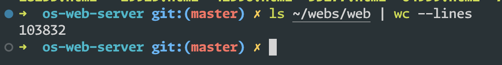
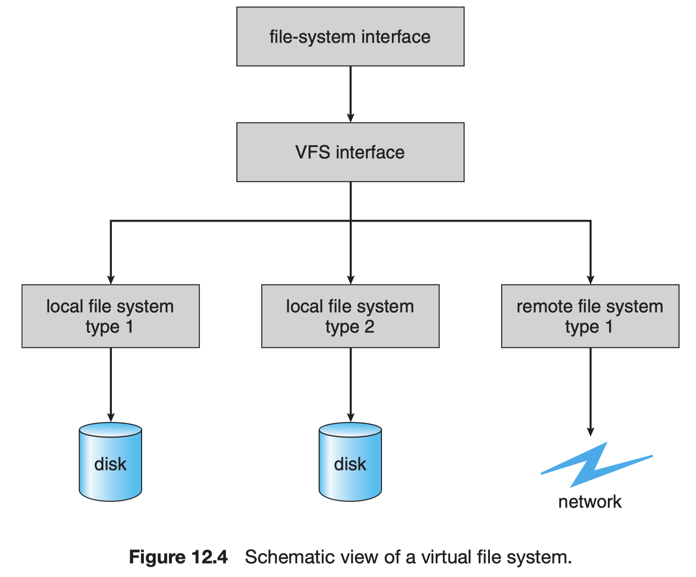
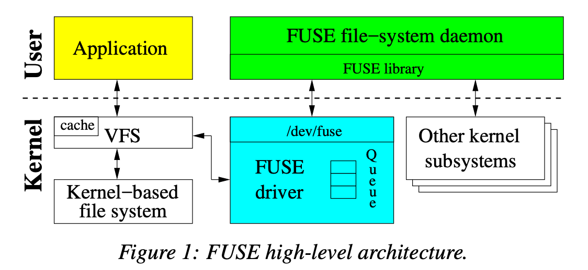
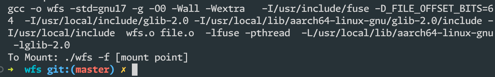
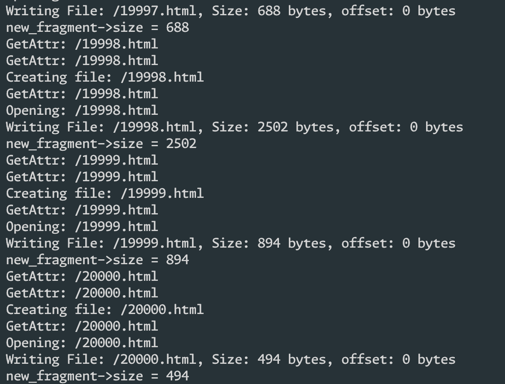
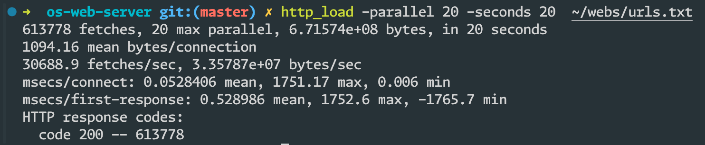
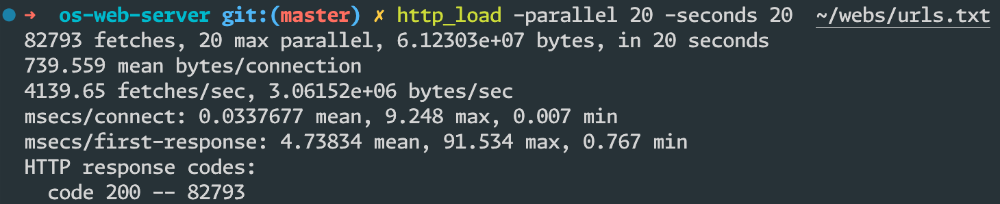

# 实验8

## 题目1

> 使⽤⽹络爬⾍⼯具，下载⾜够多的⽹⻚及其图⽚⽂件，数据量在⼏⼗GB左右。

```python
import os
import requests
from bs4 import BeautifulSoup
from urllib.parse import urlparse, urljoin

# 保存下载内容的目录
output_dir = "~/webs/web"
if not os.path.exists(output_dir):
  os.makedirs(output_dir)

# 要爬取的起始网页
start_url = "https://news.qq.com"
# 要爬取的总页面数量
total_pages = 100000

# 创建一个集合来存储已经访问过的网址，避免重复下载
visited_urls = set()

def download_page(url):
  response = requests.get(url)
  if response.status_code == 200:
    return response.text
  return None

def download_image(url, filename):
  response = requests.get(url)
  if response.status_code == 200:
    with open(os.path.join(output_dir, filename), 'wb') as f:
      f.write(response.content)

def parse_page(html):
  soup = BeautifulSoup(html, 'html.parser')

  # 解析页面中的图片链接
  image_tags = soup.find_all('img')
  for img_tag in image_tags:
    image_url = img_tag.get('src')
    if image_url and not image_url.startswith('data:'):
      image_url = urljoin(start_url, image_url)
      image_filename = image_url.split('/')[-1]
      download_image(image_url, image_filename)

def crawl_page(url, depth):
  if depth == 0:
    return

  if url in visited_urls:
    return

  visited_urls.add(url)
  html = download_page(url)

  if html:
    parse_page(html)

    # 解析页面中的链接继续爬取
    soup = BeautifulSoup(html, 'html.parser')
    link_tags = soup.find_all('a', href=True)
    for link_tag in link_tags:
      next_url = urljoin(start_url, link_tag['href'])
      crawl_page(next_url, depth-1)

# 开始爬取网页
if __name__ == "__main__":
	crawl_page(start_url, total_pages)

```

这个爬虫程序主要实现了如下功能：

1. 创建文件夹并指定下载目录：
     - 在程序开始时，会检查是否存在指定的下载目录`output_dir`，如果不存在则创建该目录，以存储下载的网页内容和图像文件。

2. 发送 HTTP 请求并下载网页内容：
     - 使用 `requests` 库发送 HTTP GET 请求来下载网页内容，函数`download_page`下载页面的 HTML 内容，保存在 `html` 变量中。如果服务器成功响应（状态码为 200），则返回页面内容，否则返回 None。

3. 解析页面内容并下载图片
     - 使用 `BeautifulSoup` 库来解析 HTML 内容，提取页面中的图像链接。
     - 对于每个图像链接，如果不是 base64 编码的图片（以`data:`开头），则将其下载到下载目录中。函数`download_image`根据图片链接下载图片，并保存在指定的下载目录下。

4. 递归爬取页面
     - 在`crawl_page`函数中，递归爬取指定深度的页面内容。
     - 对于每个待爬取的页面，首先检查是否已经访问过，避免重复下载。然后下载页面内容，解析页面中的图片，并继续获取页面中的链接。
     - 对于页面中的每个链接，将其作为下一层要爬取的页面，继续递归爬取，直到达到指定的深度或没有更多链接为止。

5. 链接处理
     - 使用`urljoin`来处理相对路径，将相对链接转换为绝对链接。

6. 程序入口
     - 在程序的主入口处，指定起始网页`start_url`和需要爬取的总页面数量`total_pages`，然后调用`crawl_page`函数开始爬取网页。


在终端中输入如下命令：

```bash
python crawling.py
```

完成后，即可在本地的到所需要的网页。



可以看到，一共爬取了 103832 个文件。

## 题目2

> 设计并实现⼀个适合⼩⽂件存储和快速读取的本地⽂件系统WFS（Web FileS ystem），将题⽬1下载下来的⽂件内容存⼊到设计好的WFS中。为此⽂件系统设计相关索引结构（参考Hash、B+-tree等索引⽂件结构），能够根据⽂件名定位到⽂件时间存储的位置，并根据⽂件⼤⼩进⾏⽂件内容读取。当将此索引结构加载到内存后，读取⽂件仅需要进⾏⼀次I/O操作即可完成。（常⽤的linux⽂件系统经常需要三次I/O完成⽂件的读取，⼀次为读取⽬录结构数据到内存；⼀次为读取⽂件的inode节点到内存；最后根据inode记载信息在磁盘中读取⽂件内容）。

### 如何实现⼀个适合⼩⽂件存储和快速读取的本地⽂件系统WFS（Web File System）

Linux 提供了 `Virtual File System` 来适配几乎任何的文件系统，为不同类型的文件系统提供了统一的接口，使得应用程序可以透明地操作各种不同类型的文件系统，而不需要关心底层文件系统的细节。但是其仍然有一定的局限性：需要涉及到内核模块的编译。



幸运的是， `libfuse`  提供的接口解决了这一问题，使得可以在用户态开发一个完整的操作系统，并且可以正常的通过系统的 api 与内核交流，读写文件，且性能差距与通常的文件系统差距不大。FUSE (Filesystem in Userspace) 是一种使用户能够开发自定义文件系统的工具，而不需要编写内核模块。FUSE 通过在用户空间提供一个库和接口，将文件系统的操作转发到用户空间的进程中处理，从而避免了必须编译内核模块的需求。



采用基于 `libfuse` 实现的虚拟文件系统，可以提供一个轻量级、快速的文件存储解决方案，适用于存储和检索小文件，同时减少对磁盘IO的频繁访问，从而提升系统性能。通过在用户态实现文件系统，我们可以避免编写复杂的内核模块，简化了文件系统的开发和部署过程。此外，该文件系统可以集成到内存中，最大程度减少磁盘的 IO，进一步提高文件的读取速度，适用于对文件读取速度要求较高的场景，如网页服务器、缓存服务器等。

### 设计索引结构

> 为此⽂件系统设计相关索引结构（参考Hash、B+-tree等索引⽂件结构），能够根据⽂件名定位到⽂件时间存储的位置，并根据⽂件⼤⼩进⾏⽂件内容读取。

由于在文件系统中最直观的方法是通过文件的字符串名进行索引，故可以使用一个全局的 hash 表来进行索引，其复杂度为 $O(1)$ 。

```c
GHashTable *dir_list;
GHashTable *files;
```

`dir_list` 和 `files` 分别是两个 `GHashTable`（哈希表）的指针变量，用来存储目录和文件相关的信息。

1. `dir_list` 是一个用于存储目录列表的哈希表。在创建 `dir_list` 时，通过 `g_hash_table_new_full()` 函数来初始化一个哈希表，并指定了要使用的 hash 函数 `g_str_hash` 和比较函数 `g_str_equal`，以确保哈希表的正确性。此外，在销毁哈希表时，指定了释放 key 和 value 内存的函数为 `free`，以便在释放 `dir_list` 时可以正确释放相关内存空间。

2. `files` 是一个用于存储文件信息的哈希表。同样地，通过 `g_hash_table_new_full()` 函数初始化哈希表，并指定了 hash 函数和比较函数。在这里，传递的释放 key 的函数是`NULL`，表示文件名的 key 不需要释放（因为文件名字符串是`file_handle` 的一部分，会在`file_handle` 释放的时候一起释放，并不需要手动释放），而释放 value 的函数为 `file_handle_free`，用于释放与文件相关联的数据结构（如文件的描述符等）的内存空间。

并在该文件系统的 main 函数中初始化：

```c
int main(int argc, char *argv[]) {
  dir_list = g_hash_table_new_full(g_str_hash, g_str_equal, free, free);
  files =
      g_hash_table_new_full(g_str_hash, g_str_equal, NULL, file_handle_free);

  return fuse_main(argc, argv, &operations, NULL);
}`
```

> 当将此索引结构加载到内存后，读取⽂件仅需要进⾏⼀次I/O操作即可完成

作为一个相对简单的文件系统，由于文件系统的索引结构全部储存在内存中，当读取文件的时候，只需要通过文件的 hash 表获取文件的内容即可，因此，只需要一次 I/O 操作便可以读取文件。

## 题目3

> 设计并实现⽀持上⾯⽂件系统的api接⼝（读⽂件、写⽂件、删除⽂件）。这个接⼝能够⽀持多线程对同⼀个或多个⽂件的并发操作；能够提前预读或缓冲部分⽂件数据以加快⽂件读取速度。通过实现的⽂件系统api接⼝，将题⽬1中下载的⽂件导⼊到此⽂件系统中。

`struct fuse_operations` 是 FUSE（Filesystem in Userspace）中的一个结构体，用于定义用户空间文件系统与 FUSE 模块之间的接口和操作。该结构体中包含了一系列函数指针，用于实现各种文件系统操作，从而在用户空间实现一个自定义的文件系统。

`fuse_operations` 的结构体中含有不同的函数指针，这些函数指针指向由用户定义的函数，这样，就实现了文件系统和用户函数的对接。

```c
struct fuse_operations {
        int (*getattr) (const char *, struct stat *, struct fuse_file_info *fi);
 
        int (*readlink) (const char *, char *, size_t);
 
        int (*mknod) (const char *, mode_t, dev_t);
 
        int (*mkdir) (const char *, mode_t);
 
        int (*unlink) (const char *);
 
        int (*rmdir) (const char *);
 
        int (*symlink) (const char *, const char *);
 
        int (*rename) (const char *, const char *, unsigned int flags);
 
        int (*link) (const char *, const char *);
 
        int (*chmod) (const char *, mode_t, struct fuse_file_info *fi);
 
        int (*chown) (const char *, uid_t, gid_t, struct fuse_file_info *fi);
 
        int (*truncate) (const char *, off_t, struct fuse_file_info *fi);
 
        int (*open) (const char *, struct fuse_file_info *);
 
        int (*read) (const char *, char *, size_t, off_t,
                     struct fuse_file_info *);
 
        int (*write) (const char *, const char *, size_t, off_t,
                      struct fuse_file_info *);
 
        int (*statfs) (const char *, struct statvfs *);
 
        int (*flush) (const char *, struct fuse_file_info *);
 
        int (*release) (const char *, struct fuse_file_info *);
 
        int (*fsync) (const char *, int, struct fuse_file_info *);
 
        int (*setxattr) (const char *, const char *, const char *, size_t, int);
 
        int (*getxattr) (const char *, const char *, char *, size_t);
 
        int (*listxattr) (const char *, char *, size_t);
 
        int (*removexattr) (const char *, const char *);
 
        int (*opendir) (const char *, struct fuse_file_info *);
 
        int (*readdir) (const char *, void *, fuse_fill_dir_t, off_t,
                        struct fuse_file_info *, enum fuse_readdir_flags);
 
        int (*releasedir) (const char *, struct fuse_file_info *);
 
        int (*fsyncdir) (const char *, int, struct fuse_file_info *);
 
        void *(*init) (struct fuse_conn_info *conn,
                       struct fuse_config *cfg);
 
        void (*destroy) (void *private_data);
 
        int (*access) (const char *, int);
 
        int (*create) (const char *, mode_t, struct fuse_file_info *);
 
        int (*lock) (const char *, struct fuse_file_info *, int cmd,
                     struct flock *);
 
        int (*utimens) (const char *, const struct timespec tv[2],
                         struct fuse_file_info *fi);
 
        int (*bmap) (const char *, size_t blocksize, uint64_t *idx);
 
#if FUSE_USE_VERSION < 35
        int (*ioctl) (const char *, int cmd, void *arg,
                      struct fuse_file_info *, unsigned int flags, void *data);
#else
        int (*ioctl) (const char *, unsigned int cmd, void *arg,
                      struct fuse_file_info *, unsigned int flags, void *data);
#endif
 
        int (*poll) (const char *, struct fuse_file_info *,
                     struct fuse_pollhandle *ph, unsigned *reventsp);
 
        int (*write_buf) (const char *, struct fuse_bufvec *buf, off_t off,
                          struct fuse_file_info *);
 
        int (*read_buf) (const char *, struct fuse_bufvec **bufp,
                         size_t size, off_t off, struct fuse_file_info *);
        int (*flock) (const char *, struct fuse_file_info *, int op);
 
        int (*fallocate) (const char *, int, off_t, off_t,
                          struct fuse_file_info *);
 
        ssize_t (*copy_file_range) (const char *path_in,
                                    struct fuse_file_info *fi_in,
                                    off_t offset_in, const char *path_out,
                                    struct fuse_file_info *fi_out,
                                    off_t offset_out, size_t size, int flags);
 
        off_t (*lseek) (const char *, off_t off, int whence, struct fuse_file_info *);
};
```

在上述的结构体定义中，有几个主要的有关读、写和删除操作的函数指针：

1. `getattr`
   - 用于获取文件或目录的属性，包括文件大小、权限、修改时间等信息。


2. `read`
   - 用于读取文件内容。当用户空间的进程向 FUSE 请求读取文件时，该函数会被调用来处理读取操作。


3. `write`
   - 用于写入文件内容。当用户空间的进程向 FUSE 请求写入文件时，该函数会被调用来处理写入操作。


4. `readdir`
   - 用于读取目录内容，返回目录中的子目录和文件信息。当用户空间的进程请求读取目录内容时，该函数会被调用。


5. `create`, `mkdir`, `unlink`, `truncate` 等：
   - 分别用于创建文件、创建目录、删除文件、截断文件等操作。这些函数指针定义了文件系统的基本操作，通过实现这些函数可以实现完整的文件系统功能。


6. `init`,  `destroy` 等
   - 用于初始化和销毁文件系统。`init` 在文件系统被加载时调用，`destroy` 在文件系统被卸载时调用。


通过实现 `struct fuse_operations` 结构体中的函数，并将指针赋值给实现的函数，用户就可以定义一个完整的文件系统操作接口，并实现自定义的文件系统功能。在用户态进程中将该结构体注册到 FUSE 模块中，即可建立用户态文件系统与 FUSE 挂载点之间的操作通信链路。这样，用户就可以在不需要写内核模块的情况下，通过 FUSE 实现自定义的文件系统。

### 读文件

读文件是一个较为宽泛的概念。其具体可分为多个部分

对于 FUSE 文件系统中的读文件操作，可以细分为以下几个部分，每个部分对应了 `struct fuse_operations` 结构体中的不同函数指针，实现了不同的功能：

- 打开文件 (`fuse_operations.open()`)，该函数会完成打开文件所需的操作，比如检查权限、分配文件描述符等

```c
static int do_open(const char *path, struct fuse_file_info *fi) {
  printf("Opening: %s\n", path);
  return 0;
}
```

- 读取目录信息 (`fuse_operations.readdir()`) ，该函数会返回目录中每个文件和子目录的名称

```c
static int do_readdir(const char *path, void *buffer, fuse_fill_dir_t filler,
                      off_t offset, struct fuse_file_info *fi) {
  filler(buffer, ".", NULL, 0);  // Current Directory
  filler(buffer, "..", NULL, 0); // Parent Directory

  if (strcmp(path, "/") != 0) {
    return 0;
  }

  // If the user is trying to show the files/directories of the root
  // directory show the following
  struct files_data *data = (struct files_data *)malloc(sizeof(*data));
  *data = (struct files_data){
      .buffer = buffer,
      .filler = filler,
  };

  g_hash_table_foreach(dir_list, files_foreach, data);
  g_hash_table_foreach(files, files_foreach, data);

  free(data);

  return 0;
}
```

- 读取文件内容 (`fuse_operations.read()`)，在该函数中，会读取文件指定偏移量处的数据，并将其写入给用户空间的 buffer 内

```c
static int do_read(const char *path, char *buffer, size_t size, off_t offset,
                   struct fuse_file_info *fi) {
  printf("Reading: %s, size: %zu, offset: %ld\n", path, size, offset);
  struct file_handle *handle = g_hash_table_lookup(files, path + 1);
  if (handle == NULL) {
    fprintf(stderr, "File not found");
    return -ENOENT;
  }

  size_t read_size = read_offset_content(buffer, handle, size, offset);
  printf("Read size: %lu\n", read_size);
  return read_size;
}

```

- 读取目录/文件的 `attribute` (`fuse_operations.getattr()`)，该函数会返回指定文件或目录的属性，如大小、权限、修改时间等信息

```c
int is_dir(const char *path) {
  if (g_hash_table_contains(dir_list, path)) {
    return true;
  }
  return false;
}
```

```c
int is_file(const char *path) {
  if (g_hash_table_contains(files, path)) {
    return true;
  }
  return false;
}
```

```c
static int do_getattr(const char *path, struct stat *st) {
  printf("GetAttr: %s\n", path);
  st->st_uid = getuid(); // The owner of the file/directory is the user who
                         // mounted the filesystem
  st->st_gid = getgid(); // The group of the file/directory is the same as the
                         // group of the user who mounted the filesystem
  st->st_atime =
      time(NULL); // The last "a"ccess of the file/directory is right now
  st->st_mtime =
      time(NULL); // The last "m"odification of the file/directory is right now

  if (strcmp(path, "/") == 0 || is_dir(path + 1) == 1) {
    st->st_mode = S_IFDIR | 0755;
    st->st_nlink = 2; // Why "two" hardlinks instead of "one"? The answer is
                      // here: http://unix.stackexchange.com/a/101536
    return 0;
  } else if (is_file(path + 1) == 1) {
    st->st_mode = S_IFREG | 0644;
    st->st_nlink = 1;
    st->st_size = 1024;
    return 0;
  }
  return -ENOENT;
}
```

完成上述函数后，在`struct fuse_operations` 中给指针赋值即可。

```c
static struct fuse_operations operations = {
    .getattr = do_getattr,
    .readdir = do_readdir,
    .open = do_open,
    .read = do_read,
    ......
};
```

### 写文件

读文件也是一个较为宽泛的概念。其具体可分为多个部分

具体来看，读文件的操作也可以分为：

- 创建目录 (`fuse_operations.mkdir()`)，该函数会执行创建目录的操作，包括在指定路径下创建新目录、设置新目录的权限等。

```c
void add_dir(const char *dir_name) {
  char *new_dir_name = strdup(dir_name);
  g_hash_table_add(dir_list, new_dir_name);
}
```

```c
static int do_mkdir(const char *path, mode_t mode) {
  printf("Make dir: %s\n", path);
  add_dir(path + 1);
  return 0;
}
```

- 创建节点（文件/设备） (`fuse_operations.mknod()`)，该函数会执行创建节点的操作，包括在指定路径下创建新的文件或设备节点、设置节点的属性等。

```c
void add_file(const char *filename) {
  struct file_handle *new_handle = file_handle_init(filename);
  g_hash_table_insert(files, new_handle->path_to_file, new_handle);
}
```

```c
static int do_mknod(const char *path, mode_t mode, dev_t rdev) {
  printf("Creating file: %s\n", path);
  add_file(path + 1);
  return 0;
}
```

- 写入文件内容 (`fuse_operations.write()`)，该函数会接收用户空间传递的数据，并将这些数据写入到指定文件中的指定偏移量处

```c
void write_to_file(const char *path, const char *new_content, size_t size,
                   off_t offset) {
  struct file_handle *handle = g_hash_table_lookup(files, path);
  if (handle == NULL) {
    fprintf(stderr, "Null Handle, creating files...\n");
    return;
  }
  file_handle_add_content(handle, new_content, size, offset);
}
```

```c
static int do_write(const char *path, const char *buffer, size_t size,
                    off_t offset, struct fuse_file_info *info) {
  printf("Writing File: %s, Size: %zu bytes, offset: %ld bytes\n", path, size,
         offset);
  write_to_file(path + 1, buffer, size, offset);
  return size;
}
```

完成上述函数后，在`struct fuse_operations` 中给指针赋值即可。

```c
static struct fuse_operations operations = {
  	......
    .mkdir = do_mkdir,
    .mknod = do_mknod,
    .write = do_write,
    ......
};
```

### 删除文件

删除文件只需要实现一个 `unlink` 函数即可。

- 删除文件或符号链接 (`fuse_operations.unlink()`)，该函数会执行删除文件的操作，包括释放文件占用的资源、从目录中删除文件条目等。

```c
int unlink_file(const char *path) {
  if (g_hash_table_remove(dir_list, path)) {
    return 0;
  }
  if (g_hash_table_remove(files, path)) {
    return 0;
  }
  return -ENOENT;
}
```

```c
static int do_unlink(const char *path) {
  printf("Deleting File: %s\n", path);
  return unlink_file(path + 1);
}
```

完成上述函数后，在`struct fuse_operations` 中给指针赋值即可。

```c
static struct fuse_operations operations = {
  	......
    .unlink = do_unlink,
};
```

### 导入网页文件到文件系统中

1. 首先让文件系统运行起来

```bash
make
```



将文件系统挂载在用户目录下：

```bash
mkdir -p ~/wfs
./wfs -f ~/wfs
```

即可使用 `~/wfs` 作为挂载点，访问新的文件系统

2. 拷贝使用爬虫爬取的网页文件

在爬取文件夹 `~/webs` 文件夹下新建 `copy.sh` 文件，文件内容如下：

```bash
#!/bin/zsh

for entry in {0..20000..1};
do
  cp "./web/$entry.html" ~/wfs/
done
```

- `for entry in {0..20000..1};`：这是一个 `for` 循环，从 `0` 到 `20000`，每次递增 `1`，循环体是操作每个文件的逻辑。

- `cp "./web/$entry.html" ~/wfs/`：这行命令是核心操作。它会将当前循环变量（如 `0`、`1`、`2` 等）作为文件名的一部分，构成类似 `./web/0.html`、`./web/1.html` 的路径，然后将这些文件复制到 `~/wfs/` 目录下。

这个脚本的作用是将 `web` 目录下的 `0.html`、`1.html`、`2.html` 一直到 `20000.html` 等文件依次复制到当前用户的 `wfs` 目录下。最终效果是将 `web` 目录中的一系列 HTML 文件复制到新创建的文件系统中。

运行该脚本：

```bash
chmod +x copy.sh
./copy.sh
```

可以看到，wfs 在终端一直在输出日志，表示当前正在创建文件、读文件信息和写文件。s



可以看到，当前文件系统已经写入了20001个文件。

```bash
ls | wc --lines 
```


## 题目4 ｜ 题目5

> 设计相关测试⽅法和程序，以⽐较本地 Linux ⽂件系统和前⾯设计的⽂件系统在存储和读取上⾯⽂件时的差别（特别要注意空间利⽤率和检索、读取⽂件速度之间的差别）。如果本地⽂件系统的数据检索和⽂件读取速度较慢，则分析导致速度慢的原因：是⽂件系统结构设计问题？还是算法问题？还是编程中的代码没有优化？在分析这些原因过程中，要参考Linux⽂件系统中的相关设计思想和源代码。
>
> 将上⾯实现的⽂件系统及其api接⼝集成⼊前⾯章节实现的Web服务器中，并测试其性能，特别是在处理⽤户⾼并发请求时的⽂件i/o读取速度。将上⾯实现的⽂件系统及其api接⼝集成⼊前⾯章节实现的Web服务器中，并测试其性能，特别是在处理⽤户⾼并发请求时的⽂件i/o读取速度。

 由于 VFS 提供的接口是统一的，无论使用任何文件系统，都会采用同一套系统调用来进行文件的读取、写入、修改、删除。因此，无需对 webserver 的源代码进行修改，但是需要修改 webserver 的运行时参数，将指定的运行目录从 `~/webs/web` 修改为 `~/wfs` 即可。

如果需要测试本地文件系统和 wfs 的区别，只需要区分工作目录即可。

此外，为了测试文件的读写性能，需要使用没有缓存的 web 服务器版本，即业务分割模型的 web 服务器版本。

1. 测试本地文件系统结合 web 服务器的性能

```bash
./webserver 8088 ~/webs/web
```

```bash
http_load -parallel 20 -seconds 20  ~/webs/urls.txt 
```

测试结果如下：



2. 测试 wfs 结合 web 服务器的性能

```bash
./webserver 8088 ~/wfs
```

```bash
http_load -parallel 20 -seconds 20  ~/webs/urls.txt 
```

测试结果如下：



### 测试结果对比

测试结果对比发现，wfs 的性能比本地文件系统慢不少，对比运行在本地文件系统的 web 服务器来说， 运行、在wfs 的 web 服务器的性能约为 0.13 倍，这可能是由于 Linux 本地文件系统运行在内核态，而 wfs 是经由 FUSE 这一中间层运行的，性能可能会有损失。

再者，wfs 的文件系统中，文件以链表组织，链表的寻找时间复杂度为 $O(n)$，因此，时间复杂度较高，这也可能是效率较低的原因之一。

## 附录：文件系统的完整代码

```c
// wfs.c

#define FUSE_USE_VERSION 30

#include <asm-generic/errno-base.h>
#include <errno.h>
#include <fuse.h>
#include <glib.h>
#include <stdbool.h>
#include <stddef.h>
#include <stdio.h>
#include <stdlib.h>
#include <string.h>
#include <sys/types.h>
#include <time.h>
#include <unistd.h>

#include "file.h"

GHashTable *dir_list;
GHashTable *files;

void add_dir(const char *dir_name) {
  char *new_dir_name = strdup(dir_name);
  g_hash_table_add(dir_list, new_dir_name);
}

int is_dir(const char *path) {
  if (g_hash_table_contains(dir_list, path)) {
    return true;
  }
  return false;
}

void add_file(const char *filename) {
  struct file_handle *new_handle = file_handle_init(filename);
  g_hash_table_insert(files, new_handle->path_to_file, new_handle);
}

int is_file(const char *path) {
  if (g_hash_table_contains(files, path)) {
    return true;
  }
  return false;
}

void write_to_file(const char *path, const char *new_content, size_t size,
                   off_t offset) {
  struct file_handle *handle = g_hash_table_lookup(files, path);
  if (handle == NULL) {
    // printf(stderr, "Null Handle, creating files...\n");
    return;
  }
  file_handle_add_content(handle, new_content, size, offset);
}

int unlink_file(const char *path) {
  if (g_hash_table_remove(dir_list, path)) {
    return 0;
  }
  if (g_hash_table_remove(files, path)) {
    return 0;
  }
  return -ENOENT;
}

static int do_getattr(const char *path, struct stat *st) {
  // printf("GetAttr: %s\n", path);
  st->st_uid = getuid(); // The owner of the file/directory is the user who
                         // mounted the filesystem
  st->st_gid = getgid(); // The group of the file/directory is the same as the
                         // group of the user who mounted the filesystem
  st->st_atime =
      time(NULL); // The last "a"ccess of the file/directory is right now
  st->st_mtime =
      time(NULL); // The last "m"odification of the file/directory is right now

  if (strcmp(path, "/") == 0 || is_dir(path + 1) == 1) {
    st->st_mode = S_IFDIR | 0755;
    st->st_nlink = 2; // Why "two" hardlinks instead of "one"? The answer is
                      // here: http://unix.stackexchange.com/a/101536
    return 0;
  } else if (is_file(path + 1) == 1) {
    st->st_mode = S_IFREG | 0644;
    st->st_nlink = 1;
    st->st_size = 1024;
    return 0;
  }
  return -ENOENT;
}

static int do_open(const char *path, struct fuse_file_info *fi) {
  // printf("Opening: %s\n", path);
  return 0;
}

struct files_data {
  void *buffer;
  fuse_fill_dir_t filler;
};

void files_foreach(gpointer key, gpointer value, gpointer userdata) {
  char *path_to_file = (char *)key;
  struct files_data *data = (struct files_data *)userdata;

  data->filler(data->buffer, path_to_file, NULL, 0);
}

static int do_readdir(const char *path, void *buffer, fuse_fill_dir_t filler,
                      off_t offset, struct fuse_file_info *fi) {
  filler(buffer, ".", NULL, 0);  // Current Directory
  filler(buffer, "..", NULL, 0); // Parent Directory

  if (strcmp(path, "/") != 0) {
    return 0;
  }

  // If the user is trying to show the files/directories of the root
  // directory show the following
  struct files_data *data = (struct files_data *)malloc(sizeof(*data));
  *data = (struct files_data){
      .buffer = buffer,
      .filler = filler,
  };

  g_hash_table_foreach(dir_list, files_foreach, data);
  g_hash_table_foreach(files, files_foreach, data);

  free(data);

  return 0;
}

static int do_read(const char *path, char *buffer, size_t size, off_t offset,
                   struct fuse_file_info *fi) {
  // printf("Reading: %s, size: %zu, offset: %ld\n", path, size, offset);
  struct file_handle *handle = g_hash_table_lookup(files, path + 1);
  if (handle == NULL) {
    // printf(stderr, "File not found");
    return -ENOENT;
  }

  size_t read_size = read_offset_content(buffer, handle, size, offset);
  // printf("Read size: %lu\n", read_size);
  return read_size;
}

static int do_mkdir(const char *path, mode_t mode) {
  // printf("Make dir: %s\n", path);
  add_dir(path + 1);
  return 0;
}

static int do_mknod(const char *path, mode_t mode, dev_t rdev) {
  // fprintf("Creating file: %s\n", path);
  add_file(path + 1);
  return 0;
}

static int do_write(const char *path, const char *buffer, size_t size,
                    off_t offset, struct fuse_file_info *info) {
  // printf("Writing File: %s, Size: %zu bytes, offset: %ld bytes\n", path, size, offset);
  write_to_file(path + 1, buffer, size, offset);
  return size;
}

static int do_unlink(const char *path) {
  // printf("Deleting File: %s\n", path);
  return unlink_file(path + 1);
}

static struct fuse_operations operations = {
    .getattr = do_getattr,
    .readdir = do_readdir,
    .open = do_open,
    .read = do_read,
    .mkdir = do_mkdir,
    .mknod = do_mknod,
    .write = do_write,
    .unlink = do_unlink,
};

int main(int argc, char *argv[]) {
  dir_list = g_hash_table_new_full(g_str_hash, g_str_equal, free, free);
  files =
      g_hash_table_new_full(g_str_hash, g_str_equal, NULL, file_handle_free);

  return fuse_main(argc, argv, &operations, NULL);
}
```

```c
// file.h
#pragma once
#ifndef FILE_H
#define FILE_H

#include <glib.h>
#include <pthread.h>
#include <stdbool.h>
#include <stddef.h>
#include <sys/types.h>

// 缓存文件的 handle，含有键值对，哈希表用
struct file_handle {
  char *path_to_file; // 代表文件的路径
  // 文件的起始链表节点
  // 对于大文件，单个的buffer不够储存，使用 list 存储内容
  GList *contents;
};

// 初始化该 handle
struct file_handle *file_handle_init(const char *path_to_file);

GList *find_offset_content(const struct file_handle *const handle,
                           off_t *const offset);

size_t read_offset_content(char *buffer, struct file_handle *handle, size_t size,
                         off_t offset);

// 给 file_handle 加上 content 的内容
void file_handle_add_content(struct file_handle *const handle,
                             const char *content, const size_t content_size,
                             off_t offset);

// 释放 handle
// hash 表使用，**不要直接调用**
void file_handle_free(gpointer handle);

// content 中指针指向的每个小字符串碎片
struct string_fragment {
  // 内容
  char *content;
  // 内容长度
  size_t size;
};

// 字符串碎片释放，**不要直接调用**
void string_fragment_free(gpointer string_fragment);

#endif

```

```c
// file.c
#include <bits/time.h>
#include <glib.h>
#include <pthread.h>
#include <stdbool.h>
#include <stddef.h>
#include <stdio.h>
#include <stdlib.h>
#include <string.h>
#include <sys/types.h>
#include <time.h>

#include "file.h"

// 初始化该 handle
struct file_handle *file_handle_init(const char *path_to_file) {
  struct file_handle *handle = (struct file_handle *)calloc(1, sizeof(*handle));
  // 复制 path_to_file的 string
  handle->path_to_file = strdup(path_to_file);
  handle->contents = NULL;

  return handle;
}

GList *find_offset_content(const struct file_handle *const handle,
                           off_t *const offset) {
  if (*offset == 0) {
    return handle->contents;
  }
  GList *ptr = handle->contents;
  GList *prev = ptr;
  for (; ptr && ((*offset - ((struct string_fragment *)(ptr->data))->size) > 0);
       ptr = ptr->next) {
    *offset -= ((struct string_fragment *)(ptr->data))->size;
    prev = ptr;
  }

  if (ptr == NULL) {
    return prev;
  }

  return ptr;
}

size_t read_offset_content(char *buffer, struct file_handle *handle,
                           size_t size, off_t offset) {
  GList *frag_pos = find_offset_content(handle, &offset);
  if (frag_pos == NULL) {
    return 0;
  }
  // printf("File: %s, Size: %zu\n", handle->path_to_file, ((struct string_fragment *)(frag_pos->data))->size);

  size_t counter = 0, prev = 0;
  for (; size-- > 0; counter++) {
    if (offset + counter ==
        ((struct string_fragment *)(frag_pos->data))->size) {
      offset = 0;
      if (frag_pos->next == NULL) {
        break;
      }
      frag_pos = frag_pos->next;
      prev += counter;
      counter = 0;
    }

    buffer[prev + counter] =
        ((struct string_fragment *)(frag_pos->data))->content[offset + counter];
  }
  return prev + counter;
}

// 给 file_handle 加上 content
void file_handle_add_content(struct file_handle *const handle,
                             const char *content, const size_t content_size,
                             off_t offset) {
  off_t new_fragment_offset = offset;
  GList *frag_pos = find_offset_content(handle, &new_fragment_offset);

  struct string_fragment *new_fragment =
      (struct string_fragment *)malloc(sizeof(*new_fragment));
  // strdup 会在数据为 0 的时候停止，不能使用（尤其针对 binary 例如图片）
  // "new_fragment->content = strndup(content, content_size + 8);" is wrong!
  // 所以改用 malloc 加 memcpy的形式
  new_fragment->content =
      (char *)malloc((content_size + new_fragment_offset + 8) * sizeof(char));
  // 拷贝以前的内容
  // 当原来的 list 不为空的时候
  if (frag_pos != NULL) {
    memcpy(new_fragment->content,
           ((struct string_fragment *)(frag_pos->data))->content,
           new_fragment_offset);
  }

  // 拷贝新内容
  memcpy(new_fragment->content + new_fragment_offset, content, content_size);
  new_fragment->size = new_fragment_offset + content_size;
  // printf("new_fragment->size = %zu\n", new_fragment->size);

  // list 不为空的时候
  if (frag_pos != NULL) {
    string_fragment_free(frag_pos->data);
  }

  handle->contents = g_list_remove(handle->contents, frag_pos);
  handle->contents = g_list_append(handle->contents, new_fragment);
}

// 释放 handle
void file_handle_free(gpointer handle_passed) {
  struct file_handle *handle = (struct file_handle *)handle_passed;

  // 1. 释放 contents
  g_list_free_full(handle->contents, string_fragment_free);

  // 2. 释放 path to file
  free(handle->path_to_file);

  // 3. 释放 handle
  free(handle);
}

// 释放字符串碎片
void string_fragment_free(void *string_fragment_passed) {
  struct string_fragment *string_fragment =
      (struct string_fragment *)string_fragment_passed;

  // 释放字符串
  free(string_fragment->content);

  // 释放自身
  free(string_fragment);
}
```

